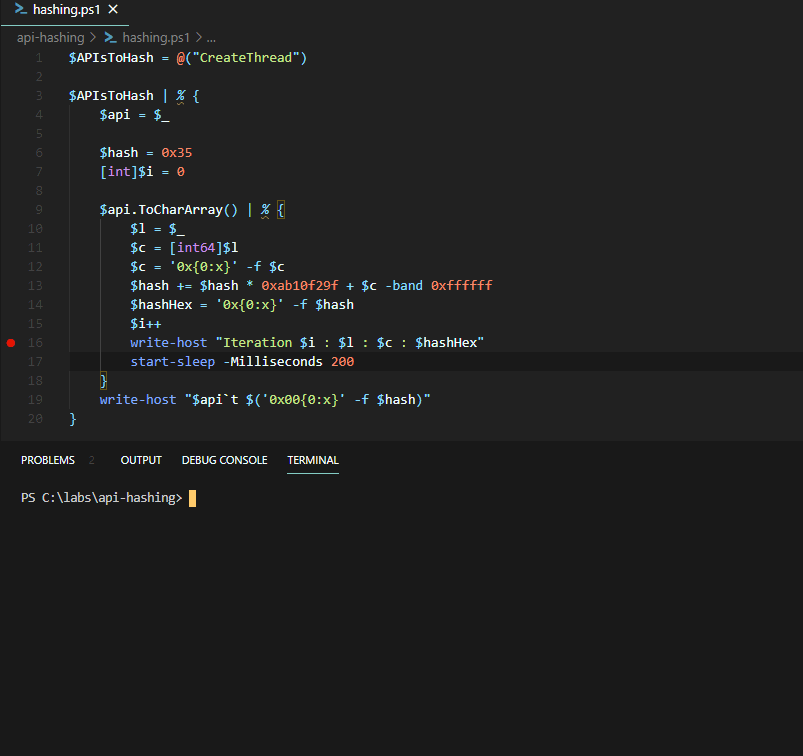

# Windows API Hashing in Malware

The purpose of this lab is to get a bit more familiar with API Hashing - a technique employed by malware developers, that makes malware analysis a bit more difficult by hiding suspicious imported Windows APIs from the Import Address Table of the Portable Executable.

## Overview

### Problem \(for Malware Developers\)

If we have a PE with its IAT intact, it's relatively easy to get an idea of what the PE's capabilities are - i.e. if we see that the binary loads `Ws2_32.dll`, it's safe to assume that it contains some networking capabilities, or if we see a function `RegCreateKeyEx` being imported, we know that the binary has ability to modify the registry, etc.

### Solution \(for Malware Developers\)

Malware authors want to make initial PE analysis/triage harder by simply looking at the IAT, and for this reason they may use API hashing to hide suspicious API calls from the IAT. This way, when an analyst runs the malicious binary through the `strings` utility or opens it in some PE parser, the Windows APIs that malware developer did not want the analyst to know without deeper analysis, will be hidden.

Assume we have written some malware called `api-hashing.exe` that uses`CreateThread`:


If we compile the above code and inspect it via a PE parser, we see that there are 28 imported functions from kernel32 library and `CreateThread` is one of them:


For some reason, we decide that we do not want malware analysts to know that our malware will be calling `CreateThread` just by looking at the binary's IAT/running `strings` against the binary. To achieve this, we can employ the API hashing technique and resolve `CreateThread` function address at runtime. By doing this, we can make the `CreateThread` disappear from the PE's IAT, and this is exactly the purpose of this lab - to see how this techique works in real life.

## The Goal

In this lab we're going to write:

1. A simple powershell script that will calculate a hash for a given function name. For example, feeding a string `CreateThread` to the script will spit out its representation as a hash value, which in our lab, as we will see later, will be `0x00544e304`
2. A simple C program that will resolve `CreateThread` function's virtual address inside the `api-hashing.exe` by iterating through all the exported function names of kernel32 module \(where `CreateThread` lives\), calculating their hashes \(using our hashing algoritm\) and comparing them to our hash `0x00544e304` \(for `CreateThread`\). In our case, the program will spit out a virtual address `00007FF89DAFB5A0` as will be seen later.

Visually, the process of what we are going to do looks something like this:


## Calculating the Hash

API hashing is simply an `arbitrary` \(that we can make up on our own\) function / algorithm, that calculates a hash value for a given text string.

In our case, we defined the hashing algorithm to work like this:

1. Take the function name to be hashed \(i.e `CreateThread`\)
2. Convert the string to a `char` array
3. Set a variable `$hash` to any initial value. In our case, we chose `0x35` - no particular reason - as mentioned earlier, hash calculation can be any arbitrary algorithm of your choice - as long as we can reliably create hashes without collisions, meaning that no two different API calls will result in the same hash value.
4. Iterate through each character and perform the following arithmetics - hash calculation
   1. Convert character to a hex representation
   2. Perform the following arithmetics `$hash += $hash * 0xab10f29f + $c -band 0xffffff`, where:
      1. `0xab10f29f` is simply another random value of our choice
      2. `$c` is a hex representation of the character from the function we're hashing
      3. `-band 0xffffff` is for masking off the high order bits of the hash value
5. Spit out the hash representation for the string `CreateThread`


Our hashing function has not been tested for hash collisions and is only meant to demonstrate the idea behind it. In fact, YoavLevi informed me that this function indeed causes hash collisions for at least these two APIs:  
`GetStdHandle     0x006426be5
  
CloseHandle      0x006426be5`


```csharp
$APIsToHash = @("CreateThread")

$APIsToHash | % {
    $api = $_
    
    $hash = 0x35
    [int]$i = 0

    $api.ToCharArray() | % {
        $l = $_
        $c = [int64]$l
        $c = '0x{0:x}' -f $c
        $hash += $hash * 0xab10f29f + $c -band 0xffffff
        $hashHex = '0x{0:x}' -f $hash
        $i++
        write-host "Iteration $i : $l : $c : $hashHex"
    }
    write-host "$api`t $('0x00{0:x}' -f $hash)"
}
```

If we run the hashing function against the string `CreateThread`, we get its hash - `0x00544e304`:



We are now ready to move on to the C program that will resolve `CreateThread` function address by parsing out the `Kernel32` module's Export Address Table and tell us where `CreateThread` function is stored in our malicious process's memory, based on the hash we've just calculated - `0x00544e304`.

## Resolving Address by Hash

Our C program will have 2 functions:

`getHashFromString` - a function that calculates a hash for a given string. This is an identital function \(related to the hash calculation\) to the one that we wrote earlier for hashing our function name `CreateThread` in Powershell.

On the left is the `getHashFromString` in our C program and on the right is the powershell version of the hash calculation algorithm:


`getFunctionAddressByHash` - this is the function that will take a hash value \(`0x00544e304` in our case for `CreateThread`\)  as an argument and return function's, that maps back to that hash, virtual address - `00007FF89DAFB5A0` in our case.

This function at a high level works like this:

1. Get a base address of the library where our function of interest \(`CreateThread`\) resides, which is  - `kernel32.dll` in our case
2. Locates kernel32 Export Address Table
3. Iterates through each exported function name by the kernel32 module
4. For each exported function name, calculates its hash value using the `getHashFromString`
5. If calculated hash equals `0x00544e304` `(CreateThread)`, calculate function's virtual address
6. At this point, we could `typedef` the `CreateThread` function prototype, point it to the resolved address in step 5 and use it for creating new threads, but this time without `CreateThread` being shown in our malware PE's Import Address Table!

Below is our aforementioned C program that resolves `CreateThread` function address by the hash \(`0x00544e304`\):

```cpp
#include <iostream>
#include <Windows.h>

DWORD getHashFromString(char *string) 
{
	size_t stringLength = strnlen_s(string, 50);
	DWORD hash = 0x35;
	
	for (size_t i = 0; i < stringLength; i++)
	{
		hash += (hash * 0xab10f29f + string[i]) & 0xffffff;
	}
	// printf("%s: 0x00%x\n", string, hash);
	
	return hash;
}

PDWORD getFunctionAddressByHash(char *library, DWORD hash)
{
	PDWORD functionAddress = (PDWORD)0;

	// Get base address of the module in which our exported function of interest resides (kernel32 in the case of CreateThread)
	HMODULE libraryBase = LoadLibraryA(library);

	PIMAGE_DOS_HEADER dosHeader = (PIMAGE_DOS_HEADER)libraryBase;
	PIMAGE_NT_HEADERS imageNTHeaders = (PIMAGE_NT_HEADERS)((DWORD_PTR)libraryBase + dosHeader->e_lfanew);
	
	DWORD_PTR exportDirectoryRVA = imageNTHeaders->OptionalHeader.DataDirectory[IMAGE_DIRECTORY_ENTRY_EXPORT].VirtualAddress;
	
	PIMAGE_EXPORT_DIRECTORY imageExportDirectory = (PIMAGE_EXPORT_DIRECTORY)((DWORD_PTR)libraryBase + exportDirectoryRVA);
	
	// Get RVAs to exported function related information
	PDWORD addresOfFunctionsRVA = (PDWORD)((DWORD_PTR)libraryBase + imageExportDirectory->AddressOfFunctions);
	PDWORD addressOfNamesRVA = (PDWORD)((DWORD_PTR)libraryBase + imageExportDirectory->AddressOfNames);
	PWORD addressOfNameOrdinalsRVA = (PWORD)((DWORD_PTR)libraryBase + imageExportDirectory->AddressOfNameOrdinals);

	// Iterate through exported functions, calculate their hashes and check if any of them match our hash of 0x00544e304 (CreateThread)
	// If yes, get its virtual memory address (this is where CreateThread function resides in memory of our process)
	for (DWORD i = 0; i < imageExportDirectory->NumberOfFunctions; i++)
	{
		DWORD functionNameRVA = addressOfNamesRVA[i];
		DWORD_PTR functionNameVA = (DWORD_PTR)libraryBase + functionNameRVA;
		char* functionName = (char*)functionNameVA;
		DWORD_PTR functionAddressRVA = 0;

		// Calculate hash for this exported function
		DWORD functionNameHash = getHashFromString(functionName);
		
		// If hash for CreateThread is found, resolve the function address
		if (functionNameHash == hash)
		{
			functionAddressRVA = addresOfFunctionsRVA[addressOfNameOrdinalsRVA[i]];
			functionAddress = (PDWORD)((DWORD_PTR)libraryBase + functionAddressRVA);
			printf("%s : 0x%x : %p\n", functionName, functionNameHash, functionAddress);
			return functionAddress;
		}
	}
}

// Define CreateThread function prototype
using customCreateThread = HANDLE(NTAPI*)(
	LPSECURITY_ATTRIBUTES   lpThreadAttributes,
	SIZE_T                  dwStackSize,
	LPTHREAD_START_ROUTINE  lpStartAddress,
	__drv_aliasesMem LPVOID lpParameter,
	DWORD                   dwCreationFlags,
	LPDWORD                 lpThreadId
);

int main()
{
	// Resolve CreateThread address by hash
	PDWORD functionAddress = getFunctionAddressByHash((char *)"kernel32", 0x00544e304);

	// Point CreateThread function pointer to the CreateThread virtual address resolved by its hash
	customCreateThread CreateThread = (customCreateThread)functionAddress;
	DWORD tid = 0;

	// Call CreateThread
	HANDLE th = CreateThread(NULL, NULL, NULL, NULL, NULL, &tid);

	return 1;
}
```


For more information on parsing PE executables, see [Parsing PE File Headers with C++](../../miscellaneous-reversing-forensics/windows-kernel-internals/pe-file-header-parser-in-c++.md).


If we compile and run the code, we will see the following:


...where from left to right:

1. `CreateThread` - function name that was resolved for the given hash `0x00544e304`
2. `0x00544e304` - hash that was used to resolve the said `CreateThread` function name
3. `00007FF89DAFB5A0` - `CreateThread` virtual memory address inside our `api-hashing.exe` process

Below image confirms that `00007FF89DAFB5A0` is indeed pointing to the `CreateThread` inside `api-hashing.exe`:


...and more importantly, its IAT is now free from `CreateThread`:


## Testing if `CreateThread` Works

Below shows that we can now successfully call `CreateThread` which was resolved at run time by hash `0x00544e304` - this is confirmed by the obtained handle `0x84` to the newly created thread:


Below also shows the thread ID that was created during our `CreateThread` invokation:


## References



