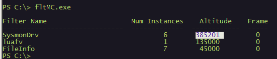
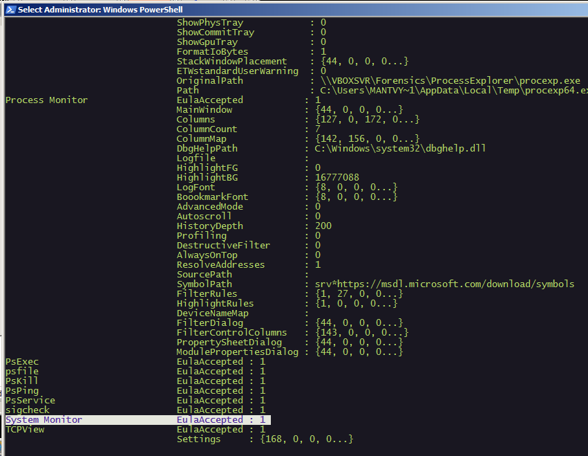
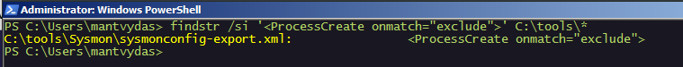
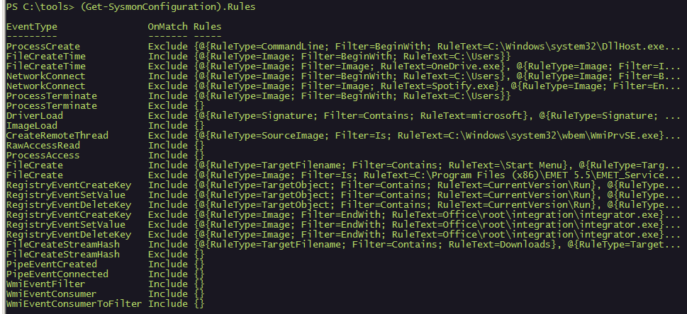
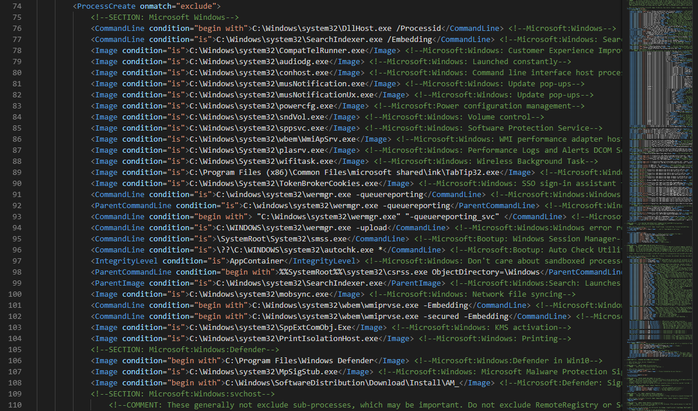

# Detecting Sysmon on the Victim Host

## Processes



```csharp
PS C:\> Get-Process | Where-Object { $_.ProcessName -eq "Sysmon" }
```





Note: process name can be changed during installation


## Services



```csharp
Get-CimInstance win32_service -Filter "Description = 'System Monitor service'"
# or
Get-Service | where-object {$_.DisplayName -like "*sysm*"}
```





Note: display names and descriptions can be changed


## Windows Events



```csharp
reg query HKLM\SOFTWARE\Microsoft\Windows\CurrentVersion\WINEVT\Channels\Microsoft-Windows-Sysmon/Operational
```




## Filters



```text
PS C:\> fltMC.exe
```



Note how even though you can change the sysmon service and driver names, the sysmon altitude is always the same - `385201`



## Sysmon Tools + Accepted Eula



```text
ls HKCU:\Software\Sysinternals
```





## Sysmon -c

Once symon executable is found, the config file can be checked like so:

```text
sysmon -c
```


## Config File on the Disk

If you are lucky enough, you may be able to find the config file itself on the disk by using native windows utility findstr:



```csharp
findstr /si '<ProcessCreate onmatch="exclude">' C:\tools\*
```





## Get-SysmonConfiguration

A powershell tool by @mattifestation that extracts sysmon rules from the registry:



```csharp
PS C:\tools> (Get-SysmonConfiguration).Rules
```





As an example, looking a bit deeper into the `ProcessCreate` rules:



```csharp
(Get-SysmonConfiguration).Rules[0].Rules
```



We can see the rules almost as they were presented in the sysmon configuration XML file:


A snippet from the actual sysmonconfig-export.xml file:



## Bypassing Sysmon

Since [Get-SysmonConfiguration](detecting-sysmon-on-the-victim-host.md#get-sysmonconfiguration) gives you the ability to see the rules sysmon is monitoring on, you can play around those.

Another way to bypass the sysmon altogether is explored here:



## References










