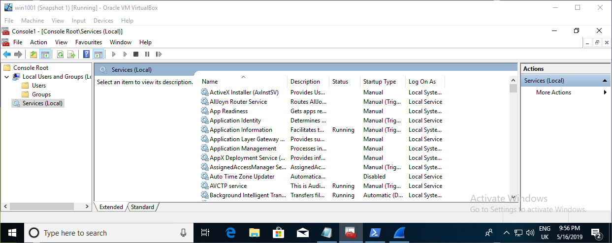
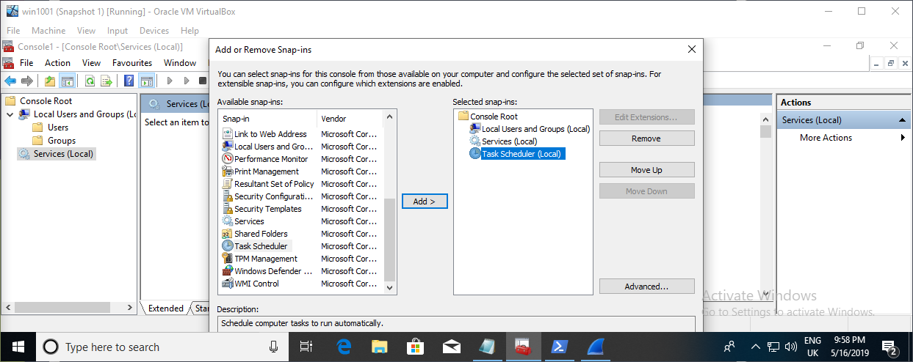
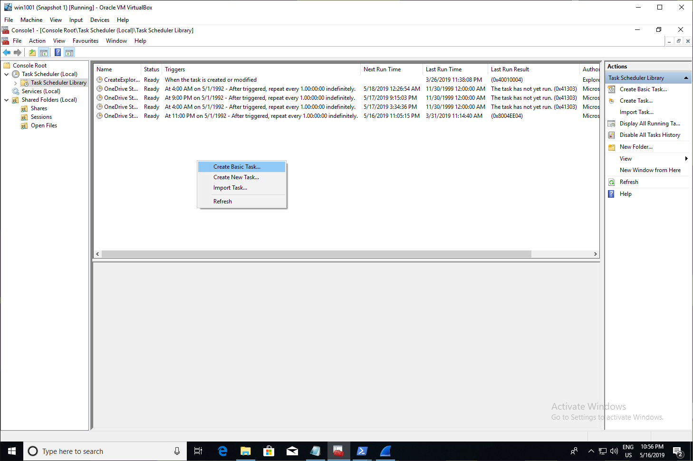
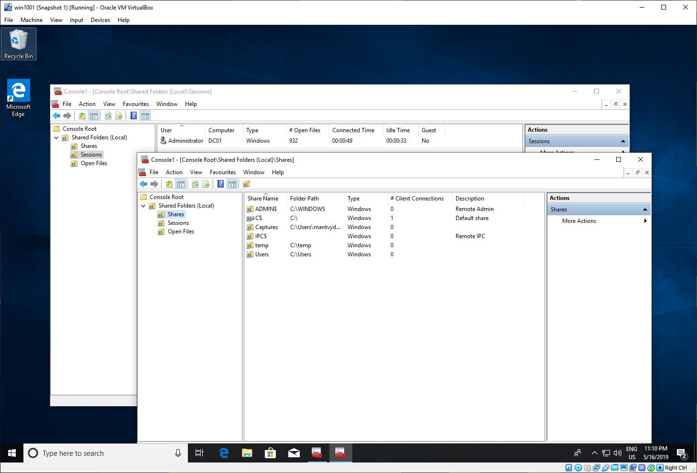

# Enumerating Users without net, Services without sc and Scheduled Tasks without schtasks

It is possible to use MMC snap-ins to enumerate local users and local groups, services, scheduled tasks, SMB shares and sessions on a system if you have an interactive desktop session on the compromised system either via RDP or if you are simulating an insider threat during a pentest and you are given a company's laptop.

## Why would you do it?

The use of well known lolbins like net, sc and schtasks on a host where an EDR solution is running is risky and may get you caught. Using snap-ins may help evade commandline detections SOC may be relying on. 

Of course, marketing department is unlikely to run mmc snap-ins either, so beware :\)

## Enumerating Users and Local Groups

Launch mmc.exe, click File &gt; Add\remove snap-in &gt; Local users and Groups:

## Enumerating Services

Same could be done for enumerating services running on the system:

Note that `services.msc` could give you the same view.

## Enumerating Scheduled Tasks

Persistence anyone? Note that `taskschd.msc` could give you the same view:

## Shares and Sessions

