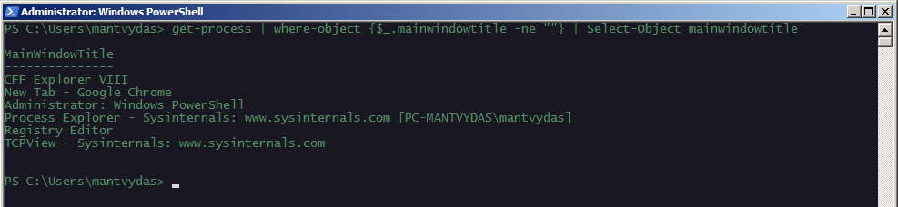

# T1010: Application Window Discovery

Retrieving running application window titles:


```csharp
get-process | where-object {$_.mainwindowtitle -ne ""} | Select-Object mainwindowtitle
```




A COM method that also includes the process path and window location coordinates:


```csharp
[activator]::CreateInstance([type]::GetTypeFromCLSID("13709620-C279-11CE-A49E-444553540000")).windows()
```



## References




