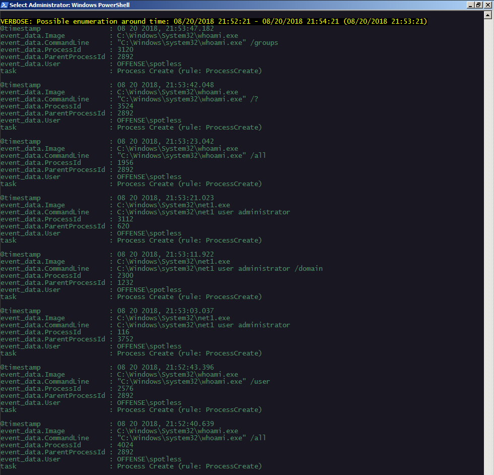
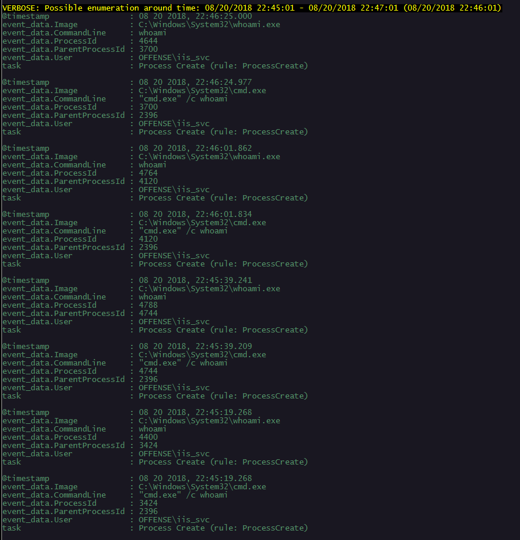
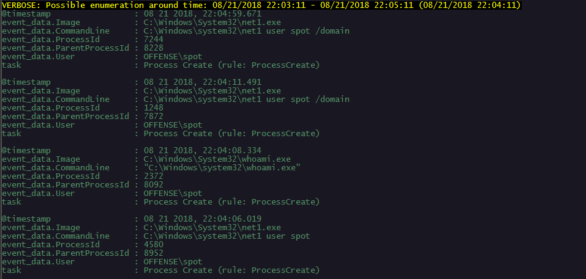

# T1087: Account Discovery & Enumeration

## Execution

Let's run some of the popular enumeration commands on the victim system:


```csharp
net user
net user administrator
whoami /user
whoami /all
...
```


## Hunting and Observations

Having command line logging can help in identifying a cluster of enumeration commands executed in a relatively short span of time on a compromised host .

For this lab, I exported 8600+ command lines from various processes and wrote a dirty powershell script that ingests those command lines and inspects them for a couple of classic windows enumeration commands that are executed in the span of 2 minutes and spits them out:


```csharp
function hunt() {
    [CmdletBinding()]Param()
    $commandlines = Import-Csv C:\Users\mantvydas\Downloads\cmd-test.csv
    $watch = 'whoami|net1 user|hostname|netstat|net localgroup|cmd /c'
    $matchedCommandlines = $commandlines| where-object {  $_."event_data.CommandLine" -match $watch}

    $matchedCommandlines| foreach-Object {
        [datetime]$eventTime = $_."@timestamp"
        [datetime]$low = $eventTime.AddSeconds(-60)
        [datetime]$high = $eventTime.AddSeconds(60)
        $clusteredCommandlines = $commandlines | Where-Object { [datetime]$_."@timestamp" -ge $low -and [datetime]$_."@timestamp" -le $high -and  $_."event_data.CommandLine" -match $watch}
        
        if ($clusteredCommandlines.length -ge 4) {
            Write-Verbose "Possible enumeration around time: $low - $high ($eventTime)"
            $clusteredCommandlines
        }
    }
}
```


Invoking the script to start the hunt:

```csharp
. \hunt.ps1; hunt -verbose
```

Below are some of the findings which may warrant further investigation of the suspect host:








## References



