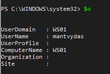
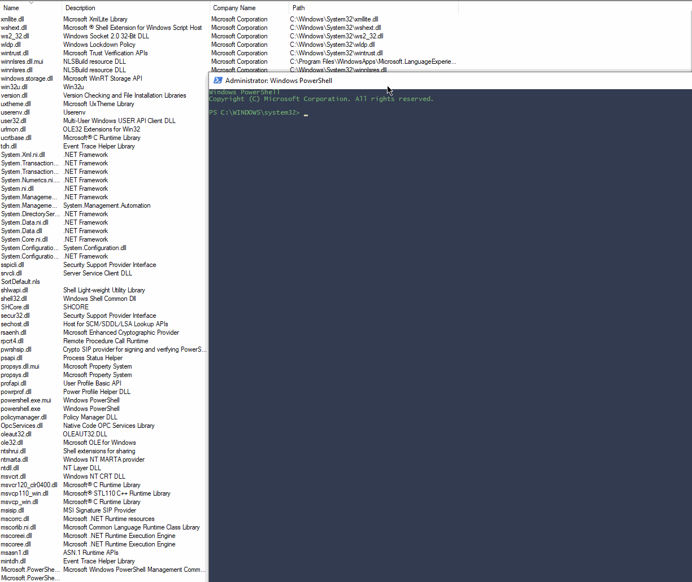

# Using COM to Enumerate Hostname, Username, Domain, Network Drives

At `Computer\HKEY_CLASSES_ROOT\CLSID\{093FF999-1EA0-4079-9525-9614C3504B74}` we have a **Windows Script Host Network Object** COM object which allows us to get details such as computer name, logged on user, etc:


```csharp
$o = [activator]::CreateInstance([type]::GetTypeFromCLSID("093FF999-1EA0-4079-9525-9614C3504B74"))
```

Below are all the properties and methods exposed by the object:

```csharp
$o | gm
```


Viewing username, domain, machine name, etc:

```text
$o
```



We can also see any network connected drives:

```text
$o.EnumNetworkDrives()
```


## Observations

Below shows what additional modules Powershell loads once the COM object is instantiated:




