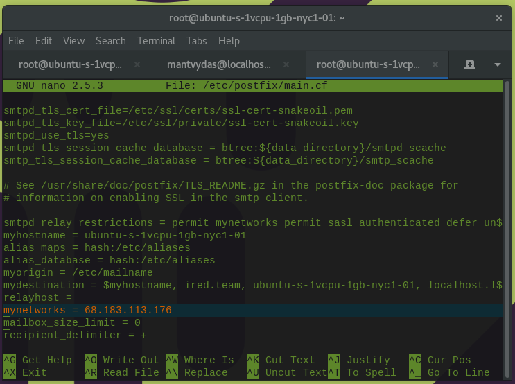
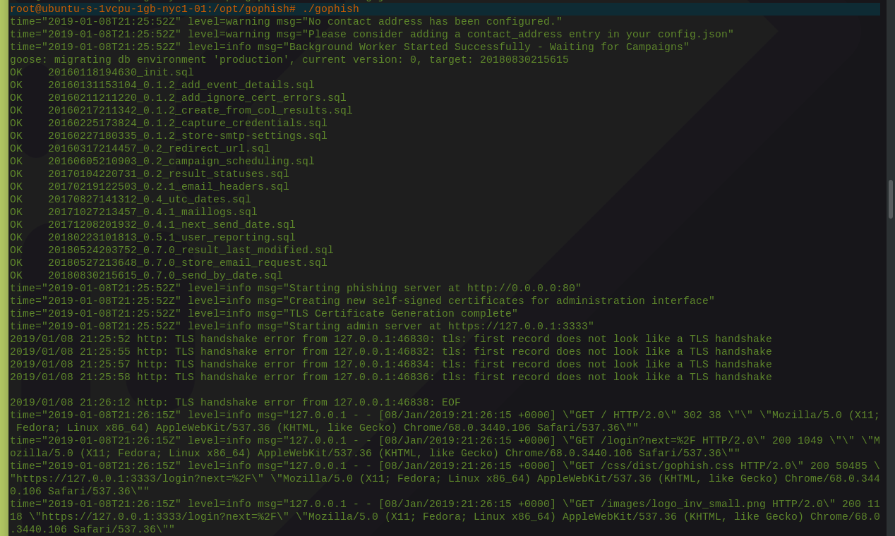
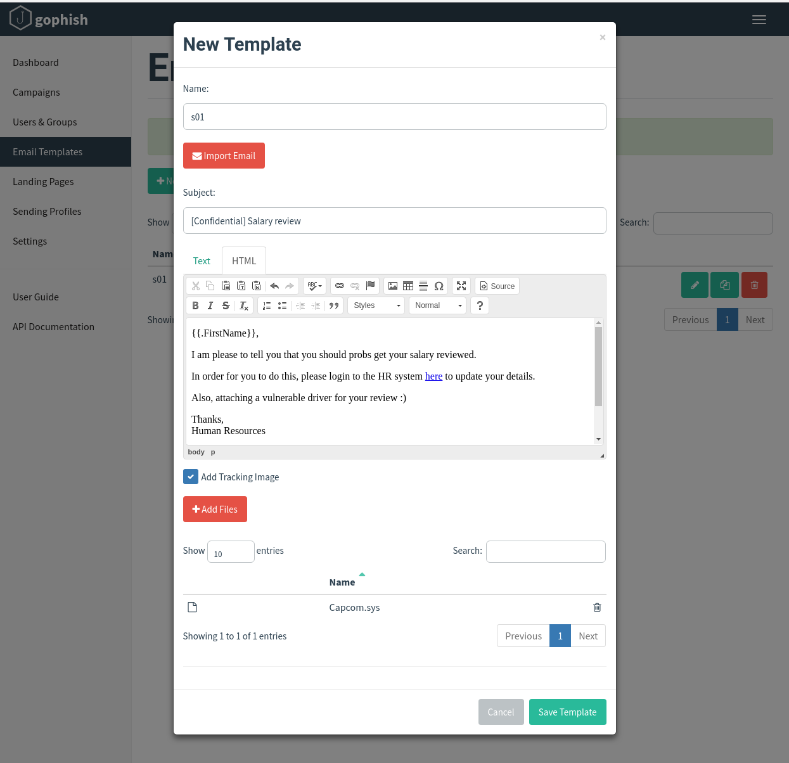
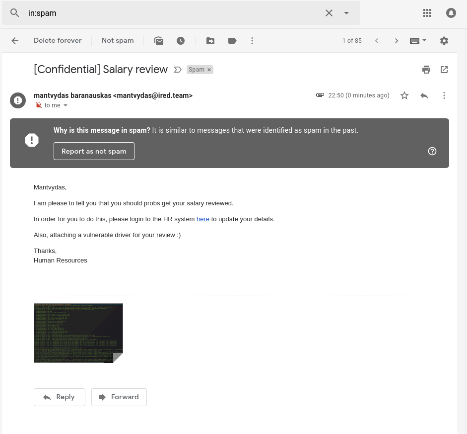
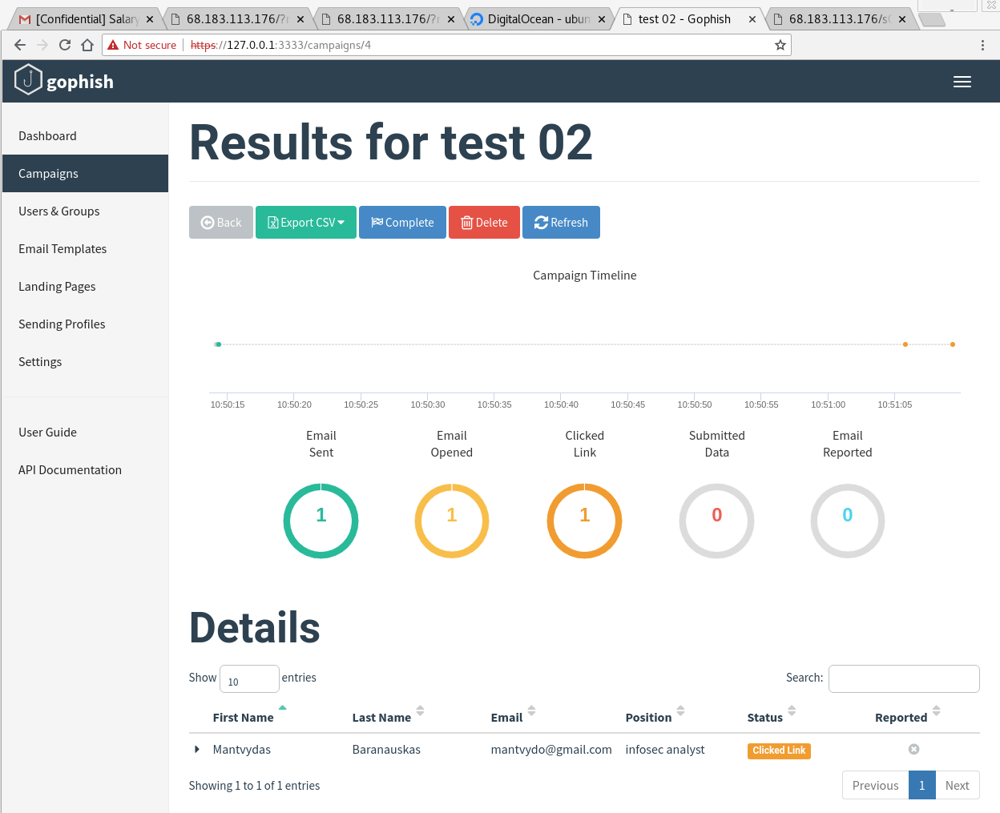

# Phishing with GoPhish and DigitalOcean

This lab is dedicated to exploring one of the phishing frameworks GoPhish. I will be installing and configuring GoPhish on a DigitalOcean VPS running Ubuntu Linux distribution.

## Configuring Environment

### DigitalOcean VPS

The dropled that I have created got assigned an IP address `68.183.113.176`

Let's login to the VPS and install the mail delivery agent:


```csharp
ssh root@68.183.113.176
apt-get install postfix
```



Point `mynetworks` variable in postfix config to the IP we got assigned in DigitalOcean:


```csharp
nano /etc/postfix/main.cf
```




### Configure DNS Zones

Create an `A` record `mail` that points to the VPS IP and an `MX` record that points to `mail.yourdomain`:


### Install GoPhish


```csharp
wget https://github.com/gophish/gophish/releases/download/0.7.1/gophish-v0.7.1-linux-64bit.zip
apt install unzip
unzip gophish-v0.7.1-linux-64bit.zip 
chmod +x gophish
```



## Execution

Launching GoPhish is simple:


```csharp
./gophish
```




GoPhish admininistration panel is bound to 127.0.0.1:3333 by default, so we can either modify the config and change it to listen on 0.0.0.0 \(all interfaces\) if we want to access the admin panel from the Internet or create a local SSH tunnel if we want to restrict access to local network only. Let's do an SSH tunnel:


```csharp
ssh root@68.183.113.176 -L3333:localhost:3333 -N -f
```


We can now access the GoPhish admin panel via `https://127.0.0.1:3333` from our Kali box. After creating user groups \(phish targets\), landing pages \(phishing pages victims will see if they click on our phishing links\), etc, we can create an email template - the email that will be sent to the unsuspecting victims as part of a phishing campaign that we will create in the next step:



Below is a quick demo of how a new campaign is put together once all the other pieces mentioned above are in place \(users, templates, landing pages\):


## Receiving the Phish

Below is the actual end result of our mock phish campaign:



The URL found in the above phish email takes the user to our mock phishing page:


## Campaign Results

Switching to `Campaigns` section of the admin panel, we can see how many emails were sent as part of the campaign, how many of them were opened and how many times the phishing URL was clicked:



## References





