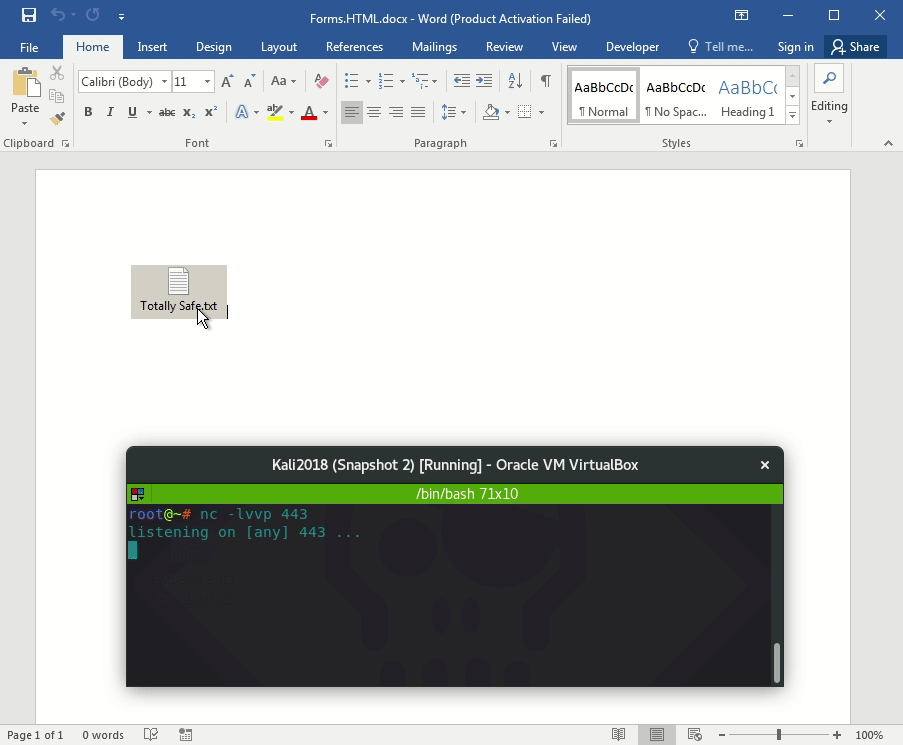
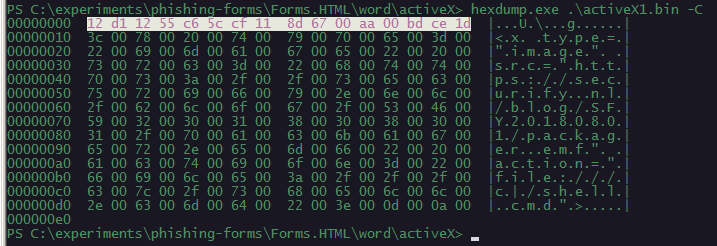
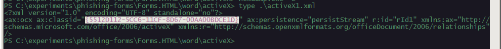
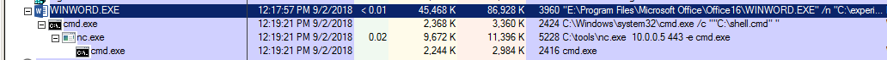

# Phishing: Embedded HTML Forms

In this phishing lab I am just playing around with the POCs researched, coded and described by Yorick Koster in his blog post [Click me if you can, Office social engineering with embedded objects](https://securify.nl/blog/SFY20180801/click-me-if-you-can_-office-social-engineering-with-embedded-objects.html)

## Execution





## Observations

These types of phishing documents can be identified by looking for the CLSID 5512D112-5CC6-11CF-8D67-00AA00BDCE1D in the embedded `.bin` files:

...as well as inside the activeX1.xml file:

As usual, MS Office applications spawning cmd.exe or powershell.exe should be investigated:

## References



