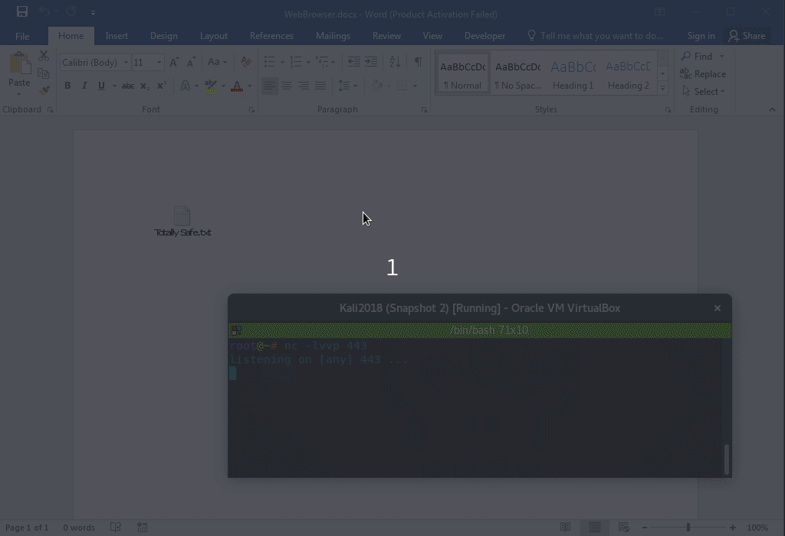
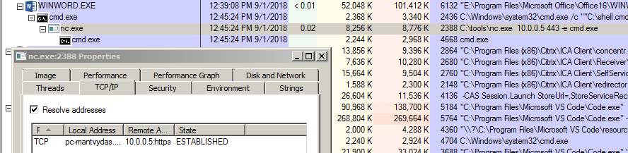
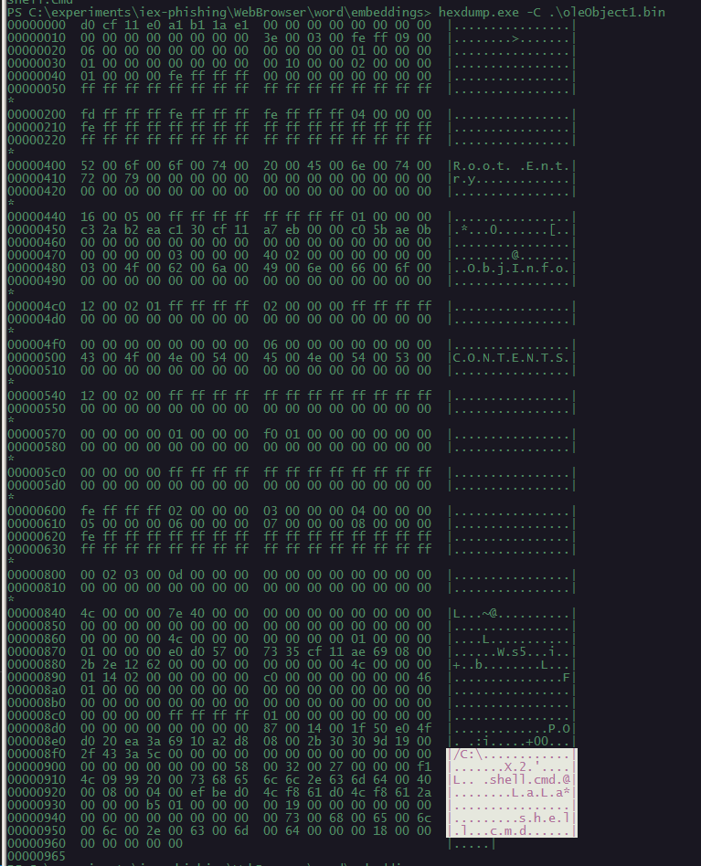
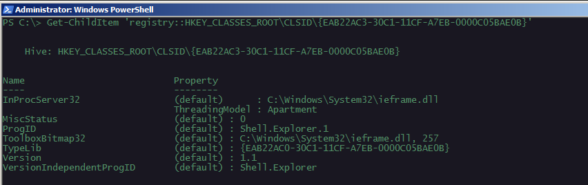
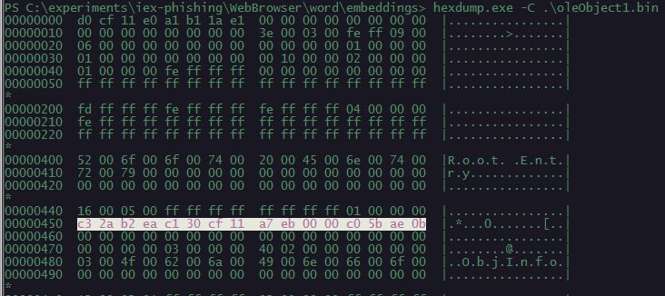

# Phishing: Embedded Internet Explorer

In this phishing lab I am just playing around with the POCs researched, coded and described by Yorick Koster in his blog post [Click me if you can, Office social engineering with embedded objects](https://securify.nl/blog/SFY20180801/click-me-if-you-can_-office-social-engineering-with-embedded-objects.html)

## Execution







## Observations



As with other phishing documents, we can unzip the .docx and do a simple hexdump/strings on the `oleObject1.bin` to look for any suspicious strings referring to some sort of file/code execution:



The CLSID object that makes this technique work is a `Shell.Explorer.1` object, as seen here:

```csharp
Get-ChildItem 'registry::HKEY_CLASSES_ROOT\CLSID\{EAB22AC3-30C1-11CF-A7EB-0000C05BAE0B}'
```



As an analyst, one should inspect the .bin file and look for the {EAB22AC3-30C1-11CF-A7EB-0000C05BAE0B} bytes inside, signifying the `Shell.Explorer.1` object being embedded in the .bin file:



## References



  


