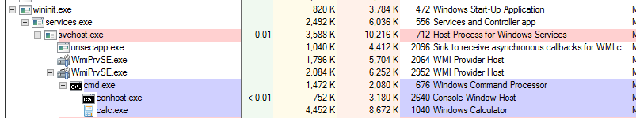
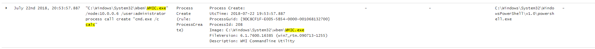
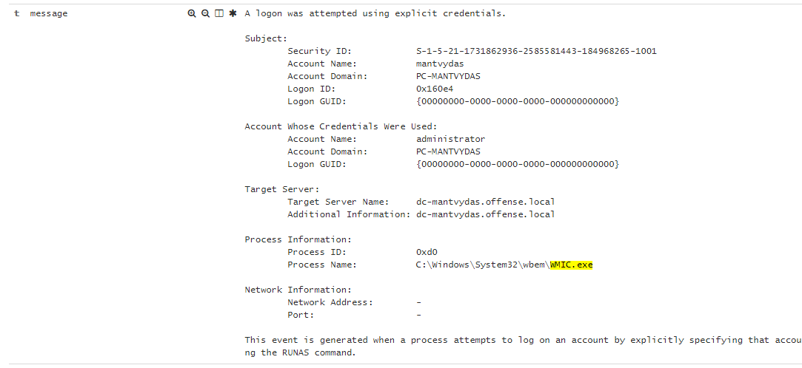
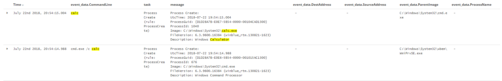
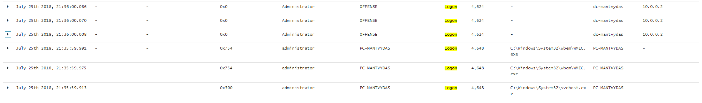

# T1047: WMI for Lateral Movement

## Execution

Spawning a new process on the target system 10.0.0.6 from another compromised system 10.0.0.2:


```bash
wmic /node:10.0.0.6 /user:administrator process call create "cmd.exe /c calc"
```


## Observations



Inspecting sysmon and windows audit logs, we can see `4648` logon events being logged on the source machine as well as processes being spawned by `WmiPrvSe.exe` on the target host:







Both on the host initiating the connection and on the host that is being logged on to, events `4624` and `4648` should be logged:



## References



