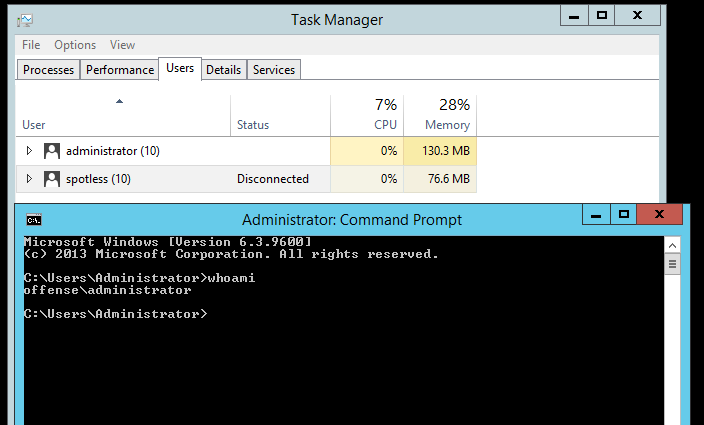
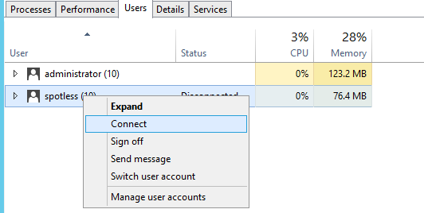
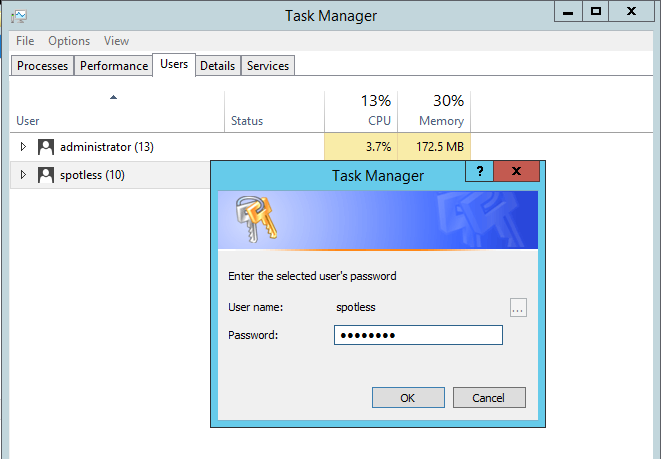
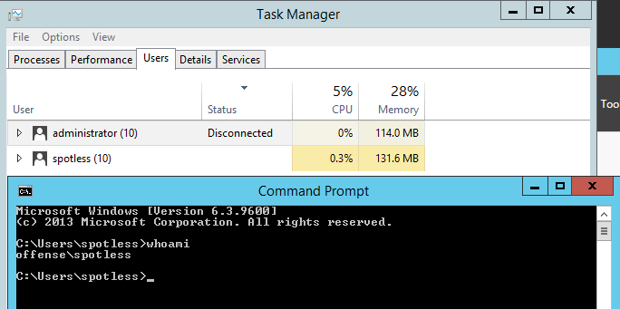
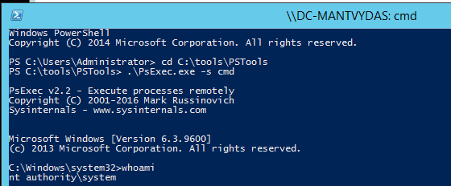
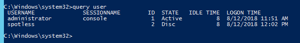
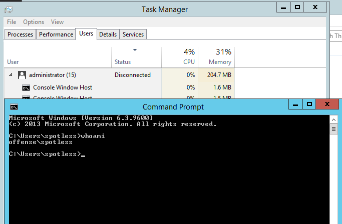
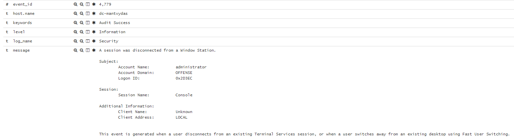
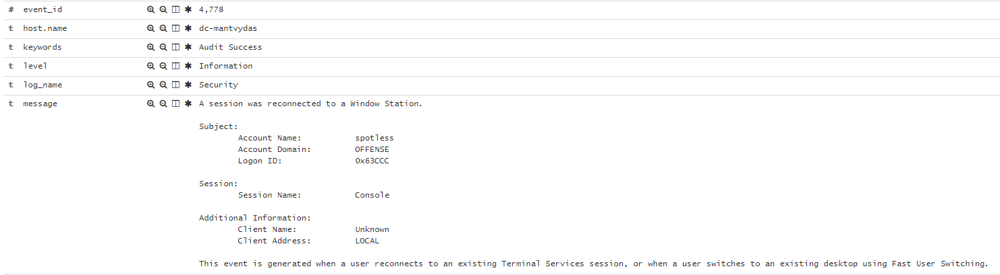
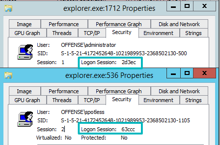

# T1076: RDP Hijacking for Lateral Movement with tscon

## Execution

It is possible by design to switch from one user's desktop session to another through the Task Manager \(one of the ways\).

Below shows that there are two users on the system and currently the administrator session is in active:



Let's switch to the `spotless` session - this requires knowing the user's password, which for this exercise is known, so lets enter it:





We are now reconnected to the `spotless` session:



Now this is where it gets interesting. It is possible to reconnect to a users session without knowing their password if you have `SYSTEM` level privileges on the system.   
Let's elevate to `SYSTEM` using psexec \(privilege escalation exploits, service creation or any other technique will also do\):

```text
psexec -s cmd
```



Enumerate available sessions on the host with `query user`:



Switch to the `spotless` session without getting requested for a password by using the native windows binary `tscon.exe`that enables users to connect to other desktop sessions by specifying which session ID \(`2` in this case for the `spotless` session\) should be connected to which session \(`console` in this case, where the active `administator` session originates from\):

```csharp
cmd /k tscon 2 /dest:console
```


Immediately after that, we are presented with the desktop session for `spotless`:



## Observations

Looking at the logs, `tscon.exe` being executed as a `SYSTEM` user is something you may want to investigate further to make sure this is not a lateral movement attempt:


Also, note how `event_data.LogonID` and event\_ids `4778` \(logon\) and `4779` \(logoff\) events can be used to figure out which desktop sessions got disconnected/reconnected:





Just reinforcing the above - note the usernames and logon session IDs:



## References










