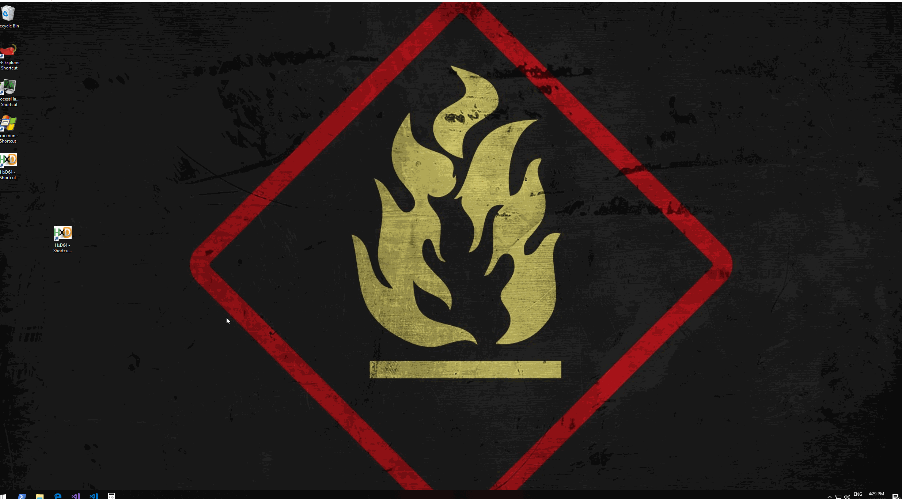
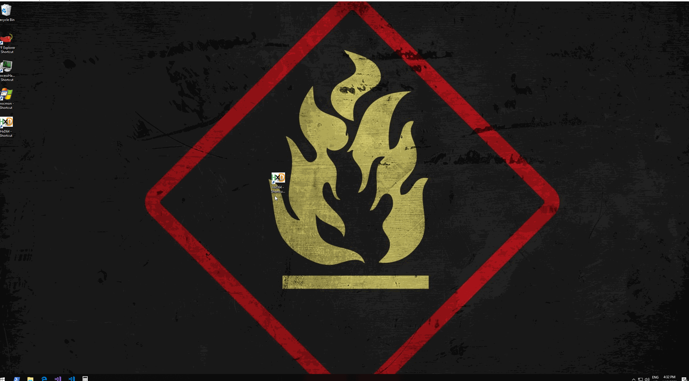

# Modifying .lnk Shortcuts

This is a quick lab showing how .lnk \(shortcut files\) can be used for persistence.

## Execution

Say, there's a shortcut on the compromised system for a program HxD64 as shown below:


. That shortcut can be hijacked and used for persistence. Let's change the shortcut's target to this simple powershell:

```csharp
powershell.exe -c "invoke-item \\VBOXSVR\Tools\HxD\HxD64.exe; invoke-item c:\windows\system32\calc.exe"
```

It will launch the HxD64, but will also launch a program of our choice - a calc.exe in this case. Notice how the shortcut icon changed to powershell - that is expected:


We can change it back by clicking "Change Icon" and specifying the original .exe of HxD64.exe:


The original icon is now back:


## Demo

Below shows the hijack demo in action:



In the above gif, we can see the black cmd prompt for a brief moment, however, it can be easily be hidden by changing the `Run` option of the shortcut to `Minimized`:


Running the demo again with the `Run: Minimized` shows the black prompt went away:




Note that hovering the shortcut reveals that the program to be launched is the powershell.


## Reference



