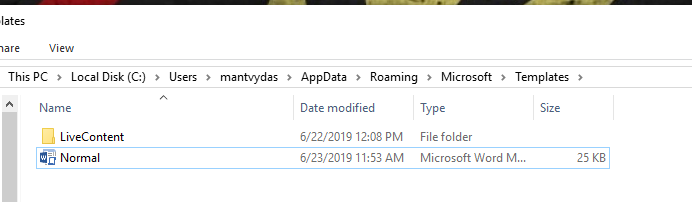
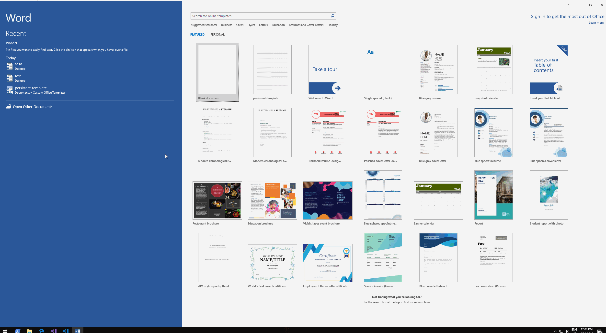

# Office Templates

It's possible to persist in the userland by abusing Microsof templates - documents that are used as base templates for all new documents created by Office. In this lab, I am abusing Ms Word templates.

## Weaponization

Let's open and edit the base template called `Normal` that can be found at:

```text
C:\Users\mantvydas\AppData\Roaming\Microsoft\Templates
```



Create a new AutoOpen macro and add your VBA code there:

```javascript
Sub AutoOpen()
MsgBox "Ohai from the template :)"
End Sub
```


Save the template and exit. We're now ready to create a new document, save it and launch it - at this point, we should get our VBA code executed. Below GIF shows exactly that:



## References



