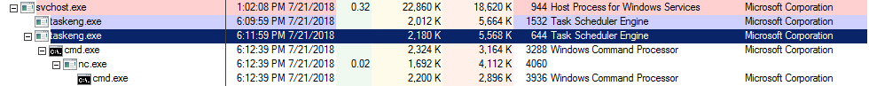
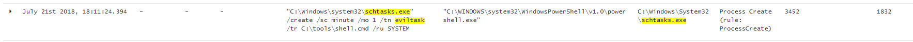
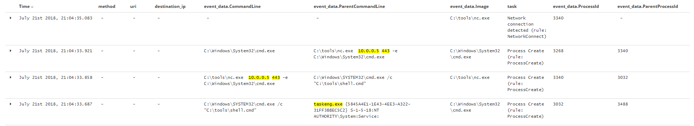
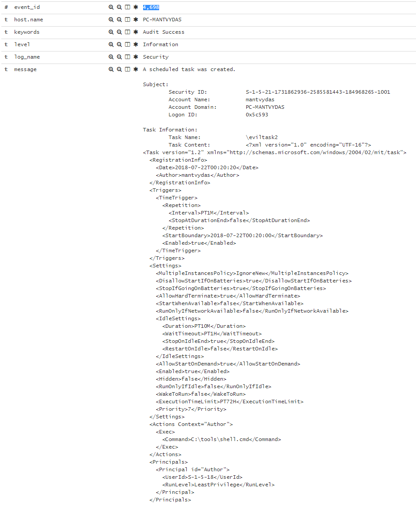
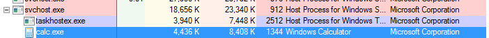

# T1053: Schtask

## Execution

Creating a new scheduled task that will launch shell.cmd every minute:



```bash
schtasks /create /sc minute /mo 1 /tn "eviltask" /tr C:\tools\shell.cmd /ru "SYSTEM"
```



## Observations

Note that processes spawned as scheduled tasks have `taskeng.exe` process as their parent:



Monitoring and inspecting commandline arguments and established network connections by processes can help uncover suspicious activity:





Also, look for events 4698 indicating new scheduled task creation:



### Lateral Movement

Note that when using schtasks for lateral movement, the processes spawned do not have taskeng.exe as their parent, rather - svchost:



```bash
schtasks /create /sc minute /mo 1 /tn "eviltask" /tr calc /ru "SYSTEM" /s dc-mantvydas /u user /p password
```





## References





