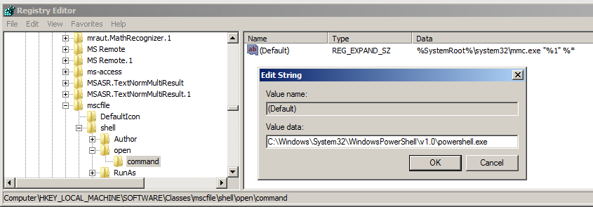
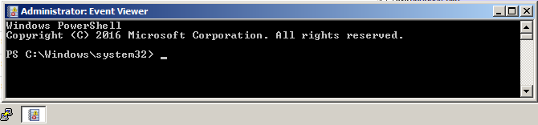
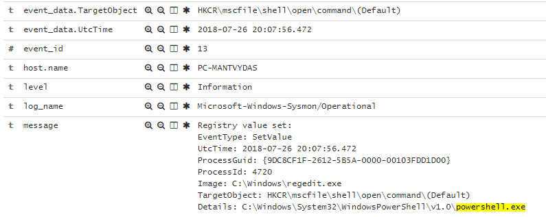

# T1122: COM Hijacking

> The Microsoft Component Object Model \(COM\) is a platform-independent, distributed, object-oriented system for creating binary software components that can interact. COM is the foundation technology for Microsoft's OLE \(compound documents\), ActiveX \(Internet-enabled components\), as well as others.

In this lab we will execute a file-less UAC bypass technique.

## Execution

On the compromised system, change the `HKEY_LOCAL_MACHINE\SOFTWARE\Classes\mscfile\shell\open\command` default value to point to your binary. In this case I chose powershell.exe:

By default, launching Windows Event Viewer calls under the hood:`"C:\Windows\system32\mmc.exe" "C:\Windows\system32\eventvwr.msc" /s` 

Since we hijacked the `HKEY_LOCAL_MACHINE\SOFTWARE\Classes\mscfile\shell\open\command` to point to powershell, when launching Even Viewer, the powershell is invoked instead:

## Observation

Monitoring registry for changes in `HKEY_CLASSES_ROOT\mscfile\shell\open\command` can reveal this hijaking activity:

## References









