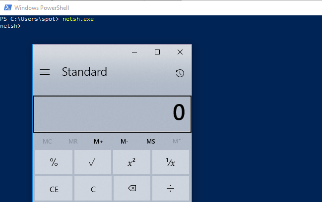
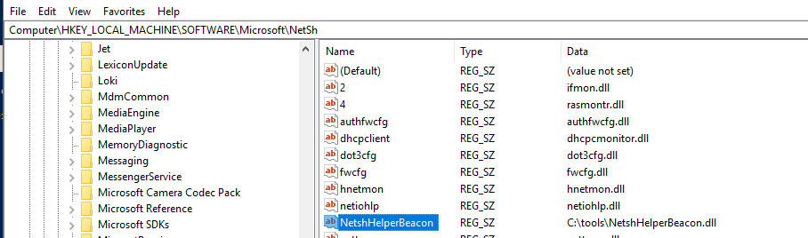
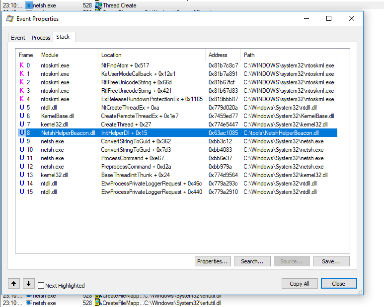
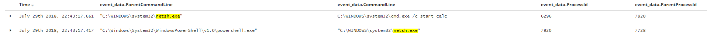
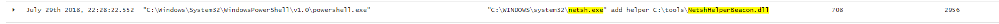
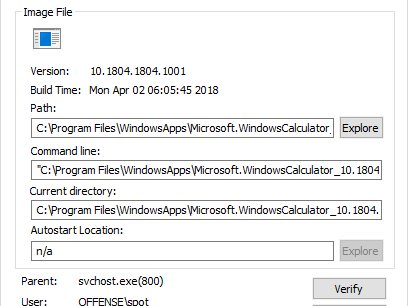

# T1128: NetSh Helper DLL

## Execution

[NetshHelperBeacon helper DLL](https://github.com/outflanknl/NetshHelperBeacon) will be used to test out this technique. A compiled x64 DLL can be downloaded below:



The helper library, once loaded, will start `calc.exe`:



```bash
.\netsh.exe add helper C:\tools\NetshHelperBeacon.dll
```




## Observations

Adding a new helper via commandline modifies registry, so as a defender you may want to monitor for registry changes in `Computer\HKEY_LOCAL_MACHINE\SOFTWARE\Microsoft\NetSh`:



When netsh is started, Procmon captures how `InitHelperDLL` expored function of our malicious DLL is called:



As usual, monitoring command line arguments is a good idea that may help uncover suspicious activity:





## Interesting

Loading the malicious helper DLL crashed netsh. Inspecting the calc.exe process after the crash with Process Explorer reveals that the parent process is svchost, although the sysmon logs showed cmd.exe as its parent:



## References



