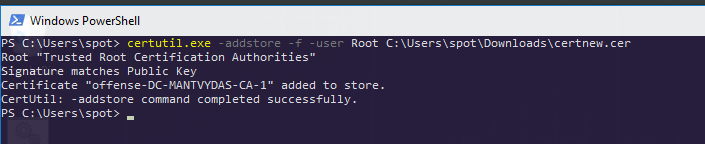
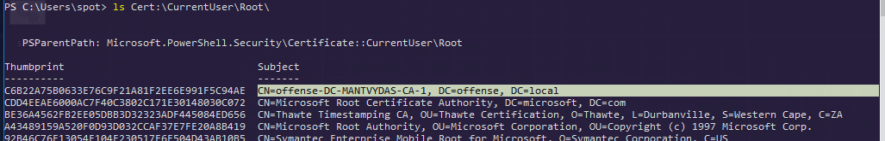
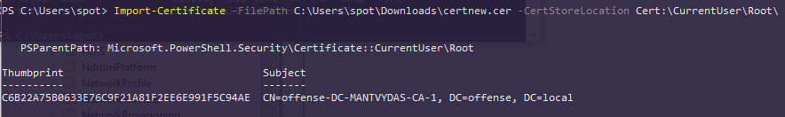
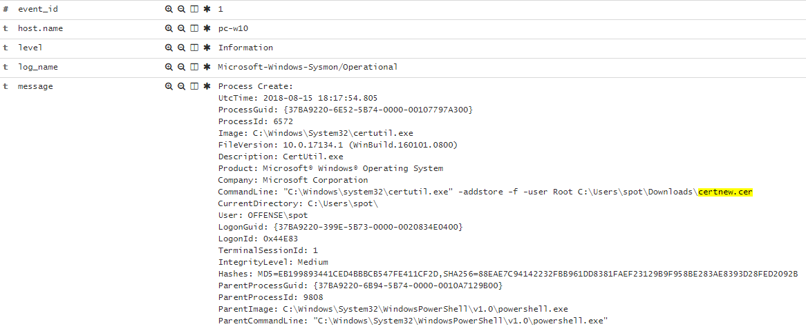
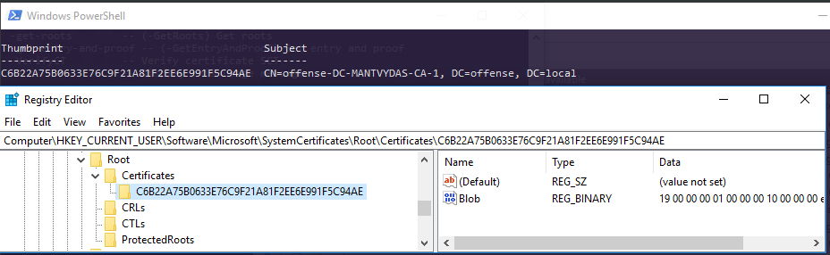

# T1130: Installing Root Certificate

## Execution

Adding a certificate with a native windows binary:


```csharp
certutil.exe -addstore -f -user Root C:\Users\spot\Downloads\certnew.cer
```




Checking to see the certificate got installed:



Adding the certificate with powershell:


```csharp
Import-Certificate -FilePath C:\Users\spot\Downloads\certnew.cer -CertStoreLocation Cert:\CurrentUser\Root\
```




## Observations

Advanced poweshell logging to the rescue:


Commandline logging:



The CAs get installed to:

```csharp
Computer\HKEY_CURRENT_USER\Software\Microsoft\SystemCertificates\Root\Certificates\C6B22A75B0633E76C9F21A81F2EE6E991F5C94AE
```

..so it is worth monitoring registry changes there:



## References



