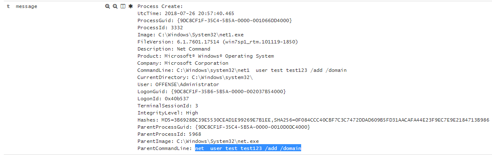
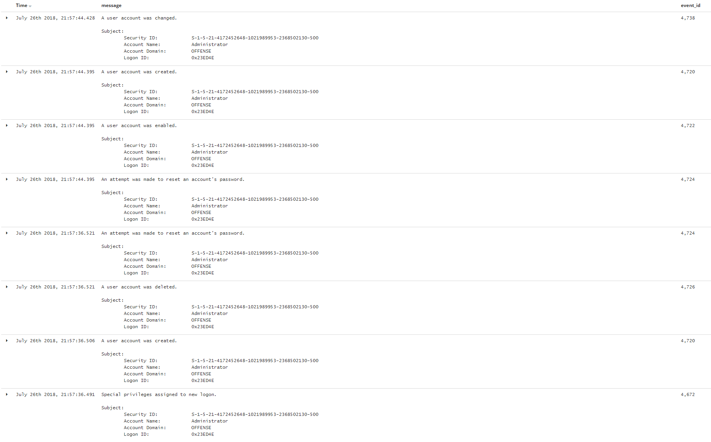
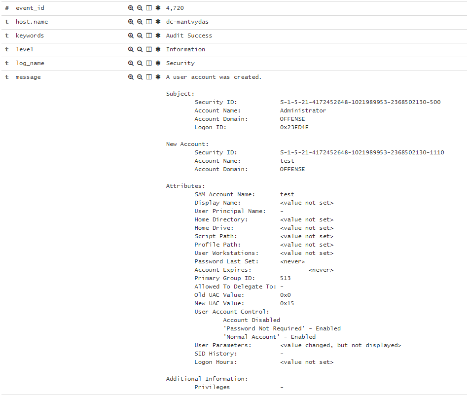

# T1136: Create Account

## Execution


```bash
net user test test123 /add /domain
```


## Observations



There is a whole range of interesting events that could be monitored related to new account creation:



Details for the newly added account are logged as event `4720` :



## References




