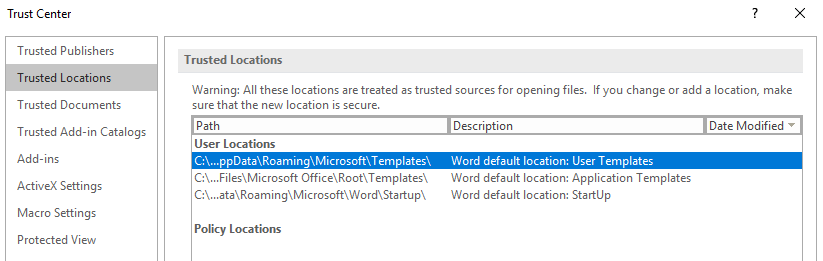
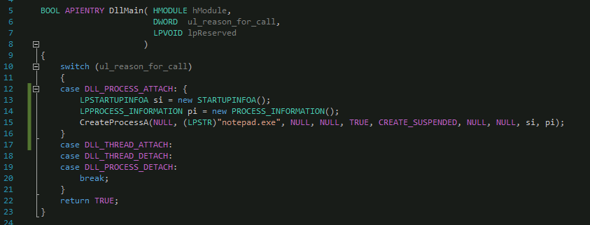
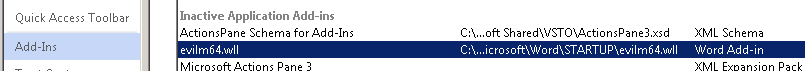

# Word Library Add-Ins

It' possible to persist in the userland by abusing word library add-ins by putting your malicious DLL into a Word's trusted location. Once the DLL is there, the Word will load it next time it is run.

## Execution

Get Word's trusted locations where library add-ins can be dropped:



```csharp
 Get-ChildItem "hkcu:\Software\Microsoft\Office\16.0\Word\Security\Trusted Locations"
```




Those trusted locations are actually defined in Word's Security Center if you have access to the GUI:



Let's create a simple DLL that will launch a notepad.exe once the DLL addin is loaded:



Compile the DLL and copy it over to `Startup` folder and rename it to `evilm64.wll`:


```text
mv .\evilm64.dll .\evilm64.wll
```


Next time the victim opens up Word, `evilm64.wll` will be loaded and executed:


Interesting to note that Process Explorer does not see the evilm64.wll loaded in any of the currently running processes:


...although we can definitely see that the add-in is now recognized by Word:




This technique did not work for me on Office 365 version, but worked on Office Professional. Not sure if there's a bug in the 365 version or it's just a limitation of that version.


## References





