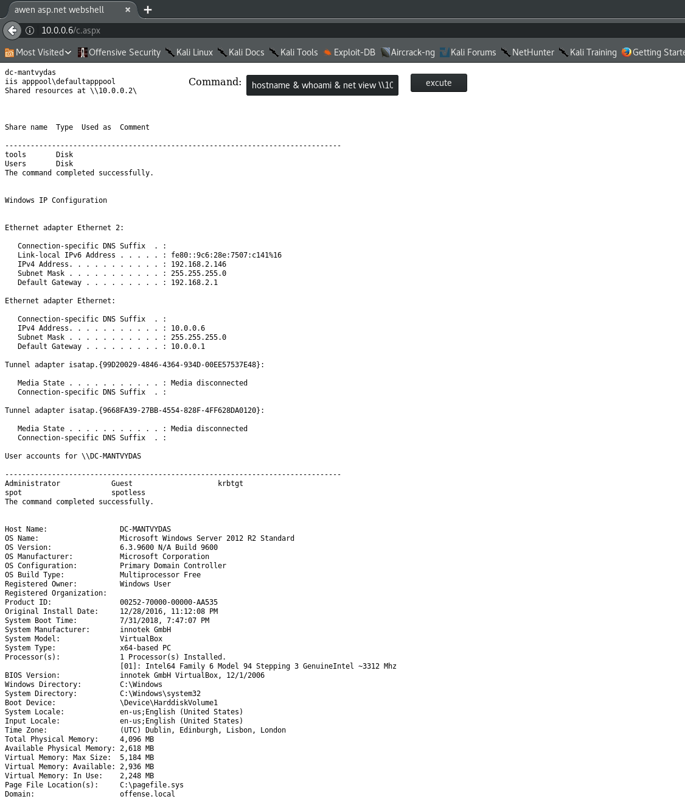
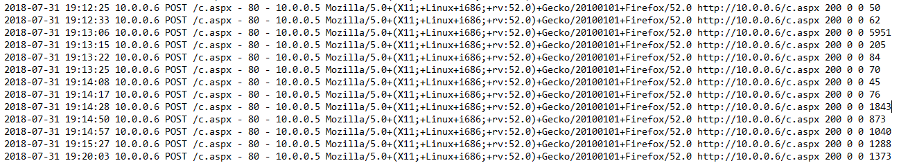
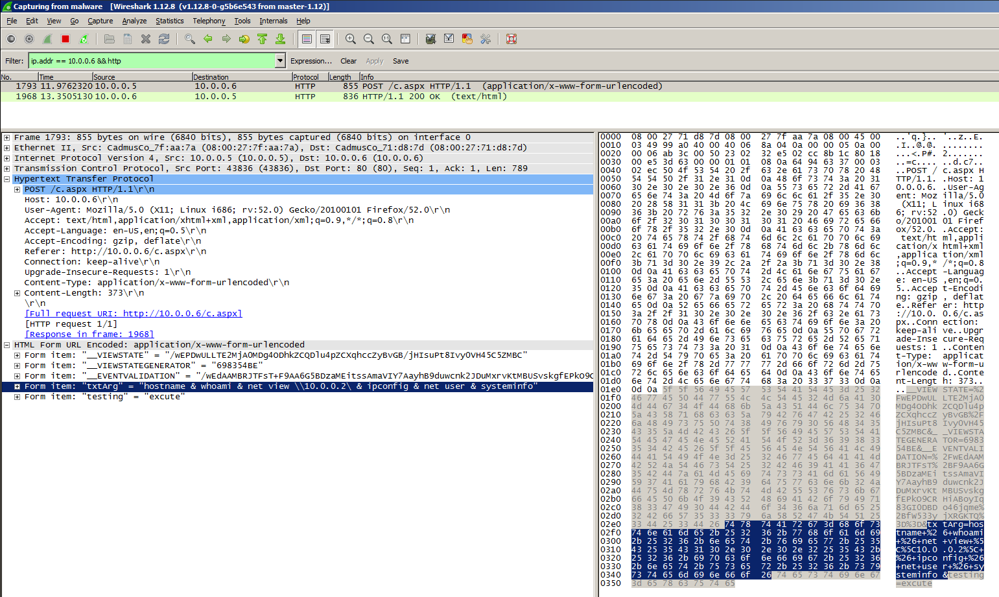
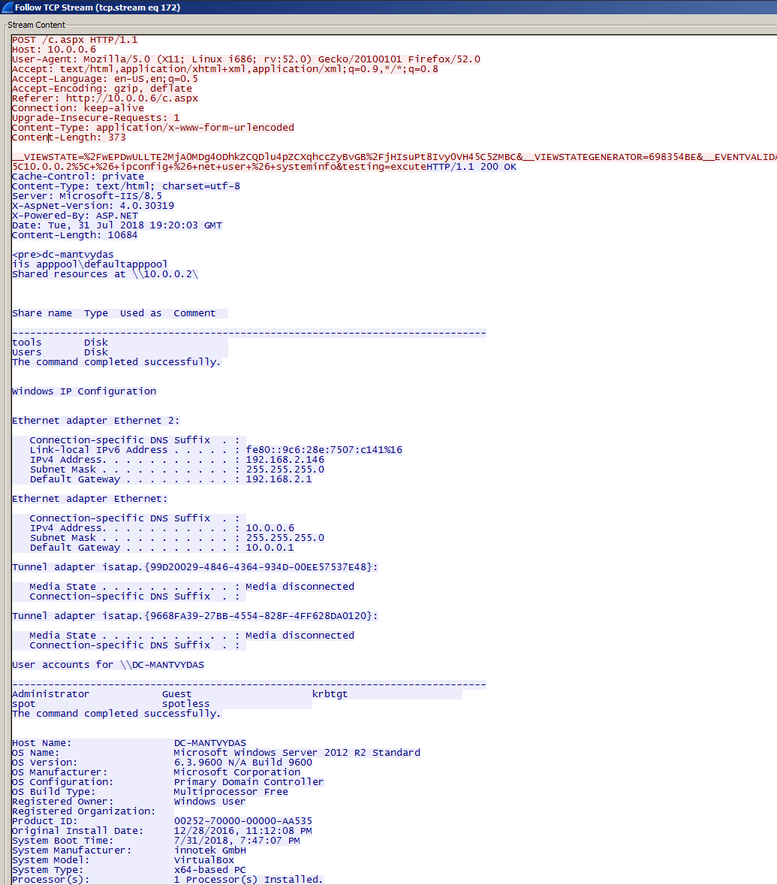
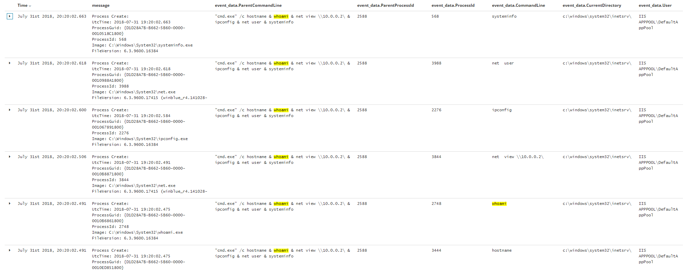

# T1108: WebShells

This demo assumes a server compromise and that the attacker has already uploaded a webshell to the compromised host for persistence.

## Execution

Below illustrates the existence of a simple webshell on a compromised Windows 2008R at 10.0.0.6 running IIS web service. It also shows output of the classic system enumeration commands - `net`, `whoami`, `ipconfig`, etc:

## Observations

Note that this particular webshell's HTTP requests are sent to the webserver via POST method which means that looking at the IIS web logs will not allow you to see what commands were executed using the webshell. The only things you will just will be a bunch of POST requests to the `c.aspx` file:

However, if you are collecting network traffic data, you can see the attacker's commands and their outputs:

Looking at sysmon process creation logs, we can immediately identify nefarious behaviour - we can see multiple enumeration commands being invoked from `c:\windows\system\inetsrv` working directory under a `ISS\APPOOL\DefaultAppPool` user - this should not happen under normal circumstances and should raise your suspicion:

## References



